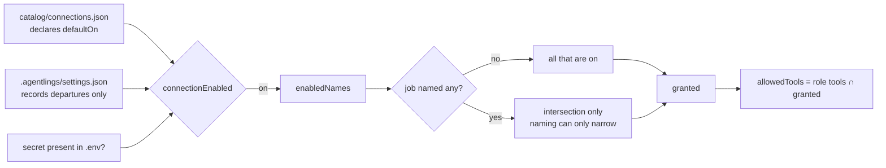
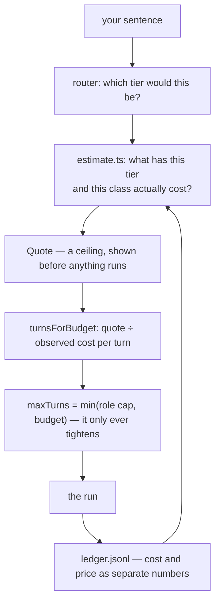
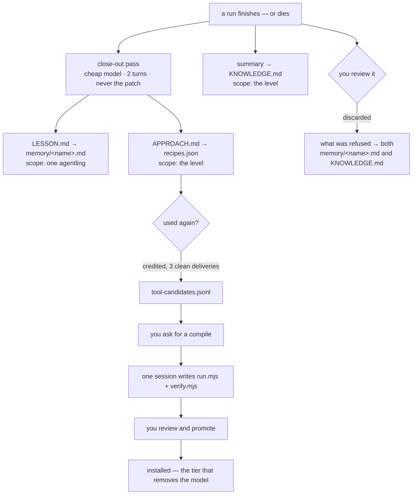
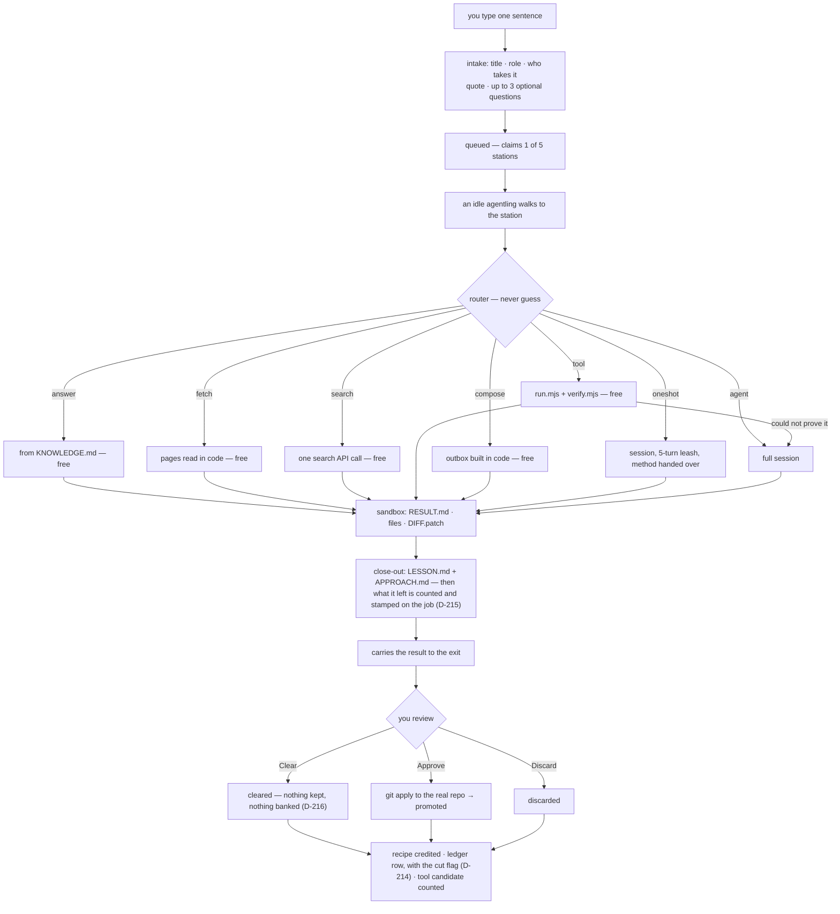
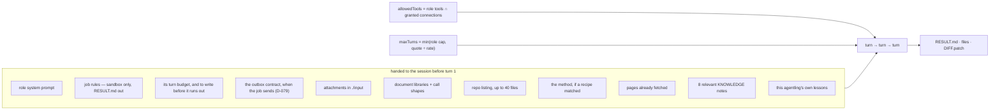

# The Agentling — a generalist CV

What one agentling is, and what it can do, *before* it is given a trade, a
skill, a level or a job. Everything here is a property of the engine rather
than of any particular crew member.

The three files are meant to be read together: `SPEC.md` says what the product
is, `DECISIONS.md` says why each choice was made and what measurement settled
it, and this one says what the thing in the middle is actually capable of.
Where a claim here was settled by evidence, the entry is cited (`D-021`).

Every capability carries a status:

| | Meaning |
|---|---|
| **Live** | Built, running, and exercised by tests or by real jobs |
| **Partial** | The mechanism exists; the thing it is for is not fully there |
| **Not built** | Designed, decided, or deliberately refused — with the reason |

Written 2026-08-01 against `e5c80c9`, re-read against `3839d4d`
(2026-08-17) — §§2, 3, 5, 10 and 15 corrected where D-158 landed: the clerk,
the calendar connection, sixteen skills, and the reading row ticked; §§5 and
15 corrected again the same day where D-191 landed: the mail connection, nine
credentialed connections, the email reading row ticked; §§4, 6 and 11
corrected 2026-08-22 where D-211 landed: the sandbox trajectory trail, and
the document brief's scan line repaired; §§6, 11 and 12 re-read against
`abc0263` the same day where the UI unclogging landed (D-213–D-215): the
trail read back in the review, the ledger row carrying the cut, the job
carrying what it left; §2 gains the four Wave 1 trades on 2026-08-24 (D-235),
read from the four role files rather than from the plan that proposed them. Since 2026-08-23 (D-228) the app shows this file's
substance itself — Settings → catalog → *Meet the crew* — with every number
on a trade's card read from the role file and the ledger rather than from
here, and the prose typed in `web/src/panels/crew.ts`; when a section here
changes, that file is the one to re-read; its positions board (D-229) grades
twelve human jobs duty by duty against §§4, 5, 11 and 14, in
`web/src/panels/positions.ts`, and a capability landing or leaving owes
those grades a re-read too — as it owes the power and boundary ledgers in
`server/src/coverage.ts` (D-230), which grade a real occupation's duties
against §§4, 5, 10, 11 and 14 by the same evidence; `npm run
bench:coverage` measures the result over a downloaded O*NET or ESCO
release. §8's figures
regenerate with `npm run ledger:report`, and §15 is the list of what is not
here yet.

---

## 0. At a glance

|  |  |
|---|---|
| **What it is** | One Claude Agent SDK session, run in a child process, inside a per-job sandbox, wrapped in a deterministic layer that tries not to start it at all |
| **Where it works** | `.agentlings/levels/<level>/jobs/<id>/` — a directory it may never leave |
| **What it starts with** | A name, a colour, a role, an empty memory file, and whatever its level already knows |
| **What it can touch** | Files, a shell, a git clone of your repo, web pages as text, a read-only browser, document libraries |
| **What it can never touch** | Your real repository before you approve; any credential value; anything on the far end of a network it was not granted |
| **What it is asked not to touch** | Anything outside its sandbox — an instruction and a working directory, not an OS jail. See §10 |
| **What one job costs** | Free on five of seven tiers, 19c on a leash, 87c for a full session — measured, not quoted from memory (§8) |
| **What binds it** | Turns, not dollars — 10 by default, 40 hard ceiling, 5 on a recipe leash. It is told how many it has, and asked to deliver before they run out (D-063) |
| **What it remembers** | Its own lessons, its level's knowledge, and the method for any job it has done before |
| **What it can become** | A script. Work done often enough compiles into a tool that runs with no model at all |
| **Who it answers to** | You, at review. Nothing it produces reaches the real world until you promote it — or until a standing approval *you* earned and granted promotes a pure send job for you (D-082) |

---

## 1. Identity at birth — Live

A blank agentling is nine fields and a file.

| Field | At hire | Notes |
|---|---|---|
| `id` | generated | Stable for its life |
| `name` | assigned | Also the filename of its memory: `memory/<name>.md` |
| `color` | assigned tint | `0xRRGGBB`; the dot on the level card and the sprite in the world |
| `role` | chosen at hire | The whole of its capability — see §2 |
| `jobDescription` | your sentence | What *you* said it was for, in your words; seeded as its first memory |
| `state` | `idle` | `idle → walking → working → delivering` |
| `x`, `targetX` | spawn point | Presentation only; the world can never block or corrupt a job |
| `jobsDone` / `jobsFailed` | `0` | Persisted in the roster, not the sim — a restart no longer wipes a career |
| `memory/<name>.md` | absent | Created on its first lesson |

What is **not** blank: the level it is born into. A new agentling inherits its
level's `KNOWLEDGE.md`, its recipes and its compiled tools from the moment it
starts. Capability is a property of the level, not of the worker — a method
that works against one repository is not a method that works against another.

The roster is the record and the sim holds only who is awake (`crew.ts`). An
agentling can be **rested** (walks out the door, off the queue, nothing lost),
**woken** (drops back through the hatch with career and lessons intact), **let
go** (roster entry removed, lessons moved to `memory/archive/`, never deleted),
or **merged** into another of the same role (careers add, memories merge
oldest-first with duplicates dropped, an absorption note records who was folded
in). All four are blocked mid-job.

---

## 2. Trades — Live

A role is a Claude Code subagent file: `roles/<name>.md`, frontmatter plus a
system prompt as the body. **The role is the agentling.** It decides the system
prompt, the tool allowlist, the model, the mounted skills and the turn budget.
A scout with read-only tools genuinely cannot edit code — this is enforced at
the SDK session, not advised in a prompt.

| Role | For | Tools | Skills | Model | Turns |
|---|---|---|---|---|---|
| `worker` | Generalist — takes any job, masters none | read, write, edit, bash | concise-reports, check-your-work, organizing-folders | default | 10 |
| `mason` | Builds — implements, refactors, fixes | read, write, edit, bash, grep | small-diffs, check-your-work | default | 15 |
| `scout` | Reconnaissance — looks into how existing code and sources work, writes little | read, write, grep, web_fetch | concise-reports, cite-sources | Haiku 4.5 | 12 |
| `researcher` | Deep research — cited, triangulated briefs from many sources | read, write, grep, web_fetch | deep-research, cite-sources, concise-reports | default | 30 · 25-min wall · $4 ceiling |
| `scribe` | Documentation — turns work into words, and into .docx and report PDFs | read, write, grep, bash | concise-reports, plain-language, document-design, pdf-report | default | 10 |
| `analyst` | Numbers — computes over records in a kept script, draws the result as an SVG chart | read, write, grep, bash | concise-reports, tables-and-numbers, cite-sources, data-analysis | Haiku 4.5 | 6 |
| `designer` | Visual design — worlds, layouts, colours; renders and judges its own work | read, write, edit, bash | see-your-work, concise-reports, authoring-a-level-pack, plate-design, deck-design, pdf-report | default | 20 · 25-min wall |
| `drafter` | Technical drawings — blueprints, floor plans, CAD plots, site maps; extracts the geometry, builds the dimensioned model, then composites, corrects or renders from it (D-198) | read, write, edit, bash | plan-geometry, see-your-work, check-your-work, concise-reports | default | 35 · 25-min wall · $5 ceiling |
| `architect` | Architecture — C4 blueprints, module maps, ADRs, from the files that are there | read, grep, bash, write | architecture-blueprints, cite-sources, concise-reports | default | 15 |
| `clerk` | Standing desks — reads the connected calendar and mail and briefs the day: events, conflicts, invites and mail awaiting a reply (D-158, D-191) | read, write | concise-reports | Haiku 4.5 | 6 |
| `operations` | Quality and procedure — the record of how work is done: SOPs, work instructions, acceptance criteria, test and inspection findings read against a named standard, corrective actions (D-235) | read, write, grep, bash | concise-reports, tables-and-numbers, check-your-work, plain-language | default | 12 |
| `logistics` | Supply — stock positions, reorder points, lead times, supplier and carrier comparisons, freight and landed cost (D-235) | read, write, grep, bash | concise-reports, tables-and-numbers, data-analysis, cite-sources | default | 12 |
| `planner` | Project planning — work breakdowns, milestones, sequencing and dependencies, estimates carrying their basis, risk registers (D-235) | read, write, grep | concise-reports, tables-and-numbers, plain-language | default | 12 |
| `security` | Security auditing — a clone read for dependency advisories, committed secrets, permission and configuration weakness, each finding at a file and line with the smallest fix (D-235) | read, write, grep, bash | concise-reports, cite-sources, check-your-work | default | 15 |

The last four are the **Wave 1 trades (D-235)**, and they are the first roles
hired off a measurement rather than off a request: each is named for a cluster
the coverage benchmark counted in O*NET's 18,797 duties, not for a job somebody
thought of. They are **new seats, not new reach** — every one works the way the
crew already works, on files in a sandbox, and the four prompts spend as much
text on what they do not do (operate, order, schedule, probe) as on what they
do. None of them has run a real job yet: their powers are vouched by the
ledger and their routing is measured, which is not the same as proven (§15).

Role tool names map onto SDK tools (`grep` → `Grep` + `Glob`, `web_fetch` →
`WebFetch`). A role naming no tools gets the default set: Read, Write, Edit,
Bash, Grep, Glob. A role naming `maxTurns` gets it clamped to 40.

**The catalog is global; the crews are per level.** Roles install from GitHub
URLs, SHA-pinned, preview-first: the full text plus warnings about broad tools,
outbound links and the declared licence, because installing copies the file
into your own project. Provenance is recorded, so a later sync can report
"update available" and never apply one.

---

## 3. Abilities — Live

A skill is a `SKILL.md` folder mounted into `sandbox/.claude/skills` for the
session. Eighteen are installed: seventeen written against this app's
contract — sandbox only, `RESULT.md` out — which third-party skills know
nothing about, and one third-party fork adapted to it (`ponytail`, D-190 —
measured in a paired trial, currently mounted on no role):

`architecture-blueprints` · `authoring-a-level-pack` · `check-your-work` ·
`cite-sources` · `concise-reports` · `data-analysis` · `deck-design` ·
`deep-research` · `document-design` · `organizing-folders` · `pdf-report` ·
`plain-language` · `plan-geometry` · `plate-design` · `ponytail` ·
`see-your-work` · `small-diffs` · `tables-and-numbers`

Two of them mark a line the others do not cross: `see-your-work` was
hand-written for the designer (D-112), and `authoring-a-level-pack` was
**written by a run** — a training-ground session distilled it from the pack
sources as attachments (job `9524e59b`), it was previewed and spot-verified
against source, installed through the role picker, and the next pack authored
under it measured the best crew separation yet (19.8, D-118).

Skills install from the same library as roles, whole-folder: up to 200
companion files and 2 MB, with every remote path refused rather than sanitised
if it could climb out of its folder. The preview says how many extra files a
skill brings and that they are scripts it can run, which is the question the
preview exists to ask.

An installed skill can also be handed to a role from any agentling's card
(Live, D-089): role-level on purpose — capability lives in the baseline tier
(D-050), so the button says "hand to every worker" and means it. The role
file's skills line is edited in place; recipes learned without the skill
demote to hints until they land again (D-036's surface doing its job).

---

## 4. What an agentling can actually do

### Inside its sandbox — Live

| Activity | How |
|---|---|
| Read, write and edit files | SDK `Read` / `Write` / `Edit`, gated by role |
| Run commands | `Bash`, gated by role. No shell is available to a role without it |
| Search | `Grep` / `Glob` |
| Work on your code | `git clone --local --no-hardlinks` into `sandbox/repo`; every change captured as `DIFF.patch` after the session |
| Read your attachments | Up to 5 files, 10 MB each, waiting in `input/` — never at the sandbox root, because everything that asks "did this run deliver?" looks at top-level files |
| Produce real documents | `.docx` (docx, mammoth), `.xlsx` (exceljs), `.pptx` (pptxgenjs), `.pdf` (pdf-lib, pdf-parse) — resolved from the project root, nothing installed per job. A **styled** PDF is printed, not drawn: the run authors one self-contained HTML and the `render_pdf` tool prints it through the system Edge, offline — every external URL aborted (D-128) |
| Author a backdrop plate stack | The run writes self-contained HTML pages — three.js served from the server's pinned copy at `http://three.local/three.module.js`, the offline rule's one stated exception — sets `document.title = "ready"`, and `render_plate` writes PNGs at the sandbox root, quantized to the 128-colour backdrop budget. Five modes (D-148): `plate` 2000×900 opaque, `plate-overscan` 2120×900 (drifts with the pointer), `cutout`/`cutout-overscan` (transparent-background upper plates and occlusion strips, alpha snapped binary, receipt reports coverage), `tile` ≤512×512 for `plateloop` regions — each crossed with `finish: quantized\|smooth` (D-151: smooth keeps the render exactly as drawn, for `backdrop.finish: "smooth"` packs and for `backdrop.depthMap` grayscale maps, which displace the back plate under the pointer on quantized packs). The budget is the layer's: one palette across every raster (`pack:quantize` cuts it jointly); a smooth pack has no budget at all. Named in `backdrop.plates`/`backdrop.occlusion`/`backdrop.depthMap`, the files ride the PACK.json draft through review, and Approve installs them all (D-143, D-148, D-151) |
| Work from a technical drawing | The `drafter` trade and its `plan-geometry` skill (D-198): pull the vector paths out of a CAD-plotted PDF with pdf.js — job `41fbbf49` took 153,926 paths off a plot with no text layer at all, by its own RESULT.md — derive the scale from the drawing's own stated areas and dimension chains rather than assuming it, place every sheet in one coordinate frame, and composite or render from the placed model. The deliverable carries its own proof: closures, residuals in centimetres, and hashes of what was delivered. Pixels are for reading labels off an enlargement and for looking at the result, never for assembling it. **The ceiling is white-model massing** — reliable in plan and in aerial three-quarter views, unreliable at eye level (one of two attempted missed its subject), with no textures and no photometric lighting. Photoreal is decided-not-built (D-204): the demand is one request, and the visible gap is unused three.js rather than a missing renderer |
| Write and run scripts | Plain Node, no shell, no dependencies — this is also how a tool gets compiled (§9) |
| Report | `RESULT.md`: outcome first, evidence second |

The document libraries are named in the system prompt with their exact call
shapes, because a library nobody is told about is not a capability: watched
live, an agentling asked for a PDF hand-assembled the bytes over several turns
because it had no idea `pdf-lib` was there (D-031). The scan line among them
— the OCR readers for a PDF with no text layer — named a placeholder path
that nothing substituted from D-061 to D-211, and the import failed two more
ways under plain node; measured by running it from outside the repo, and
repaired (D-211).

The repository listing — up to 40 files — is handed over before the first turn,
because every repo run used to open with `ls` before it could do anything, and
on a five-turn leash that orientation turn was the difference between landing
the edit and running out.

### Reaching a page — Live

Web reading is **on by default**. This is an outreach platform, so reaching a
page is what the crew is *for* rather than a permission to be granted job by
job (D-032). It is the app's own fetch, not a browser and not a raw dump: a
page comes back as readable text trimmed to 12,000 characters. A Wikipedia
article measured 573 KB raw (~143k tokens) against ~3k tokens delivered.

Two paths, one implementation:

- URLs **you** typed are fetched by plain code *before* the session starts, at
  no token cost, and land as files the agent reads.
- An in-session `fetch_page` tool calls back into the server, so extraction,
  trimming and the allowlist have one implementation.

Non-HTTP is refused. 15-second timeout, 5 MB cap.

**This reads a page you name. Finding one is the `search` connection**, added
after the gap was measured rather than guessed at: two real jobs asked the same
question, one fell back to model knowledge and said so, the other spent its
whole budget driving the browser at a search engine and died (D-053). **A
missing capability is substituted, not refused** — which is why the fix was a
search box rather than a better browser.

**Verified on that same failing prompt** (D-054): with the browser still
switched on and available, it searched, read two pages and wrote up a
cross-checked answer in 9 turns — never opening the browser. A turn cost 4.4c
against the 2.0c a no-repo session averages, because fetched pages are input
tokens on every subsequent turn. Search buys accuracy the same way a clone buys
context: by making every turn dearer.

The two compose and both trim: `search_web` returns titles, snippets and links,
then `fetch_page` reads the one that was chosen. `WebSearch` — the SDK's own —
is still never granted, and a session reaching for it is denied.

### Driving a browser — Partial (reads, cannot act)

Playwright MCP, headless and isolated, fetched by `npx` so no code lands in the
repo. **Eight** of its twenty-four tools are granted, and all eight read:

`browser_navigate` · `browser_navigate_back` · `browser_snapshot` ·
`browser_find` · `browser_wait_for` · `browser_take_screenshot` ·
`browser_console_messages` · `browser_network_requests`

Twelve that act are deliberately absent — `click`, `type`, `fill_form`,
`press_key`, `select_option`, `drag`, `drop`, `file_upload`, `handle_dialog`,
`evaluate`, `run_code_unsafe`, `network_request`. `catalog.test.ts` asserts
those names against the shipped catalog, so the boundary is a test rather than
a description of one. Why, in full, is §11.

**Measured again in production, and the case is still weak** (D-053). A run
sent looking for a fact it could not search for spent ten tool calls in the
browser and exhausted its turns; its last act was to ask for `browser_evaluate`
— one of the twelve it does not have — and be refused. The same question,
worded without "find out", was answered in three calls for 34c. D-035's negative
measurement now has a live failure behind it.

It ships **off**. Signing in, when you want it, works by re-using a session you
made yourself: log in once in a real browser, save the storage state, point
`AGENTLINGS_BROWSER_STATE` at the file. The app never sees a password, and with
the variable unset the argument is dropped and browsing works signed out.

### Answering a run — Live

A job can carry `continues: <jobId>`. The earlier run's sandbox is carried
forward — `RESULT.md`, `DIFF.patch`, `LESSON.md`, `APPROACH.md` — so a reply
picks up where that run stopped instead of paying to redo it (D-033).

---

## 5. Reach outside the sandbox

### The rule

Nothing is ambient. A job gets what the platform has switched on, narrowed to
what it named, and nothing else. This is both the security boundary and the
cost one: every visible tool is definition overhead in every request of the
session.



Four properties worth stating plainly:

1. **Settings is authoritative.** A job cannot name its way past a switch you
   turned off. Never switched on is not the same as not switched off.
2. **Naming a connection can only narrow.** Per-job opt-in is about not
   carrying tool definitions you do not need, not about a job granting itself
   something.
3. **A connection that cannot work is not a preference.** Missing secret means
   never live, whatever its default says.
4. **One resolver, three readers** — the quote, the router and the executor all
   ask the same function. Measured on the same sentence: web on quotes `routed`
   / "Free — we already know this"; web off quotes `session` / "Up to $1.58".
   Two answers here would be dollars apart (D-032).

The SDK's own `WebFetch` and `WebSearch` are gated by the same door. They were
not, once: a role naming `web_fetch` got them whatever the user had switched
off, so the app's fetch was gated and this second door was not.

### What ships

| Connection | Transport | Default | Status |
|---|---|---|---|
| `web` — read web pages | builtin | **on** | Live |
| `render` — print a run's own HTML to a styled PDF, or render a level-backdrop plate | builtin | **on** | Live; offline by construction — every request the page makes is aborted, except the vendored three.js pair served from the server's own disk (D-128, D-143) |
| `github` — read a code host | builtin | off, needs `GITHUB_TOKEN` | Live, read-only in a session; its one write is a reviewed comment, replayed at approval (D-104) |
| `search` — find pages | builtin | off, needs `BRAVE_API_KEY` | Live, read-only |
| `bls` — read US labour statistics | builtin | off, needs `BLS_REGISTRATION_KEY` | Live, read-only; its own door because the key rides in a POST body and the web door is GET (D-187). One batched call carries up to 50 series |
| `calendar` — read the user's own Google Calendar | builtin | off; ready the moment `google` is connected | Live, read-only; the first reading sibling on the Google consent (D-158), reusing the Connect flow's stored secrets behind its own switch. One tool returns compact event lines — times as the calendar states them, replies still owed, who is invited. Deliberately no compiled-tool door: desk work never compiles |
| `mail` — search and read the user's own Gmail | builtin | off; ready the moment `google` is connected | Live, read-only; the second reading sibling (D-158, D-191) — two tools on the find/read split (D-053): Gmail's own query language in, compact lines out, one message's text on request, attachments named and never fetched. The stored consent predates `gmail.readonly`, so reads answer with the fresh-sign-in sentence until Connect is walked once more. Same deliberate absence from the compiled-tool doors |
| `browser` — read pages in a real browser | stdio (Playwright MCP) | off | Partial, read-only |
| `telegram` — send messages, at approval only | builtin | off, needs `TELEGRAM_BOT_TOKEN` | Live; grants a session **no tools** — see §11 and D-075 |
| `google` — send Gmail and create Calendar events as the user, at approval only | builtin | off; the Connect flow stores its three secrets | Live; grants a session **no tools** — loopback OAuth against the user's own client, one consent covering both (D-080, D-104) |
| `whatsapp-business` — send template messages, at approval only | builtin | off, needs `WHATSAPP_TOKEN` + `WHATSAPP_PHONE_NUMBER_ID` | Live; grants a session **no tools** — pre-approved templates from a business number, priced by Meta (D-081) |
| `slack` — send messages, at approval only | builtin | off, needs `SLACK_BOT_TOKEN` | Live; grants a session **no tools** — posts as your own bot (D-104) |

Your own notes are **not** a connection and deliberately never became one — see
below.

### Reading your own notes — Live, and not a connection

A level can be pointed at folders of your own material. They are read **once,
by a sync you ask for**, into `store-index.json` beside that level's other
files; the crew reads the index and never the source (D-047).

That is not an implementation detail, it is the reason this exists at all. Every
guarantee here rests on one shape — work in a sandbox, review, promote; nothing
arrives unread — and a live connection to a notes store hands a session reach
into a corpus nobody has looked at. An index is a file you can open first.

| | |
|---|---|
| What is indexed | `.md` `.markdown` `.mdx` `.txt` `.docx` `.pdf` `.xlsx` `.pptx` `.png` `.jpg`, walked recursively; dotfolders and `node_modules` skipped. A scan or a photograph is read by OCR where Windows has an engine, and marked `read from a scan` on the line (D-061) |
| What a passage is | A markdown section where there are headings, kept with its heading; a slide, under its own title; a run of spreadsheet rows, each carrying its sheet and column names; otherwise a length-bounded run cut at a sentence end (D-059, D-060) |
| Size | 600 chars a passage, 200 passages a file, 250 files a source — every overflow **reported** rather than dropped quietly |
| Provenance | Every line ends `[<file>, synced <date>]`, so a free answer and a session's context both say where it came from |
| Staleness | Past a week the index contributes **nothing** — the free tier cannot answer from it and the job falls through to a session that can go and look |
| Scope | Per level, like recipes and tools: a note about one project is not a note about another (D-013) |

It joins the recall corpus rather than sitting beside it: `readKnowledge`
returns lines, so an index that emits lines needed no new tier, no router branch
and no second scorer.

**Measured on real work, and the shape of the win is lopsided** (D-049). A
recall question it covered was answered `routed`, **$0, no session at all** —
the whole session avoided. But paired on a question where the crew already had
a clone of the same files, it saved **1 turn and 2.45c of 27c, about 9%**, on
n=1, with both answers equally correct. Its lines are input tokens on every
turn, so it makes each turn dearer and buys fewer of them. Point it at material
the crew *cannot otherwise reach*; pointing it at a repository it already
clones is close to its worst case.

Set up from **reading** in the level header: add a folder and it is read on the
spot, since a saved folder nobody read is a setting that looks done and does
nothing. The panel shows how much it holds and when it was read, flags a source
that is **not found** — re-checked on every open, so a folder since moved is
caught and not only a typo — and says plainly when the copy has gone stale and
the crew has therefore stopped using it, which is invisible anywhere else.

### Reading a code host — Live, read-only

Seven tools: `list_pull_requests` · `get_pull_request` · `get_pull_request_files`
· `list_issues` · `get_issue` · `list_commits` ·
`get_file_contents`. Enough for "what broke on main" and "summarise this PR"
without the crew having a clone.

**It is builtin rather than an MCP server, and that was a decision** (D-040).
The reference GitHub MCP server is deprecated by npm, and GitHub's supported
replacement ships as Docker or a remote HTTP endpoint this registry cannot
express. Builtin turned out better regardless, for the reason the catalog
already gives about stdio — *the budget for a stdio server is that server's own
flags, not ours* — and a code host is exactly where that bites. Measured on 30
open issues from a real repository: **150,320 characters of raw API JSON
against 3,969 delivered, 38× smaller.** Owning the call means owning the size
of the answer.

**It reads and cannot act.** Of the 26 tools the reference server exposes —
enumerated by speaking JSON-RPC to it rather than trusting its README — the
twelve that create, update, comment, merge, push or fork are absent.
`catalog.test.ts` asserts the grant and `github.test.ts` asserts the
implementation, so the boundary is two tests rather than a sentence.
`get_pull_request_files` deliberately returns names and line counts and never
the patch, though the API offers one on every entry: a diff is unbounded, and
it is what makes a turn expensive.

The token is required, not optional as it is for the library — a connection
whose secret is missing is listed as not ready and can never be switched on.

### Connecting to other apps — Partial

Nine credentialed connections are plugged in — five that read (the code
host, the search box, the statistics service, the calendar, the mailbox) and
four that send — every one builtin, so the *external* socket still carries
nothing but the browser. An external MCP server is declared with
`name`, `label`, `transport: "stdio"`, `command`, `args`, `tools` and
optional `secrets: {ENV_NAME: "why it is needed"}`.

- **The tool list is the grant.** A server offering both reading and acting can
  be adopted for reading alone by naming only its reading tools; anything not
  named is refused by the allowlist. It also makes the catalog say what a
  connection can do without anyone having to run it.
- **Secrets are referenced by environment variable name.** Values never appear
  in the registry and reach only the connection they were declared for. A
  value crosses the API exactly once — inbound, when the Settings drawer
  stores it after validating it with one real call (D-078) — and is never
  returned, never listed, and never echoed in an error. It can be forgotten
  from its row (D-218): Disconnect turns the `.env` line back into its
  commented placeholder, forgets the live value, switches the connection
  off — and, for the Google sign-in, revokes the refresh token at Google
  first, so the grant ends rather than a copy going stale. The three Google
  rows share one sign-in, and the link says so before it is pressed.
- **`${VAR}` in an argument** is filled from the environment, and the whole
  argument is *dropped* when the variable is unset — which is what makes an
  optional sign-in optional.
- **They all ship off.** Credentialed connections carry credentials and act on
  the user's behalf, which is a different decision from reading a page (D-005).

**Not built:** everything else credentialed. Not a ticket tracker, not
a database — the batch, its order and its refusals are decided (D-076, D-077;
SPEC M5.11), not yet wired. And one shape the registry
cannot express at all: `transport` is `builtin | stdio`, so a **hosted MCP
server reached over HTTP** — which is how most vendors now ship, GitHub's and
Google's own included — has no place to go. Verified 2026-08-04 that this
batch does not force it: Google's official Workspace MCP servers still need
your own OAuth client and are in preview, so Tier 1 stays builtin (D-076).

**Never:** borrowing claude.ai or Claude Code connector auth. The app owns its
own external credentials or has none — a stated non-goal.

---

## 6. What a turn costs, and who pays

### Quote → turns → ledger



**The quote is a lookup, not a model.** It asks the router what it would do,
then asks the ledger what that tier and class have actually cost. It tightens
as history accumulates — which is only possible because the router sorts work
into tiers with genuinely different cost behaviour.

**Turns are the only enforcement that exists before the money is spent.** The
session stream carries no running cost: measured, the only `total_cost_usd` in
a 35-message session arrives on the final message, and per-message usage is
partial (52 output tokens reported against a true 568). A mid-flight dollar
check cannot stop an overspend, only notice one after the money is gone. So the
ceiling is converted into turns at what a turn of this work has really cost.

**A turn is priced by the shape of the work, not just the role.** Measured
2026-07-31, a repo run burnt 7.4c/turn against 1.8c for the same role without
one, because the clone puts hundreds of thousands of cached tokens in front of
every turn. A rate pooled across both shapes predicted neither: the budget
worked out to 17 turns against a role cap of 8, so the cap always won and the
ceiling could never bind on anything (D-018).

**And the sign has since flipped, which is an argument for the split rather
than against it.** Re-read 2026-08-21 over 422 rows, a session turn costs
**2.8c with a repo and 3.4c without** — the opposite order from July. Nothing
about clones got cheaper; the population changed. The dear work is now the
no-repo kind (spatial drawing, level packs, research at $1–$3.53 a run) while
repo work is mostly small scoped edits, so pooling the two would today
under-fund exactly the runs that overrun. That is the same failure as D-018 in
mirror image, and the reason the rate is keyed on the shape at all: the
constant was never "repos are dear", it was "these are two populations". Read
any figure here as a snapshot of a moving workload, and re-run the report
rather than quoting it.

**The rate prices a turn *granted*, never a turn the SDK reports.** A cap of 4
came back as 6 when the run was cut off, and lower when it finished early. The
gap can be much wider: a scout capped at 12 reported **21**. Across the ledger
`turns > turnsAllowed` fires on **115 rows, and 24 of them carry no cut flag
at all** (re-read 2026-08-22 over 430 rows; it was 110 of 335 with 19
finished `done` the day before, and 43 of 88 in mid-August — roughly a third
throughout). The reported count is therefore not a cut-off marker, and
reasoning built on it has already been wrong once (D-022, D-052) — which is
why, since D-214, **the row carries the cut itself**: `outOfTurns` or
`timedOut`, written off the meter when the row is built and backfilled by
identification for the rows from before the field — 100 of 430 flagged, 91 by
the turn budget and 9 by the clock, with 19 stored rows over the cap
deliberately left unflagged because their jobs finished on their own (D-212)
and 46 rows naming a job no longer stored left silent. Every cut the app shows
— the backoffice chip, the facts strip, the profile's tile — reads that flag
and never the count.

**Since D-052 a row also records what the run spent itself on** — `toolCalls`
and `lastTool`, counted off the tool stream. Recorded — and since D-213 read
back on the review's facts strip, `52 tool calls · Bash, Read, Write` — and
the only number that survives a *killed* run: a cancelled session never
reaches the result message the SDK reports cost and turns on, so its row shows
`costUnknown` and no turns at all, while still saying it made 3 calls and was
last reading. **Since D-211 the sandbox keeps the calls themselves**:
`.trajectory.jsonl`, one line per call, result and remark, clipped, with how
the child ended — the transcript sandboxes never had, and the first seam of
the runner protocol a test pins — and, from the 2026-08-22 desk firings
on, seen live: three trails by that morning and five by midday, every result
present. **Since D-213 the review reads the trail back** as "where the turns
went": the session pass as one block per call in the order the session made
them, coloured by tool, a failed call ringed, the legend with each tool's
count, the longest run of one tool and whether a failed call was retried —
counts of calls, never turns — and a run from before the trail says so rather
than drawing an empty strip. Seen live: 39a1ff24 at 43 blocks, Bash 28 ·
Read 11 · Edit 2 · ToolSearch 1 · Write 1, call 39 failed and retried on the
next; 106140b4 with the no-trail line. **And since 2026-08-22 afternoon the
trail keeps the SDK's compaction boundaries** as `compact` lines — the
trigger and the token counts either side, with the runner's own turn count at
that moment — D-212's instrument for the leash that does not bind; the ledger
report counts them (`compactions seen`). The runner half is live on the next
spawned job; the server half waits for a restart, until which the line is
emitted and dropped.

**`lastTool` is what the model asked for, not what it got.** A run whose last
call was `browser_evaluate` was *refused* it — that tool is not granted. Read
the connection's tool list before reading a name here as something that
happened; the same trap once made a denied `WebFetch` look like a leak (D-053).

### Rules the user can rely on

- **Nothing is billed above its quote.** `priceFor` takes the minimum.
- **Every way in carries a ceiling**, which is what makes the line above mean
  anything: an unquoted route has no minimum to take, so the cap silently does
  not apply. Two have been found and closed — `POST /jobs` (D-027) and
  `POST /jobs/:id/redo` (D-049), both by tripping over a row with no
  `quotedUsd` rather than by a test. A redo is quoted as a **session** because
  it sets `noRouter`: the router would price the same job `routed`, $0, for a
  run that is really going to be a full session.
- **Failed work is charged nothing.** The app absorbs it.
- **Work quoted free that then cost money is absorbed too** — if a compiled
  tool claimed a job, could not prove its output, and a session had to do it
  after all, you were promised free and a promise of free that arrives as a
  bill is the one thing the quote exists to prevent.
- **A quote may never come in under the turns it has already decided to
  grant.** A tier calibrated on its own failures cannot otherwise escape them:
  the recipe tier's history was thirteen runs that died on a three-turn leash,
  so it quoted 22c, which funded three turns, which was the leash that was
  failing (D-026).
- **The quote reads every run that spent money**, not only the ones that
  landed. The runs that break a quote are exactly the ones that exhaust their
  turns and file failed — a done-only average is blind to its own worst cases
  by construction. Measured: a job quoted at 30c cost 59c, ran out of turns,
  and the quote for the identical next job did not move a cent (D-017).
- **Two ceilings, not one.** 50c is what ignorance quotes; $2 exists only so
  one freak run cannot set every later quote for its class. They were the same
  number until that caused a breach (D-016). A role whose work genuinely costs
  more raises the $2 for its own class alone with `maxCostUsd:` in its
  frontmatter, clamped at $10 — the researcher asks $4 and the drafter $5, and
  that one frontmatter line, with no server change at all, is what let the
  spatial class be quoted enough to finish (D-130, D-198).
- **What the ledger records is what actually happened.** The job class is the
  role that *ran* the work, not the role the matcher named — a job routed to a
  role nobody holds is picked up by whoever is free and runs as their role.
  That substitution is **said out loud** rather than left to be inferred from
  the ledger afterwards (D-200): the queued line on the feed carries "no mason
  is hired here — whoever is free takes this as their own role", or names the
  holder to wake when the only ones are resting. It rides every way in, not
  just the desk card, because a schedule, a reply or a chain step queues work
  with no card for anyone to read.
- **A run that dies still leaves a row.** The ledger opens one when the session
  starts and replaces it at close-out, so a process killed mid-run leaves an
  `interrupted` row with its cost marked unknowable instead of leaving nothing
  at all (D-199). Thirteen runs had vanished that way before it existed.

**Not built:** any actual billing. There is no invoice, no payment, no user to
charge. The spine is built for pass-through because a ledger cannot be
reconstructed retroactively, and the shape has to exist from the first entry or
the history is worthless (D-012).

---

## 7. The seven tiers — Live

Every request that never reaches the model costs nothing, so this is the
largest saving available and the most dangerous, because an answer given
without the agent is an answer nobody checked.

> **The rule is: never guess.** The router claims only work whose shape it
> recognises exactly. Everything else falls through to a session untouched. A
> missed saving costs money; a wrong answer costs trust.

| Tier | Fires when | Cost | What runs |
|---|---|---|---|
| `answer` | A question about what this level already knows, answered from `KNOWLEDGE.md`; or an exact repeat with a stored answer | free | Plain code |
| `fetch` | A bare "read this page" — addresses plus words that only mean *fetch* | free | Plain code |
| `search` | A bare "find me pages about X" — a search instruction and a subject, with nothing asked *about* the results | free | One API call |
| `tool` | A compiled tool matches the job's words **and** its shape | free | Two Node scripts |
| `compose` | A send whose recipient **and** message the desk already holds — the words go as written, so there is nothing to decide | free | Plain code |
| `oneshot` | A recipe matches strongly (≥ 0.65) **and has landed before** — the method, on a 5-turn leash | 19c | A short session |
| `agent` | Everything else. A weak match (≥ 0.3), or a strong one nobody has landed yet, still lends its method | 87c | A full session |

Those two figures are measured over 422 jobs, not estimated — §8 has the
workings and the command that regenerates them. The second one keeps moving:
it read 50c until 2026-08-12, level-pack authoring at $1–$3.41 a run pushed it
to 80c, and the spatial work of 2026-08-21 — sessions up to $3.53, the dearest
single run on record — carried it to 87c. **The leash has barely moved in a
month: 19.2c against the 20c it read in mid-August**, which is the point of the
tier rather than a coincidence. A short session cannot run away, so the price
of the expensive tier is what drifts as the work gets more ambitious.

Guards that keep the free tiers honest:

- A **stored answer** is replayed only on an exact prompt repeat with **no
  repository and no web access**. The same words against a different repo are a
  different question.
- A run that **made something** banks only its method, never its answer.
  Measured on job `57bbff81`: a run that had written a PDF banked its own
  summary, and the next identical request was answered for free with
  "hello-world.pdf (1,380 bytes) is a valid one-page PDF" — and no PDF.
- An **attachment** makes an answer unrepeatable even when the run produced
  nothing, because the recipe key is the prompt: "summarise the attached
  contract" would replay contract A's summary for contract B.
- **"Do it properly"** re-queues with `noRouter` when you disagree with a
  routed answer.

---

## 8. What costs money — Live

Every figure in this section is generated from `.agentlings/ledger.jsonl`:

```bash
npm run ledger:report
```

Run it rather than trusting what is printed below. The numbers here were taken
on **2026-08-21, over 422 jobs spanning 2026-07-30 to 2026-08-21** — and the
reason the command exists is that `SPEC.md` carried "~13c / ~50c" for the two
paid tiers long after the real figures had moved — they were 19.2c and 39.2c
when that was first noticed on 2026-08-02, and the table still said "~13c /
~50c" two days later, because noticing a stale number and fixing it are
different acts. A cost written into prose is a cost nobody recomputes.

**This section proved that about itself, twice.** It sat at the 2026-08-06
figures for six days while the ledger went from 161 jobs to 258 and spend from
$53.08 to $145.91 — the session mean drifting 50.4c → 79.5c, more than half as
much again — and nobody recomputed it, in the file whose own rule is to
recompute. Then it did it again: from 2026-08-12 to 2026-08-21 the ledger went
258 → 422 jobs and spend $145.91 → $271.69, and this section still said 258
until the re-derive that followed the drafter landing. Worse than the drift,
§0 disagreed with §7 about the same number for nine days — 50c against 80c, one
scroll apart. The regeneration is one command; noticing is the part that fails.

### The three classes

**Free — no model runs at all.** These cost nothing however often you use them.

| Process | Why it is free |
|---|---|
| Intake: matching, titling, choosing who takes it | `match.ts` is BM25 plus a hand-written concept map. Local, deterministic, no auth, no network |
| The pre-flight questions | `clarify.ts`, deterministic rules; never asked on free work |
| The quote itself | A lookup over the ledger, not a model |
| `answer` tier | Recall from `KNOWLEDGE.md`, or an exact repeat with a stored answer |
| `fetch` tier | Pages pulled by plain code before any session starts |
| `tool` tier | Two plain-node scripts, no dependencies, no network |
| Library sync, search, install | GitHub's API, unauthenticated unless `GITHUB_TOKEN` is set |
| The world, the sim, the sockets | Deterministic by design — no LLM call decides movement |

**Paid — a model runs.**

| Process | Measured | Notes |
|---|---|---|
| `oneshot` — a recipe on a 5-turn leash | **19.2c** mean, 47.3c max, n=37 paid of 38 | 4.2c per turn with a repo, 4.9c without |
| `agent` — a full session | **87.0c** mean, $3.53 max, n=304 paid of 350 | 2.8c per turn with a repo, 3.4c without |
| The close-out write-up | **5.0c** mean | Cheap model, 2 turns, never handed the patch. Runs after every job that left anything behind, including the ones that died. $15.02 over 298 rows |
| A compile (promoting a recipe to a tool) | ~$1 | Its own turn cap, quoted like any session. $8.37 over 7 rows, absorbed as tuition (D-096); one produced the tool now in service |
| The optional refine tier on intake | fractions of a cent | One Haiku turn, no tools. Every failure path falls back to the local answer |

**Free to run, but it puts tokens in a paid session.** The trap worth naming:
these charge nothing themselves and are not free.

| Process | What it really costs |
|---|---|
| `fetch_page` inside a session | The trimmed text is input tokens on every subsequent turn. Trimming to 12,000 chars is what keeps it small — a Wikipedia article is 573 KB raw, ~3k tokens delivered |
| The read-only browser | Measured at 0.65c/turn in D-035 — cheap, but every snapshot is tokens |
| A repo clone | The largest single driver of what a turn costs: 5.0c against 3.4c for the same tier without one |
| Attachments | A large document eats context the turn budget was priced without. The quote does not yet know they exist |

### What you are actually charged

Three rules, all enforced in `priceFor` rather than promised in prose:

- **Never above the quote.** The charge is `min(cost, quoted)`.
- **Failed work is free.** The app absorbs it — and a run that finished but
  left nothing behind is failed work, however politely it ended. Delivery is
  what the statuses classify, not how the session exited (D-041).
- **A promise of free that fails stays free.** If a compiled tool claimed a job,
  could not prove its output, and a session had to do it, the run is absorbed.

Over those jobs that came to: **spent $275.69, chargeable $211.37, absorbed
$53.99** (423 jobs, re-read 2026-08-22). Twenty per cent of all money spent was never charged for — down from
41% in mid-August, and the fall has two causes worth keeping apart. Most of it
is that the runs added since were runs that landed: absorption barely moved
while spend nearly doubled. The last $10.19 of it is a decision rather than a
trend — work promoted before D-150 taught the promote to pay for a cut leg,
charged retrospectively on 2026-08-21 (D-206) at each row's own quote, with the
overruns, the tool fall-back and the absorbed compiles held back.

**And since D-157 the report says what that absorption actually is**, which
corrects an assumption this section used to make. It is not mostly failed work:

| | | |
|---|---|---|
| 50 rows | $44.23 | **82% — cut at the turn wall** |
| 7 rows | $8.37 | compiles, tuition by design (D-096) — the ones that did *not* land; a compile that lands prices like any session, and five here do |
| 3 rows | $1.07 | tool fall-backs — a promise of free that failed |
| 3 rows | 31.3c | failed inside its budget |
| 37 rows | $10.33 | over-quote overruns clipped back to the quote (7 of them chain legs repriced at promote) |

**Absorption is a wall phenomenon.** Four fifths of it is runs that were doing
the work and ran out of turns, not runs that failed — which is why `partial`
exists, and why a recipe must have landed once before it may shorten anything
(D-064). The buckets reconcile against `totals()` or the report exits 1, so
these are checked rather than asserted.

Thirty-eight rows are marked `costUnknown`: a killed session never reaches the
message the SDK reports cost on, so its spend is real and unmeasurable. Read the
totals as *at least*. It read 11 on 2026-08-12 and the climb has two different
causes, worth keeping apart: **11 → 25** is nine days of real deaths
accumulating, and **25 → 38** is bookkeeping — D-199 gave the ledger a row
opened at the *start* of every run, so a process dying under a session now
leaves an `interrupted` row instead of nothing, and the thirteen historical runs
that had vanished that way were backfilled by identification. Those thirteen
always spent money; until 2026-08-21 they were not counted even as unknown.

### Does it get cheaper? Two step-downs, not a curve

This is the part worth reading carefully, because the obvious metric cannot
show the effect.

| | Jobs | Free | Spent | Mean per job |
|---|---|---|---|---|
| First half | 129 | 19% | $43.68 | 33.9c |
| Second half | 129 | 19% | $102.24 | **79.3c** |

The free share held exactly level and the mean cost per job more than doubled.
Both are true: the cheap tiers took the easy work while the paid half absorbed
the compiles, the level-pack authoring runs at $1–$3.41 each, and the training
programme's dearest work. **Mean cost per job is dominated by novel work and
will never show learning**, so it is the wrong number to watch — and it is
unstable as well as uninformative: across six recomputations these two rows have
read 18%/30%, then 22%/24%, then 21%/26%, then 17%/28%, then 24%/20%, and now
19%/19% — moved by where the halfway point falls and by nothing else.

Nor does a recipe make one job cheaper by degrees. Its runs are flat —

```
16 runs  "in slugify.js, make slugify robust…"   17.5c → 11.6c → 11.1c → … → 13.2c
 8 runs  "write exports.md at the repo root…"    78.2c → 46.6c → 28.1c → … → 0.0c
```

— because a recipe cuts the price **once**, by moving the job down a tier, and
then holds it there. There are exactly two step-downs, and both are discrete:

| Step | Fires when | Measured |
|---|---|---|
| session → one-shot | A recipe matches strongly, and has landed once | 79.5c → 19.8c, **75% off** |
| one-shot → tool | Three deliveries, then you approve a compile | 19.8c → free, **100% off** |

**That first figure is a population average across two whole tiers, and the
per-job saving is mostly smaller.** Nine jobs have now been run on both
tiers, which is the only comparison that answers "what did the leash do to
*this* job":

| Job | Session | Leash | |
|---|---|---|---|
| make slugify robust | 13.4c | 11.0c | 18% off |
| write a note in anchor2.md | 20.9c | 13.9c | 33% off |
| write exports.md at the repo root | 66.9c | 39.8c | 41% off |
| a one-page .docx summary of an attachment | 84.2c | 30.7c | 64% off |
| summarise an expenses CSV | 49.8c | 20.4c | 59% off |
| a CSV into an .xlsx workbook | 43.1c | 36.2c | 16% off |
| read a reddit page | 36.5c | 21.2c | 42% off |
| summarise recent commits (hq's scout) | 7.2c | 7.3c | **1% dearer** |
| summarise recent commits (training-ground's worker) | 27.6c | 27.7c | **1% dearer** |

So: 16–64% on work that was exploring, and nothing on work that was not. What a
recipe removes is the exploring, and the commit summaries had none to remove —
a handful of tool calls and one file each, whatever the role or the model
(D-042). The leash still binds; it had nothing to bind against.

**The two numbers have already been seen to move independently**, which is the
argument for keeping both. Three more leashed runs of that commit summary took
the headline from 50% to 53% — nothing improved, the cheap runs simply pulled
the tier mean down — while the per-job column barely stirred and its worst case
went from 11% dearer to 1% dearer. A tier average moves when the *mix* changes;
only the per-job column moves when a job does.

It has since read **55%**, and again nothing improved: two dear sessions in a
new level, 66c and 93c, pulled the session mean *up* and widened the gap from
the other side. Not one figure in the per-job table above moved. The headline
is a statement about which jobs happened to run, and reads as progress in both
directions.

**It now reads 75%, and that is the cleanest demonstration yet that the
headline is noise.** Nothing about the leash changed between 55% and 75%. What
happened is that level-pack authoring arrived — a dozen runs between $1 and
$3.41 — and dragged the session mean from 50.4c to 79.5c while the leash mean
sat exactly where it was, at 19.8c to the tenth of a cent. The gap widened by
24 points purely because expensive *new* work entered the numerator. Meanwhile
the per-job table moved once, and downward: the xlsx job's session baseline fell
from 73.0c to 43.1c as cheaper runs of it accumulated, taking its saving from
50% to 16%. **The tier headline improved while the only honest measurement got
worse.**

Read the sample size before trusting any of it: nine jobs. The honest summary
is that the step-down is largest where runs are long and wandering and
approaches zero — or reverses — on work already cheap and tight.

**And nine is out of what can be seen, not out of what happened.** A run is
matched to its job by its prompt, from the job record, so **10 paid rows cannot
be grouped at all** — their job records are gone and which job they were is
unknowable. The report says so rather than averaging over the remainder, and
the same caveat applies here: those rows might have been repeats, and nothing
above would know.

The second step, compiling to a tool, is the unconditional one, because it
removes the model rather than shortening it. `write exports.md` shows the whole
ladder in one line: **78.2c session → 46.6c leashed → free, twice.**

So the number that tracks the intent is **what share of work has descended the
ladder, and what the descent avoided** — not any average.

**Avoided so far: about $54.70, against $271.69 actually spent.** 37 one-shot
runs saved ~$25.10 and 34 free runs saved ~$29.59, pricing each at what a session
would have cost. It is a counterfactual and the report says so: the assumption
is that each would otherwise have run as an ordinary session, which is what the
router's fall-through would have made it.

**The honest caveat, which applies to this whole section.** 422 jobs over
twenty-three days is a small and mostly synthetic sample — most were queued to
exercise a mechanism rather than to get work done. It is less synthetic than it
was: the training programme has since put five distinct real jobs through one
level, and one of them walked the whole ladder to a compiled tool that now
serves it for nothing (D-096). The machinery for the fourth tier was built ahead
of the demand deliberately and with that known (D-021). These figures describe a
test bench that has started to see real traffic, not yet a workload.

### The write-up is priced apart from the session — Live

A close-out costs **mean 5.0c, $15.02 over 298 rows** — about 6% of a session
now, against the 9% it was when the session mean was 50.4c. The share has held
while the session mean went 50.4c → 87.0c, which is what a fixed errand on a
cheap model looks like: its own cost barely moved. Not the rounding
error it was assumed to be either way. It is part of what you spend and is
deliberately excluded from every per-turn rate, because the write-up is a fixed
errand on a cheap model rather than something a turn budget buys more or less
of. Charging it to the session's turns makes each turn look dearer and grants
fewer of them. Note which way the share moved and why: the write-up got
*dearer* in absolute terms (3.3c → 4.7c → 5.0c) while shrinking as a share,
because sessions grew faster than it did. A percentage of a moving denominator
is not a measurement of the numerator.

That separation was specified from the start and did not exist until
2026-08-01: the field was set on the meter, declared in `JobMeter`, shown on
the terminal card, and dropped by the one function that built the ledger row —
79 jobs with no split recorded (D-039). Found by computing something from the
data and noticing a column missing, which is the argument for
`npm run ledger:report` existing at all.

Fixing the copy would have shipped inert, so the history was recovered **by
identification**: 13 rows still had their split in a surviving job record and
were matched on `jobId`; one was refused because its recorded write-up equalled
its total, which is a killed run that measured nothing else. The other 65 keep
no split and are read as all-session, which is what they meant when written.
Nothing was inferred from an average — stamping the 3.53c mean onto rows that
never recorded one would manufacture history indistinguishable from the real
thing.

Measured effect on the rates, before against after:

| Class, tier, shape | Before | After | |
|---|---|---|---|
| scribe · session · repo | 7.53c | 7.38c | −2.0% |
| scribe · one-shot · repo | 5.37c | 5.03c | −6.3% |
| worker · session · repo | 4.93c | 4.80c | −2.6% |
| worker · session · no repo | 2.97c | 2.82c | −5.1% |
| worker · one-shot · repo | 3.72c | 3.67c | −1.3% |

**Small today, and honestly so.** At a 50c ceiling only one of those five
classes wins a turn (worker without a repo, 16 → 17); the rest are unchanged,
and several are clamped by their role's cap regardless. The recovery covers 13
of 79 rows, so it understates what the fix does from here: every new row
carries the split, which makes the correction the full ~9% rather than the
1–6% recoverable retrospectively. Nobody was ever over-billed by it — the
charge is capped by `priceFor` independently — which is precisely why it stayed
invisible for 79 jobs.

---

## 9. How an agentling learns

Four things accumulate, at three different scopes — and they are fed by what
the run did *and* by what you made of it, because a method that was refused is
worth as much to the next session as one that landed (D-201).



### The close-out pass — Live

**The write-up is not the session's job.** A separate pass runs afterwards on a
cheap model with three turns, handed the run's own `RESULT.md` and the *names*
of the files it changed — never the patch, because a patch is what makes a turn
expensive.

It runs after **every job that left anything behind, including the ones that
died**, which are most of them. Asking the session itself produced nothing: the
write-up competed with the work for turns, so it was cut first, and 13 of 13
recipe runs died before writing either file. Anything that learns only from
clean successes goes blind exactly where a short leash puts most of its runs
(D-020).

**It writes the report too, when the run left none — and only then (D-208).**
Measured over 266 runs that produced something, 54 left no `RESULT.md` at all
and 26 left one still saying it was unfinished: 30% of producing runs, and 75%
of the ones cut at a wall, with no honest account of what they made. So a
fourth file joins the three below when the sandbox holds output and no report,
opening with a line that says the close-out wrote it. An **existing** report is
never rewritten — this pass may not read files, so overwriting means replacing
an account it has not seen. It is a net under the report, not a replacement for
it.

**And the order it is asked in turned out to be the order it delivers in.**
Across 281 close-outs at two turns, `LESSON.md` landed 281/281, `APPROACH.md`
280/281, and `PENDING.md` — asked last — **157/281**. One hundred and
twenty-four runs lost the single file nothing else can produce, written for
exactly the runs that died before reporting. The brief now asks for every file
**in one reply**, and the turn cap went to three as insurance; an unused turn
costs nothing.

### A discard banks too — Live (D-201)

*Since D-216 a review has a third way out, **clear**, which banks nothing: it
is for clearing the pile, not for judging the work — the bulk action on the
parcel desk is a clear, and Approve and Discard stay one at a time.*

The close-out learns from what the run did. **Turning a delivery down is the
other half**, and it used to write nothing: a promoted method banked its lesson
and a refused one banked silence, so a level whose blueprint method had been
rejected went on recommending it. Discarding a *delivered* job (`done` or
`partial` — never a failed one, where nothing was rejected) now writes two lines
from one place: the maker's own memory gets "my delivery was discarded, not what
was wanted", and `KNOWLEDGE.md` gets the same fact in the level's voice. Where
you replied before discarding, the reply is quoted into both, trimmed — taken
from the reply the route stored, never parsed back out of the prompt.

What it deliberately does **not** do is retire the lesson the promoted run
banked. Adding what happened is not the same as editing what was said.

**Where that leaves a lesson the work has overtaken — decided by hand, per
case (D-203).** A lesson merely superseded in method but still true is left
alone; a lesson that is *wrong* is edited where it stands, keeping whatever in
it was right and naming why the rest failed. Filing the correction beside it
does not work, and that was measured rather than argued: scored through the
same `relevantLines` a session's notes come from, a discard note reaches rank
8 on one phrasing of a job and misses the eight entirely on another, while the
lesson it corrects ranks 1st on both — because the note carries only the job's
title and the lesson carries the method vocabulary the query matches. Nothing
is retired while the corpus is this small, and none of this is a mechanism:
the app has no notion of a lesson being wrong, and a button that rewrites crew
memory is a much larger trust question than one that appends to it (§15).

### Recipes — Live

A recipe stores an **approach**, not an answer: how to do this *kind* of job
without exploring. Keyed on the normalised prompt, terms stemmed and weighted
by rarity, and recomputed from the key on read rather than trusted from disk —
so changing how words are stemmed can never strand the recipes written before
it.

**And keyed on the files, since D-221.** The same sentence over a different
kind of file is a different recipe: each attachment is stamped with its shape
when it is written — a spreadsheet-shaped text file by its header columns,
anything else by its extension — and a recipe, a credit and a compiled tool
all carry the shape they were learned over. One learned over a bank ledger is
no hint at all for the same words over an invoice register, never mind a
shortening, and a tool claims only the shape it was compiled for, `hasRepo`'s
rule on a second axis. Measured before it existed: three runs of one sentence
over three pairs of files rewrote one recipe toward each counterpart in turn,
until it called bank fees out-of-scope and sat one success from compiling that
(D-220). A recipe written before shapes were recorded matches only a job with
no files, the unknown-provenance rule `capabilities` already follows.

**Two bars, because the two mistakes cost different amounts.** A strong match
(0.65) shortens the run to five turns. A weak one (0.3) hands over the method
and leaves the leash alone: a wrong method given to a full-length session
wastes a turn it can ignore; the same method with the leash cut wastes the
whole run (D-019, D-023).

**And a strong match must also have worked once.** Both bars measure how alike
two jobs are, which says nothing about whether the method gets the job done.
Job `306e415e` ran out of its ten turns, banked its approach, and matched
itself exactly next time — which under the similarity bars alone would have
handed it *five* turns to do what it had just failed to do in ten. So
`canShortenLeash` wants a landing as well: `successes > 0`, meaning some run
that used this method left something behind. Until then the recipe lends its
approach and the run keeps its full budget.

It costs the leash exactly one outing, because a hint-only match still credits
the recipe when it lands — write, hint, then leash. Deliberately `successes`
rather than whether the authoring run finished: the first is evidence about the
method, the second about one run, and this is a file with a history of
collapsing pairs that only sound alike (D-064).

### The capability surface — Live

A method is only as good as what was available when it was found. Every recipe
records the surface it was learned under, as one sorted token list:

```
conn:web  conn:browser  tool:Read  tool:Bash  skill:small-diffs  lib:pdf-lib
```

When the surface has changed, the recipe still lends its method but no longer
shortens the leash — the crew has to be able to notice it has grown. Model and
turn cap are deliberately *absent* from the list: they change how *well* a run
does something, not what it can do, and a leashed run takes five turns
regardless of its role's cap (D-036, D-037).

### Compiled tools — Live

The fourth tier, and the only one that makes a cost per task actually fall. A
recipe makes repeat work cheaper by saving the exploring, and still pays a
model to read it. **A tool removes the model:** the agent stops being the thing
that does the job and becomes the thing that once wrote down how.
Interpretation compiled.

This also settles when to call the API at all — *pay for judgement that has not
been compiled yet, and nothing else* — and it sets the honest ceiling: "add
tests for module X" never compiles, because the assertions depend on the
module; "list the modules with no test file" does. Tools take the scaffolding,
sessions keep the judgement (D-021).

**A tool belongs to its level, and inside it to everyone.** `usableTools` is
not scoped per agentling, so a method one of them earned is a method the whole
crew has. It cannot leave that level, which is D-013 on purpose — and also the
ceiling on the whole idea, since the cost curve then bends per project and
starts again at zero in a new one. What would let a tool graduate, and why only
a *tool* may (mechanics carry no context; a recipe or a lesson is prose about
one), is D-050. Not built: it needs the same work proven in two levels, and
there is one.

**Each tool records the surface it was compiled under** and nothing reads it.
A tool is Node built-ins only, so none of the four axes a surface records can
invalidate one today; a moved surface makes it dated, not wrong, and its output
is proved by `verify.mjs` on every run anyway. It is recorded because the field
could not be added backwards — 4 of the 5 tools on this machine predate it and
their surface is simply unknown (D-050).

**There is a sharper test than that, learned by compiling the wrong thing.** A
recipe for writing a short explanatory note reached the gate and compiled
cleanly — into a `run.mjs` holding the note as a string literal. That is a
cache, not a method, and it makes the tier's own safety check circular: a
`verify.mjs` written by the same session, checking a constant that session
hardcoded, can never fail. The router's matching then offers it to neighbouring
questions — measured at 0.70 for "what a web manifest is" and 0.78 for "what
CORS is", both over the 0.65 bar — so asking about CORS would have returned the
favicon note, free and verified. **If the answer is a literal in `run.mjs`, it
compiled a cache.** Discarded on review, which is what review is for (D-045).

A tool is a directory holding a manifest and two plain-node ES modules,
`run.mjs` and `verify.mjs`. "No shell, no dependencies, no network" is the
**brief the compile is given, and measured 2026-08-06, not a sandbox**: a
script in a tool directory can resolve `exceljs` from the project root and can
reach the localhost doors, which carry no auth. The compiles so far have
honoured the brief without being held to it, and enforcing it was weighed and
declined (D-100) — the promise the tier actually keeps is `verify.mjs`, which
runs every time. Nothing about a tool is trusted:

- It matches on the **strong bar only**, and on **shape** as well as words. A
  script written against a clone is simply wrong where there is no clone, and
  the two jobs can be worded identically.
- It must **prove its own output**, checked in a second process, because a run
  that crashed cannot be trusted to report that it crashed. Work it cannot
  prove is discarded — the files as well as the result, since the files *are*
  the work — and the sandbox is emptied before the session redoes the job.
- **Two failures in a row retire it.** One is noise; three is a habit you paid
  for twice. A hang is killed at 60 seconds.

**Promotion is a request, never automatic.** It spends money, and a promotion
nobody asked for is a charge nobody quoted. It refuses a recipe that has not
landed three times, then queues one session whose brief insists on the check
harder than on the script — without one, the tier is only a faster way to be
wrong. The scripts land in that session's sandbox and are installed only when
it is **reviewed and promoted**, exactly like a library install: a generated
tool is executable instruction. A second attempt is told how the first failed,
because a retry that is not is an identical first try at the same price.

**It also refuses work that could never be a script.** Landing three times says
a method is repeatable; it does not say it is compilable, and the first recipe
to reach the gate on its own was one that could not be — "list the last 10
commits on GitHub" earned its deliveries through the code-host connection, and
a tool is plain node with no network. Promotion refuses with the reason,
caught before it spent the dollar (D-044) — and since D-100 it asks the better
question: **which connections the method actually *reached***, taken from the
tools its runs called, rather than which it was merely allowed. A recipe whose
runs predate that recording still gets the old answer, since silence about
what a run touched is not proof it touched nothing. Measured live: the same
refusal went from "browser and github and search" to "github".

### Level knowledge — Live

Every finished job appends to the level's `KNOWLEDGE.md`. A session is given
the **eight most relevant notes for its own job**, chosen by the same term
overlap the recall tier uses — never another level's, and never simply the most
recent. Feeding it the twelve most recent instead showed a job about billing
whatever happened to be done yesterday.

Since D-048 that corpus is the crew's own notes **plus** whatever your
knowledge store has indexed, scored together and told apart by the source each
store line carries.

**Relevance is scored on what the question is about.** The asking words — know,
learn, find, remind, tell — are dropped first, because they arrive in every
question that reaches the recall tier and are therefore evidence of nothing.
Until this was fixed, "what do we know about quantum tunnelling" was answered
free against `hq` from a note about `EXPORTS.md`: 1 of 86 notes matched, sharing
exactly `['know']`. The free tier's promise is never guess, and it had been
guessing on the one word guaranteed to be there.

### Seeing where a lesson came from — Live (D-225)

The level's record is mapped from the identifiers the records already
carry: a ledger row's recipe key, a lesson's `(job: title)` stamp, a tool
manifest's recipe key, a store passage's source file, a banked
reconciliation's job id. Every connection names the identifier it was read
off and none is a score — "learnt on this job, by its stamp" is a weaker
claim than "ran under this method, by its ledger row", and the panel says
which. A title that names several jobs is narrowed by the line's date and
otherwise said to be ambiguous; a method rows still name but the file has
lost is shown as missing; a pointer to nothing is counted, never hidden.

In the Knowledge panel: a search over the level's own record, ranked by the
same shared-word count a session's notes are; for any record, everything one
hop away (capped at 50, the rest counted); and **what would a session be
handed** — a sentence, an agentling, and the tier the router would price it
at, the eight note slots as filled, the six the recall tier would answer
from, the five lesson slots — with nothing run and nothing written.

It reads the level; nothing reads it back. The executors, the router and
the quote never import it, and a wired test pins that a mapped level briefs
a run byte for byte as an unmapped one. Measured on the real levels: hq in
55 ms, 704 records, 839 connections, the worst kind 90% resolved; and the
title stamp found not to be an identifier — 29 of hq's 55 lesson edges name
several same-day jobs even after the date.

---

## 10. Boundaries

### The sandbox — Partial, and this is the one to read carefully

The sandbox is the session's working directory plus a rule in its system
prompt: *work only inside the sandbox; never read or write paths outside it.*
It is **not an OS jail**. `Bash` runs with your own permissions, and
`permissionMode: 'dontAsk'` means there is no interactive gate to catch a stray
command. A session that decided to walk up a directory could.

What actually holds, and what the app's guarantees really rest on:

- **Your repository is a clone.** Nothing a session does reaches the real tree
  until you press Approve, at which point a *reviewed* patch is replayed. That
  is enforced by the shape of the flow, not by trust.
- **The tool allowlist is enforced.** A role without `write` has no `Write`
  tool at all. A connection you switched off contributes no tools.
- **But the allowlist bounds what the model is *offered*, not what a shell can
  *reach*.** A sandbox resolves the project root's `node_modules` — `exceljs`
  (D-100) and, since the render door landed, `playwright-core` (D-128). Proven
  live 2026-08-12: a script in a real job sandbox drove a browser through
  `click`, `hover` and `evaluate`, three tools the MCP grant withholds (D-168).
  A role with `Bash` is bounded by the sandbox convention, not by the grant.
- **The session inherits nothing.** `settingSources: []` — your own Claude Code
  settings, project rules and skills do not leak into an agentling's session.

Treat the sandbox as a strong convention that has held in practice, and the
clone-plus-review as the actual guarantee. Do not point a level at a repository
you would not let a shell near.

### The rest — Live

| Boundary | Enforcement |
|---|---|
| Tools are the intersection of the role and what you allowed | `allowedTools` is a strict allowlist; `permissionMode: dontAsk` means there is no prompt to talk past |
| The SDK never enters the server | Sessions run in `agent-runner.mjs`, plain JS spawned with plain node — its import graph stays out, and a wedged session cannot take the server down |
| A server started inside a Claude Code terminal cannot inherit that session | The child environment is laundered of `CLAUDE*`, `ANTHROPIC_BASE_URL` and `ANTHROPIC_AUTH_TOKEN` |
| A session cannot read a connection's secret out of its own environment | Every name the catalog declares under `secrets` is dropped from the runner child's env at both spawn sites — the job session and the matcher's one-turn refine (D-217). Measured before the fix: seven secret-named variables visible to a run. `ANTHROPIC_API_KEY` stays, because it is what the run authenticates with |
| A session cannot run forever | 10-minute timeout, 40-turn hard ceiling whatever a role's frontmatter says |
| A compiled tool cannot run forever | 60-second timeout, killed |
| Remote paths cannot climb out of their folder | Refused rather than sanitised — there is no legitimate skill that needs `..` or a drive letter |
| A torn ledger line cannot lose the history | Parsed line by line; a bad line is skipped, not fatal |

The world is presentation. The server sim owns all state and the client renders
it; nothing in the world may block or corrupt a job, and no LLM call decides
movement.

---

## 11. Representation and privacy — the honest section

### Acting on your behalf — at approval only, never in a session (D-075)

An agentling is **not offered any tool that acts** from inside a run. The
twelve Playwright acting tools stay held back, `catalog.test.ts` asserts their
absence, and nothing about the outbox changed that.

**That is a statement about the tool surface, not about reachable capability,
and the difference was measured on 2026-08-12 (D-168).** `playwright-core` is a
dependency of the server (it drives the render door, D-128) and therefore sits
in the project's root `node_modules`, which a job sandbox resolves like any
other — the same reach D-100 recorded for `exceljs`. So a role holding `Bash`
— six of the nine — can write four lines of Node and drive a real browser:
`click`, `hover` and `evaluate` were all exercised live from inside a real job
sandbox against this app's own localhost. Read the withheld twelve as *what
the model is handed*, not *what the sandbox can do*; §10 is where the actual
boundary is described, and it says plainly that the sandbox is a convention
rather than a jail. Nothing has ever reached for this — 254 jobs produced one
browser call in total, and that one went through MCP and was refused — and it
is localhost, single-user. It becomes load-bearing the day the app is hosted,
which is why per-job isolation belongs to that decision rather than this one.

A job carries **every channel the sentence asks for** (D-179). "Telegram Pepo
the UF and email the same figures to Ana" is one job: the work happens once, so
the figures agree, and the run writes one message set per channel, so the bodies
may differ — which is what most two-channel sentences actually want. The review
shows a card per channel and Approve sends them all, each with its own
already-sent stamp so a retry can never message anyone twice.

The desk asks **a recipient per channel** (D-180), each grouped under its own
channel with that channel's roster behind it and that channel's address shape
checked against what you type — a chat id where a chat id belongs, an address
where an address does. The message is asked once, because it is one; only a
calendar keeps its own second field, since a title is not a message. Start
arrests an empty recipient by name: "no recipient for gmail" rather than "no
recipient" beside two boxes.

What is still dropped is a channel nothing can send — WhatsApp personal, or a
planned one — and the desk names it rather than swallowing it (D-178). Two
limits stand: at most three channels in one job, and the sends all happen at
one Approve, so "email the board and telegram me **when it has gone out**"
sends both at once rather than one after the other.

What changed (D-075): it can now **ask** to send. A run writes `OUTBOX.json` —
one message set per channel it was queued with, up to 20 messages each, refused
with the reason when malformed — and
that file is a deliverable like any other. Review shows the messages, and
**Approve is the send**: the server replays the reviewed outbox through the
channel's client with the token from `.env`, exactly as a reviewed patch is
replayed by `git apply`. Results are stamped per recipient, so approving twice
can never message anyone twice — sequentially *and* concurrently since D-160:
every send goes through one claimed door per job, a second Approve landing
mid-send is refused by name (409, nothing moved), and the already-sent list
is read under the claim. A partial failure leaves the job reviewable
with the channel's own reason per recipient, and a second Approve retries only
those. The session never holds a send tool or a token — the telegram
connection grants an **empty tool list**, and `catalog.test.ts` asserts it
stays that way. Since D-097 a job is not granted the channel at all: it is
declared `sendsOnly`, `grantedTools` drops it, and the job carries the
channel on its own field. The connection stays switched on — that switch is
what the *server* consults before replaying — but a run cannot reach it, and
the surface it used to pollute was what refused every send job a compile.

**And a send the desk already holds whole never reaches a session** (D-097).
When a sentence names no message — nothing left after the send words, the
channel words and the roster's names are struck out — the desk asks for the
**Words** rather than a gist, promises to send them as written, and then
builds `OUTBOX.json` in code. Free, instant, no model: the same file, held to
the same contract, and **approval is still the send**. What changed is who
composed it, not when it goes.

**A message can carry files** (D-159). `files` on an outbox message names up
to 5 files — deliverables the run wrote at the sandbox root, or `input/<name>`
for one the user attached at Start — and only on the channels whose clients
can carry one: telegram (each file its own `sendDocument` under the text,
never the 1024-char caption) and gmail (multipart/mixed through the
media-upload endpoint; plain mail keeps the original path). The contract
checks each named file exists and fits the caps at parse, the review card
shows a paperclip row per file, and Approve reads the bytes from the sandbox
at send — nothing is copied onto the job. A desk-composed send (D-097) rides
the user's own Start attachments the same way. **Files never auto-send**: a
standing approval covered words to an allowlist, and `autoBlocker` names that
rule itself. Built 2026-08-11 against the full suite plus four mutation
kills, and proven live the same evening: five API calls, zero failures —
telegram took a body plus three documents (an `input/` forward and a PNG
among them) and gmail took a two-attachment multipart through the upload
endpoint, both to Brian himself (D-159).

**Every other channel is told it cannot** (D-186). Slack, WhatsApp, calendar
and GitHub have no `files` field, and the contract has always refused one —
but only at parse, once the run had written it and the money was spent. Both
ends now say so first: the channel's brief states there is no such field and
tells the run to send the message without it and name the missing file in
`RESULT.md`, and the desk puts a line on the card before Start — *Slack can't
carry files — the "file" you named goes into the message as words, not as an
attachment*. Nothing is blocked; a send that names a file on two channels
warns about only the one that cannot carry it.

**A run can also author a world** (D-110). Given a description, it writes
`PACK.json` at the sandbox root — a whole level pack, palette and terrain and
backdrop, in the same op format the four built-in levels are drawn from — and
that file is a deliverable like any other. Review draws the world from the
pack's own data through the interpreter that will draw it for real, so the
preview cannot flatter it, and **Approve is the install**: the server copies it
into `web/public/packs/`, where it joins the palette for new levels. The
session installs nothing and has no tool that could. Reached from the New Level
dialog rather than by a sentence, deliberately — the phrasings for this do not
exist yet, and a button cannot misfire. Measured once: $1.81 for a 17-turn run
that produced 33 foreground ops.

**A run can also reorganize a real folder** (D-132). Given a folder Brian
picks, it writes `MOVES.json` at the sandbox root — `mkdir` and `move` ops,
never a delete — from a metadata-only inventory the server walked (names,
types, sizes, dates; no contents, so nothing but a filename ever enters the
session). Review shows the moves, and **Approve is the reorganization**: the
server replays the manifest under the picked folder, journals it, and can
reverse it. The session installs nothing, touches nothing outside its
sandbox, and has no tool that could — this is the first time the promote
shape crosses into a real folder outside the app, and it crosses only as a
reviewed manifest the server carries out.

The structural argument survives intact. Every guarantee rests on one shape —
**work in a sandbox, review, promote** — and a send goes *through* promote, as
do an install and now a folder reorganization. What remains refused is acting
mid-session, where there is no promote
step: `browser_click` on "Confirm order" happens the instant the model decides
to, which is D-034's argument, untouched. Pausing a run to ask was the obvious
mitigation and stays refused (D-030).

One earned exception: a **standing approval** (D-082) promotes a pure send
job without the review click — after three unchanged reviews, only if you
granted it, locked to the recipient allowlist a human approved, and revocable
in one click. It is review amortised, not review removed: any new recipient,
template, channel, code change or extra file drops straight back to you.
Fired live for the first time on 2026-08-06: the fourth run of a $0 compose
job sent itself 906 ms after finishing, no reviewer in the loop (D-101).

### Personal data — Partial, and the gap is worth naming

What is true today:

- **Localhost only, and since D-127 that is a bind rather than a habit.**
  No multi-user, no auth, no hosting, no telemetry. `serve()` pins
  `hostname: '127.0.0.1'` — measured 2026-08-09 by netstat against the live
  server: loopback only, after the first architect run found the default
  had been listening on every interface (G7).
- **`.agentlings/` is gitignored.** The app's memory is not the repository's:
  the ledger, the sandboxes, the rosters, the lessons and everything fetched
  stay out of version control.
- **Secret values move exactly once, inbound.** The registry holds environment
  variable *names* and a reason each is needed. A value crosses the API only
  when the Settings drawer stores it — validated with one real call first,
  written to `.env`, the only store (D-078) — and is never returned, never
  listed, never echoed in an error, and passed only to the connection that
  declared it. Nor does it ride into a session: the runner child's
  environment is laundered of every name the catalog declares, at both
  spawn sites (D-217) — the compiled-tool runner had stripped the same list
  since D-100, the session spawn never had, and a probe run before the fix
  saw seven secret-named variables. And it can be forgotten: a row's
  Disconnect revokes a Google token at Google and turns the `.env` line
  back into its placeholder (D-218).
- **Sign-in without a password.** The browser's storage-state file is one you
  make yourself; the app passes a path and never reads a credential. The file
  is a bearer token for every site in it, so it is gitignored.
- **Attachments are confined.** They land in `input/` inside the sandbox and
  the prompt tells the session not to go looking elsewhere.
- **The catalog token is scoped.** `GITHUB_TOKEN`, when set, is sent to the API
  host only and never to raw file hosts.

What is **not built**, and should not be assumed:

- **No classification, and no redaction on the way *in*.** An attached
  document, a repo file or a fetched page goes into a Claude API session
  whole. If it contains personal data, the model sees it.

  On the way *out* there is now a gate, and its promise is narrow enough to
  state exactly (D-181). When a sentence asks for something to be kept out
  — "with the customer names removed", "mask everything except the totals" —
  the job is refused every shortcut tier, **and so is every later step of the
  same chain** (D-183): "…then redact the client names, then email it to the
  partners" splits into steps whose sending half says nothing about
  withholding, so the flag follows the chain rather than the sentence. The run
  is told to declare what it
  removed in `WITHHELD.json`, and **Approve searches every message, subject and
  readable attachment for those values and refuses the whole send if one is
  still there.** What that is not: it does not find sensitive data the run
  never noticed, it does not read inside a PDF or a spreadsheet (those are
  named as unscanned at review rather than passing as clean), and it makes no
  judgement about whether the run redacted the *right* things. It checks that
  what was declared removed is genuinely gone. Pattern-scanning for PII shapes
  was considered and refused: two of the three real withholding sentences are
  judgements rather than patterns, and a check claiming a coverage it does not
  have is worse at the irreversible moment than no check.
- **No retention policy.** Sandboxes, fetched pages, attachments, lessons and
  ledger rows persist under `.agentlings/` until you delete them. Nothing
  expires.
- **An audit of what a session pulled — a trace, not the content (D-211).**
  `sends.jsonl` records every approved send, kept and refused alike (D-075);
  the door trail records every door call (D-192); and since D-211 each
  sandbox keeps `.trajectory.jsonl` — every tool call with its clipped
  arguments, a 160-character head of what came back, what the run said
  between calls, how it ended and — since D-212's instrument — when the SDK
  compacted the context; since D-213 the review shows it back as the turns
  strip. What is still not recorded is the content: a fetched
  page or a read file enters the session whole, and the trail keeps the first
  line of it. The ledger row records what a job cost and, since D-214, whether
  a limit stopped it; the job itself carries a count of what the run left —
  files, PDFs, images and the folders beside them with their weight (D-215) —
  and never their content.
- **No per-level or per-job data boundary beyond the sandbox directory.**
  Levels do not share sandboxes, but nothing stops you pointing two levels at
  the same repository.
- **No filesystem isolation.** The sandbox is a working directory and an
  instruction, not a jail — see §10. A session with `Bash` runs as you do.

The honest one-line summary: **privacy here is the sandbox, the localhost
boundary, and the tokens the app does hold staying in `.env` and out of every
session — not a data control plane.**

---

## 12. The loop

### One job, end to end



Failure does not leave the loop: on failure the agentling walks home, the job
is marked `failed`, the close-out still runs, and the recipe is still credited
if it was used. A run that delivered something and then ran out of turns is
`partial` — its own outcome, not a failure, because calling it one hides work
that is ready to promote.

### Inside one session



Nothing in that list asks for `LESSON.md` or `APPROACH.md`. They used to
compete with the work for turns, so they were cut first and the crew learned
nothing.

### Researching, specifically

Two trades since D-129, split by depth. `scout` on Haiku, twelve turns —
reconnaissance: reads much, writes little, cites paths; the cheap
errand-reader. `researcher` on the default model, thirty turns and the
25-minute wall (the first user of the per-role clock): search finds,
fetch reads, **two independent sources per load-bearing claim**, per-claim
`[url, fetched date]` citations, and a Gaps section — the Wave 5 briefing
shape as a standard rather than a lucky run. Either way, URLs you named
are already on disk, and `fetch_page` trims each page to 12,000 characters
of readable text.

### Editing code, specifically

`mason`, fifteen turns, read + write + edit + bash + grep. The repository is a
local clone at `./repo` with its listing already provided. Everything it does
lands in `DIFF.patch`, summarised into files/added/removed for the review card.
`small-diffs` and `check-your-work` are mounted. Your real repository is
untouched until you press Approve.

---

### Reconciling, specifically

A sentence that asks to reconcile — *reconcile*, *conciliación*, *cuadrar* —
tells the run, in its brief, to deliver `RECONCILIATION.json` beside its
report (D-222): the two sides with their closing balances, the adjustments
each needs (signed; in transit, outstanding, fee, interest, returned, error),
the matched pairs, the unmatched lines on each side with a category, and the
entries the records side would post. At completion the server **recomputes
both adjusted balances from the run's own adjustments** — the file's claim of
a balance is never read — and stamps the summary on the job; the review shows
both sides, what adjusts each, and the verdict; **Approve is refused by name
when the sides do not meet**, and the job stays reviewable for a reply. What
that checks is the arithmetic the run declared, not that every line was
matched rightly — that reading is the reviewer's, and the card says so. No
skill is mounted for it: D-220 measured the method transferring on its own,
and only the statement had to be asked for.

Approving one banks it as the level's roll-forward state (D-223, **Live**):
`reconciliations/<jobId>.json` in the level directory, the stamped summary
verbatim plus the files' shape (D-221). The next reconciliation job whose
attachments carry the same shape finds the newest such state in its sandbox
as `PRIOR-RECONCILIATION.json`, and its brief names it as a third input to
the matching script: a prior statement-side item is looked for in this
period's statement (found, it cleared; absent, it is carried again), a prior
records-side item in this period's records (found, it is booked and settled;
absent, it is carried again, same sign), and nothing this period's own files
already carry is adjusted twice. Proven on an invented October of the US
fixture whose books were 360 high with no trace in October's own files — the
run carried the error off the prior and both sides met at the key. Clearing
or discarding a reconciliation banks nothing — a clear is a shrug and a
discard judges the run, not the account.

At the desk, a reconcile sentence with one file or none is **arrested**
(D-224, **Live**):
the server's preview names the sentence a reconciliation, the card counts the
files, and the reason lands on the Start button — *one side attached — a
reconciliation needs the statement and the records* — the way "nothing
attached" does (D-134). A second press queues anyway, because the sentence
may carry the other side. A single workbook passes: two sheets are two sides.
The desk does not say which file is which — that is the run's reading, off
the headers (D-221 declined the vocabulary).

## 13. Reference — every number that binds

### Turns

| Constant | Value | Where | What it does |
|---|---|---|---|
| `DEFAULT_MAX_TURNS` | 10 | `executors/claude.ts` | A role that names no budget |
| `TURN_CEILING` | 40 | `executors/claude.ts` | Hard clamp; a typo cannot uncap the loop |
| `RECIPE_TURNS` | 5 | `executors/claude.ts` | The leash on a strong recipe match |
| `COMPILE_TURNS` | 10 | `executors/claude.ts` | A compile gets its own cap, not the role's |
| `CLOSEOUT_TURNS` | 3 | `executors/claude.ts` | The write-up pass. Was 2, and at 2 the file asked last landed 56% of the time against 100% for the first two — the brief now asks for every file in one reply, and this is the belt (D-208) |
| `SESSION_TIMEOUT_MS` | 10 min | `executors/claude.ts` | Wall clock on one session — the default; a role raises it with `timeoutMinutes:` frontmatter (D-129) |
| `TIMEOUT_CEILING_MINUTES` | 30 | `executors/claude.ts` | Clamp on `timeoutMinutes`; a typo cannot uncap the clock |
| `ROLE_CEILING_HARD_MAX_USD` | $10 | `estimate.ts` | Clamp on a role's `maxCostUsd:`, which lifts the $2 runaway cap for its class alone (D-130); `AGENTLINGS_MAX_COST_USD` still wins |

### Money

| Constant | Value | Where | What it does |
|---|---|---|---|
| `DEFAULT_CEILING_USD` | $0.50 | `estimate.ts` | What ignorance quotes |
| `ONESHOT_CEILING_USD` | $0.10 | `estimate.ts` | One call cannot run away like a loop |
| `MAX_CEILING_USD` | $2.00 | `estimate.ts` | Runaway clamp; `AGENTLINGS_MAX_COST_USD` overrides |
| ceiling formula | `max(mean × 2, max × 1.2)` | `estimate.ts` | Room to exceed the average without breaking the quote |
| `certainty` | ≥ 3 samples → `high` | `estimate.ts` | Below that, `estimated` |

### Learning

| Constant | Value | Where | What it does |
|---|---|---|---|
| `SIMILAR_ENOUGH` | 0.65 | `recipes.ts` | Strong match — shortens the leash, if it has also landed |
| `WORTH_A_HINT` | 0.3 | `recipes.ts` | Weak match — lends the method only |
| landings before a leash | 1 | `recipes.ts` | `canShortenLeash`: similarity says two jobs are alike, not that the method works |
| `RARITY_NEEDS` | 5 | `recipes.ts` | Corpus size before rarity weighting is trusted |
| `TOOL_CANDIDATE_RUNS` | 3 | `recipes.ts` | Deliveries before a recipe is compilable |
| `SHAPE_SNIFF_BYTES` | 4 KB | `inputshape.ts` | How much of an attachment is read for its header — the shape a recipe, a credit and a tool are keyed on (D-221) |
| `STRIKES_ALLOWED` | 2 | `tools.ts` | Consecutive failures that retire a tool |
| `TOOL_TIMEOUT_MS` | 60 s | `tools.ts` | A compiled tool that hangs is not cheaper |
| KNOWLEDGE notes per session | 8 | `SESSION_NOTES`, `executors/claude.ts` | Chosen by term overlap, not recency |
| KNOWLEDGE notes per recall | 6 | `router.ts` | The `answer` tier |
| Provenance neighbourhood cap | 50 | `index.ts` | Edges past it are counted, not dropped (D-225) |
| Provenance search cap | 50 | `index.ts` | Ranked by the same shared-word count as the notes |
| Provenance cache | 10 min | `provenance.ts` | Per level, from the last look; rebuilt when a file moves |
| Provenance yield | 500 passages, 25 sandboxes | `provenance.ts` | The build breathes; worst slice 52 ms at the caps |
| `STALE_MS` | 7 days | `store.ts` | Past it the knowledge store contributes nothing at all |
| `MAX_PER_SOURCE` | 250 | `store.ts` | Files indexed per folder; the overflow is reported |
| `MAX_ENTRY_CHARS` | 600 | `store.ts` | One passage, so eight of them are still a small prompt |
| `MAX_PASSAGES_PER_FILE` | 200 | `store.ts` | About 60 pages; a long document is read that far and the count is shown |
| `MAX_OCR_PAGES_PER_FILE` | 20 | `store.ts` | Pages of one scan read off pixels |
| `MAX_OCR_PAGES_PER_SYNC` | 200 | `store.ts` | Scanned pages a whole sync will read, charged as spent; what it could not reach is reported (D-062) |
| `OCR_SCALE` | 2 | `ocr.ts` | Render size before reading; 1 loses body text, 4 reads the JPEG artefacts |

### Reaching out

| Constant | Value | Where | What it does |
|---|---|---|---|
| `DEFAULT_MAX_CHARS` | 12,000 | `web.ts` | Trimmed page text |
| `FETCH_TIMEOUT_MS` | 15 s | `web.ts` | One page |
| `MAX_BYTES` | 5 MB | `web.ts` | Refuses to download a page it will trim anyway |
| pre-fetched URLs | 5 | `router.ts` | URLs pulled out of your sentence |
| `MAX_HTML_BYTES` | 2 MB | `render.ts` | One document handed to `render_pdf` or `render_plate`; past it, inline less or split |
| `RENDER_TIMEOUT_MS` | 30 s | `render.ts` | A render that hangs is killed, like a compiled tool; a plate page gets half of it to say `ready` |
| `PLATE_WIDTH` × `PLATE_HEIGHT` | 2000×900 | `render.ts` | The frame `render_plate` screenshots — D-108's 2× authoring shape (D-143); +`PLATE_OVERSCAN`×2 wide in the overscan modes |
| `PLATE_OVERSCAN` | 60 | `shared/scene.ts` | Extra width that opts a plate into the pointer drift; half of it is the hard drift bound and the checker's clearance margin (D-148) |
| `MAX_PLATES` | 3 | `shared/scene.ts` | Backdrop stack depth — three 2× plates ≈ 21 MB decoded (D-148) |
| browser tools granted | 8 of 24 | `catalog/connections.json` | All eight read |
| `MAX_OUTBOX_MESSAGES` | 20 | `shared` | Messages in one outbox — one outbox per channel (D-179) |
| `MAX_OUTBOX_CHANNELS` | 3 | `outbox.ts` | Outboxes one job may write, one per channel (D-179) |
| `MAX_MOVES` | 200 | `shared` | Ops in one MOVES.json reorganization (D-132) |
| `INVENTORY_CAP` | 400 | `organize.ts` | Files shown to a run before "and N more"; metadata only, no contents |
| `OUTBOX_BODY_CHARS` | telegram 4,096 · gmail 50,000 · slack 40,000 | `shared` | Each channel's own limit (telegram's is protocol, D-193); `MAX_OUTBOX_BODY_CHARS` 2,000 stays only as the undeclared-channel fallback |
| `MAX_OUTBOX_FILES` | 5 | `shared` | Files one message may carry (D-159) — the job-attachment bound |
| `MAX_OUTBOX_FILE_BYTES` | 10 MB | `shared` | Per outbox file, matching what Start may attach |
| `MAX_OUTBOX_FILES_TOTAL_BYTES` | 15 MB | `shared` | Per message — Gmail's 25 MB counts the base64 inflation |
| `SEND_TIMEOUT_MS` | 15 s | `channels.ts` | One send call at approval |
| `SEND_FILE_TIMEOUT_MS` | 120 s | `channels.ts` | One document/upload post — 10 MB on a slow uplink is minutes |
| `APPROVALS_FOR_AUTO` | 3 | `approvals.ts` | Unchanged reviews before auto-send may be offered (D-082) |

### Intake and files

| Constant | Value | Where | What it does |
|---|---|---|---|
| `MIN_CONFIDENCE` | 0.35 | `match.ts` | Below it the app says so instead of guessing |
| `MAX_STEPS` | 4 | `steps.ts` | Steps one sentence may split into; past it the box is a script (D-105, raised D-183) |
| `INTENT_WEIGHT` / `DOMAIN_WEIGHT` | 1.5 / 0.55 | `match.ts` | The verb decides the role, not the noun |
| `MAX_QUESTIONS` | 3 | `clarify.ts` | Above this the box has become a form |
| `MAX_ATTACHMENTS` | 5 | `shared` | Per job |
| `MAX_ATTACHMENT_BYTES` | 10 MB | `shared` | Per file |
| `MAX_RECONCILIATION_ADJUSTMENTS` · `_MATCHES` · `_UNMATCHED` · `_ENTRIES` | 200 · 2,000 · 500 · 100 | `shared` | The reconciliation contract's caps (D-222) |
| `RECONCILIATION_TOLERANCE` | 0.005 | `shared` | Under it the two adjusted sides are equal; the sums are done in cents, so it is a guard and not a fudge |
| `SNIFF_BYTES` | 8,000 | `outputs.ts` | How much to read before calling a file binary |
| `MAX_COMPANIONS` | 200 | `library.ts` | Files a skill folder may bring |
| `MAX_COMPANION_BYTES` | 2 MB | `library.ts` | Per companion file |
| `MAX_PER_SOURCE` | 250 | `library.ts` | Catalog entries per source repo |
| `STALE_MS` | 7 days | `library.ts` | Catalog TTL, refreshed in the background |

### The world

| Constant | Value | What it does |
|---|---|---|
| `MAX_STATIONS` | 5 | Jobs visibly in progress; extras wait |
| `TICK_MS` | 100 | Sim tick — 10 Hz on the wire |
| `SERVER_PORT` | 4600 | API and WebSocket; the runner calls back here for fetches |
| `WORLD_WIDTH` | 1000 | Logical units the client scales |
| `SCHEDULE_SWEEP_MS` | 30 s | How often due schedules are looked for; boot is a sweep too (D-103) |
| `DECODE_TIMEOUT_MS` | 5 s | A plate that has not decoded by then is a plate that failed to load (D-185) |
| `BOOT_WAIT_MS` | 10 s | The first render happens by then whatever the pack load is doing (D-185) |

### Authentication

Any one of three, auto-detected at startup and reported once rather than one
failed agentling at a time: `ANTHROPIC_API_KEY` in `.env`, a
`CLAUDE_CODE_OAUTH_TOKEN` from `claude setup-token`, or a fresh Claude Code
login. `AGENTLINGS_EXECUTOR` overrides. With none of them the
`SimulatedExecutor` stands in for the whole tail, so the loop runs end to end
without an API key.

---

## 14. What an agentling is not

- **Not autonomous.** It takes one job, does it, and stops — it never
  grants itself future work. Two standing instructions exist, and a person
  wrote both: a **schedule** (D-103) re-queues a sentence on the cadence
  *you* set, created beside Start and revocable in the backoffice; and a
  **standing approval** (D-082) auto-sends a pure send job after three
  unchanged reviews, locked to the approved recipient set. A scheduled
  send holding both is the loop closed whole — it queues itself and sends
  itself, audited — and everything else runs only when you queue it.
- **Not a payer.** Initiating a payment or a transfer is on the shelf of
  never with the other refusals, by decision rather than by omission (D-219):
  a wrong message is embarrassing, a wrong wire is gone, and no review can
  reverse it. Reading a statement is ordinary work; moving money is not.
- **Not a planner.** A sentence splits into steps only where *you* wrote the
  order out — "then", "after that", "next", "finally", or a numbered list
  (D-105, D-177) — shown before Start, at most four, each step an ordinary
  job whose delivery queues the next with its files and with the answers you
  gave at the desk. Bare "and" splits in exactly one case (D-182) — a **send**
  after it and no send before it, "summarise the CSV **and telegram Brian the
  total**" — because that is the one reading the desk's own send gate can tell
  from a second object. "Summarise the CSV and the XLSX" stays one job, so
  does "read the report and summarise it", and so does "email it to Ana and
  telegram me the headline", which is one job on two channels rather than two
  steps. The app never invents steps you did not write; that open-ended
  decomposition stays parked in M6.
- **Not a chat.** A reply is a new job that carries the previous sandbox
  forward; there is no live conversation with a running session.
- **Not shared.** No multi-user, no auth, no hosting — localhost only.
- **Not an actor.** It reads and it produces. Everything that reaches the real
  world goes through you.

---

## 15. Capability roadmap

Everything §14 says it is not, as a list you can tick. Each row names what it
unlocks, what it needs, and what it is **blocked on** — because the axes are
not alike: some are wiring, and some are a decision nobody has taken yet. A row
blocked on a decision cannot be picked up by doing the work.

Ticking a row means the capability is **Live** in the sections above, and the
section is the record — this list is the plan, not the evidence.

**On naming servers.** Rows below name a *capability*, not an npm package. The
one connection this project wired had its tool list established by speaking
JSON-RPC to the server rather than trusting its README, because a wrong tool
name grants nothing and does so silently (D-034). Do that at wire-up; do not
paste a package name from here into a catalog.

### Connections — the registry is built and empty

`catalog/connections.json` takes any stdio MCP server today: `command`, `args`,
a `tools` allowlist, and `secrets` referenced by env-var name. Nothing
credentialed ships, by decision (D-005). Each of these is wiring plus one
judgement — *which of its tools are reading, and which are acting*.

- [x] **Read a web page** — built in, on by default, trimmed to 12k chars
- [x] **Read a page in a real browser** — Playwright MCP, 8 reading tools, ships off
- [x] **A code host** — 7 read tools over GitHub, builtin rather than MCP
      because the reference server is deprecated and a code host is where an
      unbounded reply hurts most: 38× smaller than raw API JSON (D-040). Needs
      `GITHUB_TOKEN` in `.env`; ships off
- [x] **Search the web** — `search_web` over the Brave API, builtin for D-040's
      reason: a search API answers in verbose JSON, and owning the call owns the
      size, so what comes back is three fields a result. Built because the gap
      was *measured* rather than assumed — a session that cannot search
      substitutes something far dearer and usually fails (D-053). It composes
      with `fetch_page`: search finds, fetch reads, both trim. Brave, not
      Google — Custom Search stopped being a general web search on 2026-01-20
      and caps new engines at 50 nominated domains (D-054). Scraping is not the
      fallback either: 429 and a CAPTCHA (D-035). Needs `BRAVE_API_KEY`; ships
      off
- [x] **A knowledge store** — folders of your own material, synced into a
      per-level index and never read live, so the corpus is an artefact you can
      inspect before a session can use it. Markdown splits at its headings;
      each passage is trimmed to 600 chars and stamped with its file and the
      date it was read, and that provenance rides *inside* the corpus line, so
      a recall answer and a session's context both show it. A stale index
      (a week) contributes nothing anywhere, which is how the free tier falls
      through instead of serving something that may have rotted. Set up from
      **reading** in the level header (D-047, D-048)
- [ ] **CI status** — removed from the code host rather than shipped broken
      (D-040). GitHub restricts the Checks API to GitHub Apps, and the
      documented Commit Statuses fallback measured 0 statuses against 399
      check runs on an Actions repository, so it covers nothing Actions
      produces. *Blocked on: a GitHub App, which is a bigger decision than a
      tool — and on this repo having any CI to read.*
- [ ] **A database, read-only** — unlocks the `analyst` role against real data
      rather than files. *Blocked on: a read-only credential actually existing.*
- [ ] **A task tracker** — unlocks "what am I meant to be doing".
      *Blocked on: reading is easy, and the useful half is writing — which is
      §11's question, not this one.*
- [~] **Filesystem beyond the sandbox** — the boundary decision was taken for
      one shape (D-132, EXPANSION P5): a run **proposes** a folder
      reorganization as MOVES.json and the *server* replays it at Approve —
      the model never gets a filesystem tool, never touches the real folder,
      and nothing is deleted. That answers "reorganize a folder Brian names".
      What stays open is a *session* reading or writing across repositories
      live, which is still §10's refusal — a reviewed-and-replayed manifest is
      not a live tool, which is exactly why this one was buildable.
- [x] **Calendar, reading** — the first reading desk (D-158): a `calendar`
      sibling connection on the Google consent already stored, one tool over
      the primary calendar, worked by the clerk trade as a daily reviewed
      brief. Uncompilable by construction — desk work is live-data judgement,
      so it can never become a $0 tool running with nobody looking.
- [x] **Email, reading** — D-158's named second step, built (D-191): a
      `mail` sibling on the calendar's frame, two tools on the find/read
      split — Gmail's own query language in, compact lines out, one
      message's text on request, attachments named and never fetched.
      `gmail.readonly` joined the consent walk, so one fresh Connect is the
      last step; until then reads answer with the sentence naming it. Note
      that reading a mailbox moves personal data into a session, which §11
      says there is no control plane for on the way in — D-181's gate checks
      only what leaves.
- [ ] **Chat, reading** — Slack/Telegram as *context* remains unbuilt and
      undecided; the mail pattern (a read-only sibling connection whose tool
      list is the grant) is the shape it would copy.

### Acting, not reading — decided (D-075), now per-channel tasks

The decision this section waited on is taken: **review is the promote step
for an action.** A send is an outbox written in the sandbox and replayed at
Approve — never a tool in a session, so D-034's refusal stands untouched and
the `waiting` status stays refused (D-030). What was one blocker is a task
list per channel (D-077; SPEC M5.11 has the slices):

- [x] **Send a message** — the outbox contract, per-recipient replay,
      `sends.jsonl`, telegram as the first channel. Live end to end: intake
      detects a send (verb + channel word, never less), the ask-card offers
      what the catalog can honestly offer, and a job that carries a channel
      is *told* the OUTBOX.json contract in its brief — D-031's rule,
      closed by D-079. The desk also asks the send's two facts on the card
      — the recipient, and either a gist or, when the sentence names no
      message at all, the **words themselves**, sent as written and
      composed for free without a session (D-097) — Start arrests a
      knowably doomed queue for one
      extra press — including a recipient the channel's contract cannot
      reach, like a name where a chat id belongs (D-091), and a bare
      send whose Words were left empty, the 26.8¢ lesson of a session
      that could only block on "what to say" (D-101) — and a failed
      run's question carries a reply box that continues the same job,
      channel and all (D-087). The channel's audience is persisted by
      name (Live, D-092, D-122, D-123): Telegram's is opt-in only — the
      bot's own getUpdates plus the send audit — while Gmail's adds the
      user's saved Google Contacts and, once the widened consent is
      re-granted, the people Gmail's own compose field knows — everyone
      the user has emailed (official API, never a userbot scrape; a
      refusal — the console toggle, a missing scope — comes back as a
      sentence in the picker, not an empty book). The
      roster sits behind the To field as a ranked, filtering picker, and
      what a session hears is narrower than the roster: the legend
      carries only people the sentence names or the user has sent to,
      capped at 20 — the never-invent rule intact, the whole address
      book never riding a prompt. A channel's own name claims when it is
      standing where the verb goes — "Telegram Pepo the total", "Slack the
      notes to the team", and the same after a sequence marker (D-177) — so
      a chain's sending step is recognised as one. A channel word with
      no send verb beside it — a typo'd "Sen", a bare mention — raises a
      near-miss question at the desk instead of silence, one click turns
      it into the full send surface, and a job that mentioned a channel it
      never carried says so at review before Approve keeps files and sends
      nothing (D-093). A name the roster knows uniquely prefills To —
      aliases included, learned from reviewed sends, never guessed on
      ambiguity — and "send the same again" reuses the audited body
      verbatim instead of rebuilding: sends.jsonl records what was said,
      and the brief hands it back when the prompt asks for sameness
      (D-094)
- [x] **Send mail** — the Google connection is live: Connect button,
      loopback OAuth against the user's own client, one consent across
      Gmail, Calendar and Contacts, and a gmail channel that sends approved
      outboxes as the user (D-080)
- [x] **Create an event** — the calendar channel on the consent already
      given (D-080 covered `calendar.events` from the first Connect): one
      event per outbox, validated at the seam, invitations by Google's own
      mail, reviewed and replayed like every send. The desk asks calendar's
      own two facts (D-124, revising D-104's silence): "Who's invited?" —
      optional, the picker over the gmail book behind it, empty never
      arresting, a filled non-address arrested before money — and the
      title, used verbatim; times stay the sentence's job and the brief
      carries the event contract. First live firing attempted 2026-08-07
      (D-118): the wiring held to the last hop and the Google console's
      Calendar API toggle refused it — the 400 names the enable link, the
      job stays reviewable, re-Approve retries
- [x] **WhatsApp Business** — template sends through Meta's Cloud API, the
      free-test-number on-ramp in the guide, and the audit taking the user's
      declared per-message rate or none (D-081)
- [x] **Slack** — the last of Tier 1 (D-077), wired as telegram's shape
      wholesale: paste-a-token, empty tool grant, and the Web API's
      200-with-`{ok:false}` verdict read in the body rather than trusted
      from the status (D-104)
- [x] **Comment on an issue or PR** — the first write on the reading
      connection: `to` is `owner/repo#123`, the session keeps its seven
      read tools so reading the thread and drafting the comment is one
      job, and the comment posts from the user's own account at approval
      (D-104)
- [x] **Attach files to a send** — `files` on the outbox message (D-159):
      sandbox-root deliverables or `input/` forwards, existence and caps
      checked at parse (5 × 10 MB, 15 MB per message), telegram and gmail
      only — each telegram file its own `sendDocument`, never the
      1024-cap caption; gmail multipart/mixed via the upload endpoint
      while plain mail keeps the proven raw path. Paperclip row at
      review, names in `sends.jsonl`, never auto-sent, and the desk's
      hold-whole compose rides Start attachments. Suite + four mutation
      kills 2026-08-11, live the same evening: telegram body + 3
      documents and a gmail 2-attachment multipart, five calls, zero
      failures (D-159)
- [ ] **Open a PR** — needs a pushed branch, which is promote-flow work
      rather than an outbox entry; deliberately left, with the reason in
      D-104
- [x] **Standing approval** — three unchanged reviews earn the offer;
      auto-send is locked to the approved channel, recipients and template
      (subset allowed, one stranger blocks it, any change resets the count
      and revokes the grant), fires only on a pure send job through the
      same gates as a manual approve, and is revocable in one click
      (D-082; fired live 2026-08-06, 906 ms after the run's finish — D-101)
- [ ] **Click, type, fill a form** — still refused in-session; no channel
      needs it, and reopening it is a D-034-sized decision, not a wiring task.
      The reviewed replay-at-Approve version (EXPANSION P6) was weighed and
      **deliberately not built** (D-133): no real recurring web errand
      demanded it, and a speculative web-actuation engine is the wrong
      default. Reopens the moment a concrete errand exists

### Runtime and executor

- [x] Whole-folder skill installs — 200 files, 2 MB, same commit as `SKILL.md`
- [x] **A recurrence timer** — a sentence queued again on its own cadence
      (daily / weekly / monthly at HH:MM, local time), per level, fired by a
      30-second server sweep through the same quoted glue `/work` uses.
      Downtime collapses to one catch-up firing, pause resumes from now
      rather than firing a backlog, attachments do not repeat, and a firing
      job says so on its queued line (D-103). The repeat row can also
      **schedule only** — no run today — with the first firing's date said
      from the server's own arithmetic (D-106). Since D-184 the **sentence
      itself** can carry the cadence — "every Monday at 9", "every morning",
      "monthly on the 12th", "on Tuesdays" — and the desk fills the repeat row
      in and quotes the words it read back at you. It never acts on it: Start
      still makes the schedule, "not a repeat" is one click, and a date rather
      than a cadence ("on Monday", singular) is left alone
- [ ] **Format-preserving edits to .docx / .pptx** — producing them works;
      editing without destroying formatting does not, because Node has no good
      round-tripper. *Blocked on: a second runtime. Python would do it and was
      turned down — not installed, and the obvious skills are Proprietary while
      `skills/` is committed. Revisit when editing user files is real work.*
- [ ] **Compiled tools that use the document libraries** — a tool is "plain
      node, no dependencies" on purpose, so no tool can produce a PDF. The
      libraries already resolve from the project root and need no network, so
      this half is close to free: the risk is a generated script reaching for
      something heavy, not a script reaching outside. *Blocked on: reopening
      the fourth-tier contract, which is a decision.*
- [ ] **Compiled tools that can reach a connection** — the one that would make
      "list the open issues and write them up" a genuinely free job, since the
      fetch is already free and only the reading is paid for. Scoped
      2026-08-01, and the framing matters: **not** "give tools the network".
      A tool runs with no model and no review, chosen by the router on words
      and shape alone, so arbitrary outbound calls from an unreviewed generated
      script is a new risk class. The safe version is that a tool gets the same
      gated doors a session gets — `/internal/fetch` and `/internal/github`,
      already allowlisted, already trimmed, already refusing anything the
      catalog does not grant — and nothing else. The registry stays the only
      door outside, for tools as well as sessions. That in turn needs a tool
      manifest to record which connections it was compiled against, and the
      router to refuse it when those are switched off, which is the capability
      surface recipes already carry (D-036, D-037). **Half of that now exists**:
      `ToolManifest.capabilities` is stamped from the recipe at compile time and
      read by nobody, because a tool is Node built-ins only and so cannot today
      be invalidated by a surface that moved (D-050). The day tools get the
      doors, that field is load-bearing — and it could not have been added
      backwards. Decided 2026-08-06 and the answer was **no** on measurement
      (D-100) — granting the doors would have unlocked *nothing*, because all
      three compile-eligible recipes it would have helped also carry `browser`,
      which no plain-node script can run whatever doors it holds. The real
      blocker was the gate reading availability rather than use.
      **Reversed 2026-08-12 — D-173, and this row is Live.** A compiled tool
      now receives `AGENTLINGS_DOORS`, a JSON map of connection → endpoint, and
      the server environment **minus** every secret the catalog declares — the
      two halves of one rule, since a script holding the key could reach the
      host without the door and the door would bound nothing. The router
      refuses a tool whose doors the job does not hold, and availability can
      neither grant a door nor clear one.
- [ ] **A job that waits for a specialist, or times out to anyone free** — one
      scribe currently serialises every document job while others idle.
      *Blocked on: choosing which behaviour is right; both are defensible.*

### Product shape (M6)

- [ ] **Goal decomposition** — one sentence becomes several jobs the app
      invents. *Deliberately apart from the built kind: D-105 splits only
      where the user wrote "then", and inventing steps is a different
      trust question.*
- [ ] **Photoreal rendering — declined, not deferred (D-204).** The drafter
      renders white-model massing from a measured model; a headless-Blender
      install was refused on counted demand (four render jobs in 422, one
      underlying request, both survivors promoted) and on the finding that
      the gap is unused three.js — shadow maps, PBR and image-based lighting
      are all available through the existing render door and unused, and the
      one genuinely bad artefact failed on camera placement, which any
      renderer would have drawn just as wrongly. *Blocked on: demand. Reopen
      when a photoreal ask is refused at review or three distinct requests
      need it — and then lighting and materials inside the existing door
      come first; Blender only if that proves insufficient, as its own
      architectural decision.*
- [x] **Job pipelines** — output of one feeds the next: explicit "then"
      steps, each an ordinary job with its own tier and quote, files
      forwarded as the next step's input/, a failed step halting the
      chain (D-105)
- [x] **The check pass** — "have it checked" queues a second agentling on
      the delivered work (TEAMWORK T1, D-194): fixed prompt, the checked
      job's report renamed into its input/, the primary's role forced so
      the same doors and class rate apply, a different member preferred
      with a sole-holder fallback. CHECK.md's verdict rides the checked
      job's card, anything short of `confirmed` holds auto-send, and a
      refuted claim lands in the checked member's own memory. *Live-proven
      2026-08-18 (D-194 amendment): the loop ran twice — queue-on-delivery,
      different-member pickup, verdict stamped, check self-filed — with the
      checker recomputing independently and marking invisible material
      Unchecked by name. Zero false refutations on faithful work (n=2).
      The refuted branch then fired the same evening on a REAL false brief
      (second amendment): the clerk invented an empty inbox with zero door
      calls, the check re-queried and refuted by name for 11.7c, and the
      mail desk now runs its checked sentence daily. Recorded limit: the
      checker does not see the checked job's input/ (named in its brief).*
- [x] **Work parties** — "as a team of three" plus the sentence's own list
      runs the hands at once (TEAMWORK T2, D-195): each hand an ordinary
      sibling job on its own piece, no channels (a hand never sends), no
      repository (repo parties are T4's trial). The last hand to settle
      queues the gather, which receives every hand's report and files
      renamed into its input/, names failed hands' pieces uncovered,
      carries the request's send and check, and never auto-sends (its
      fixed prompt would pool standing approvals across parties). Bare
      "team" never claims; anything the grammar cannot honour parks at the
      desk by name with run-solo one click away. *Live-proven 2026-08-18
      (D-195 amendment): three hands concurrent from the first tick,
      same-tick gather, one review card, real triangulation in the
      gathered brief — and the honest verdict is depth, not speed: a
      healthy solo run was faster and cheaper, and the party bought 86
      turns of independent coverage at 2.3× charged.*
- [x] **The planned party** — a party asked for with no list gets a priced
      planner offer (TEAMWORK T3, D-196): one architect-class plan job
      proposes PARTY.json (2–3 self-contained hand sentences, load-bearing
      marks, a why each), validated at the stamp seam and refused loud —
      including any hand that reads as a send. The review card renders the
      proposal; **approving is what queues the hands** as an ordinary
      party carrying the plan's stored spec, and a load-bearing hand
      failing halts before the gather. M6's goal-decomposition trust
      question, answered by the promote grammar. *Live-proven 2026-08-18
      (D-196 amendments): the first press exposed a contract trap — the
      planner defensively forbade sending and the detector read it as a
      send; the brief now bans mentioning sends at all. The retry
      validated first press, the split was judged at review before any
      hand ran, and the reviewed plan's own consistency checks produced
      the briefing's doubly-sourced central claim. The load-bearing halt
      path stands on its unit tests.*
- [x] **Repo parties** — the planner partitions a repository by disjoint
      path scopes (TEAMWORK T4, D-197): hands clone as any repo job and
      edit only inside their fences (strays computed in code from the
      patch's own paths and named, never silent), the gather merges the
      hand patches on a fresh clone — plain git apply in hand order,
      never --3way, refusals reconciled by hand — and its single
      DIFF.patch is what Approve applies; promote unchanged. *Trial complete
      2026-08-19 (D-197 third amendment): the pre-registered bar was
      missed — fences 9-for-9 and merges 3-for-3 with wall-deaths 1–0 to
      the party, but 2.8–3.2× spend at +39–94% wall against healthy
      solos — so this row stays machinery, not a capability, with the
      reopen triggers named in the entry.*
- [ ] **Hazards mapped to real failure modes** — rate-limit fire pits, error chasms
- [ ] **Blocker agentlings** — a paused queue you can see

*Blocked on: nothing but sequencing. These are the metaphor deepening, and they
are worth less than a single credentialed connection until the crew is doing
real work.*

### Cost machinery

- [x] **`closeOutUsd` into the ledger** — the rate now prices the session
      alone, and 13 of 79 historical rows were recovered by identification
      (D-039)
- [x] **A clean exit with nothing produced is billed** — settled as `failed`,
      because this app's statuses classify delivery rather than how a session
      ended. One shared delivery check now answers for both paths, and the
      verdict reaches the status, the event, the career record and the price
      (D-041)
- [ ] **The quote knowing about attachments** — a large document eats context
      the budget was priced without. *Blocked on: enough rows to measure it.*
- [ ] **Lesson hygiene as a mechanism — deliberately not built.** The policy
      is settled and the first case is done by hand (D-203): a wrong lesson is
      annotated where it stands, a merely superseded one is left alone, and
      nothing is retired while the corpus is this small. What is *not* built
      is any way for the app to do that itself, and the reason is not effort:
      it has no notion of a lesson being wrong, the judgement in the first
      case needed both lessons read against a chain of eight runs, and a
      button that rewrites crew memory is a far larger trust question than one
      that appends to it. The rule left for the next case is the small
      testable part — score the correction against the corpus before choosing
      where to put it, because a correction filed beside a lesson is outranked
      by it. *Blocked on: a second case worth generalising from.* (D-201,
      D-203, TEAMWORK T4)
- [ ] **Does clarifying save turns?** — `Job.clarifications` is recorded and the
      ledger carries turns and cost, so the comparison comes free from real
      traffic. *Blocked on: real traffic. A paired measurement now would land at
      n=2, which is the small-sample error this project keeps catching.*
- [ ] **A compile priced as its own kind of work** — measured at an 8% gap over
      four runs and dismissed as noise. `compile` is recorded on the ledger and
      deliberately not read. *Blocked on: more compiles, not more thought.*
- [ ] **How much paid work was a question the crew's own notes covered** — the
      measurement that prices a knowledge store *before* it is built rather than
      after. Every paid row carries `asked` (question-shaped) and `recallable`
      (notes sharing a term with the prompt), computed by `recallSignal` in
      `router.ts` from the same scorer the recall tier uses. **Including the
      runs that died and the ones you cancelled** — those become ledger rows
      too, and on a short leash they are most of them, so measuring only the
      runs that landed would blind the counter exactly where the traffic is.
      Free-tier rows carry neither: the router already answered those, so they
      are not the traffic being sized. Two raw facts rather than one verdict,
      because where "recall" stops and "work" begins is the part the data has to
      settle — and both are gated on presence rather than truth, so the negative
      rows survive as a denominator and an absent field still means "written
      before anyone was counting". Recorded and deliberately not read.
      *Blocked on: real traffic. The counter starts at zero rows — no history
      carries it, and none can be given it.* (D-046)

### The one that is not on this list

Charging anyone. The billing spine is built for pass-through and the ledger
separates cost from price from the first entry, because a ledger cannot be
reconstructed retroactively (D-012). But there is no invoice, no payment, and
no second user — and Anthropic's terms on reselling model access are an open
question that comes before any of it.
