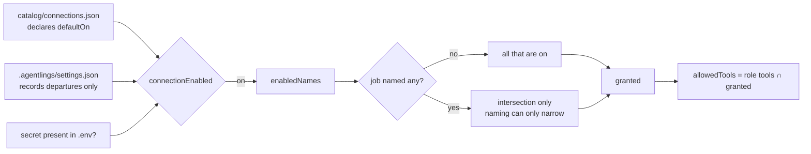
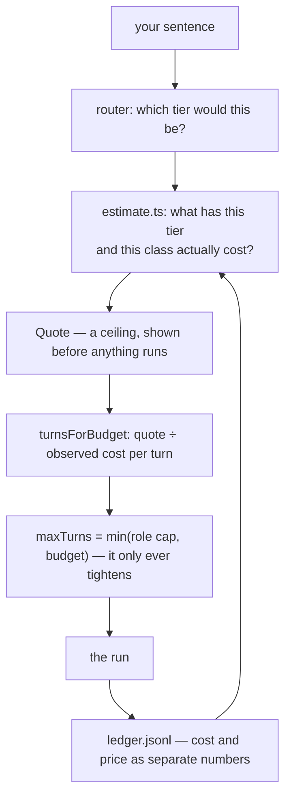
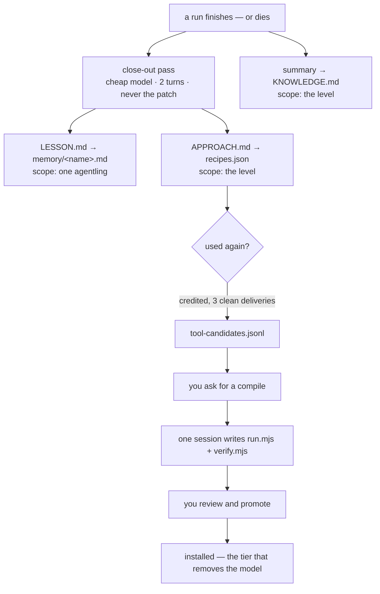
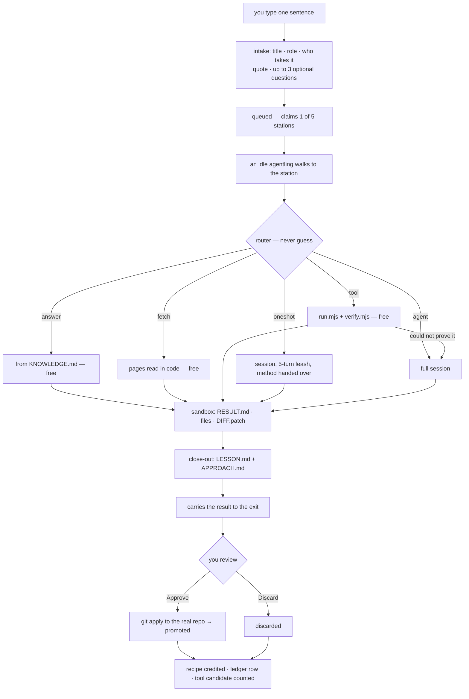
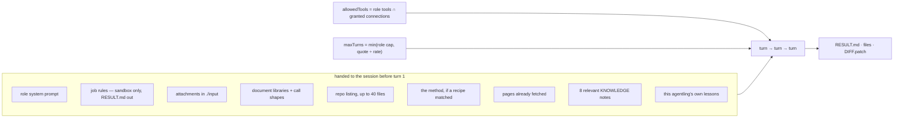

# The Agentling — a generalist CV

What one agentling is, and what it can do, *before* it is given a trade, a
skill, a level or a job. Everything here is a property of the engine rather
than of any particular crew member.

The three files are meant to be read together: `SPEC.md` says what the product
is, `DECISIONS.md` says why each choice was made and what measurement settled
it, and this one says what the thing in the middle is actually capable of.
Where a claim here was settled by evidence, the entry is cited (`D-021`).

Every capability carries a status:

| | Meaning |
|---|---|
| **Live** | Built, running, and exercised by tests or by real jobs |
| **Partial** | The mechanism exists; the thing it is for is not fully there |
| **Not built** | Designed, decided, or deliberately refused — with the reason |

Written 2026-08-01 against `e5c80c9`; §8's figures regenerate with
`npm run ledger:report`, and §15 is the list of what is not here yet.

---

## 0. At a glance

|  |  |
|---|---|
| **What it is** | One Claude Agent SDK session, run in a child process, inside a per-job sandbox, wrapped in a deterministic layer that tries not to start it at all |
| **Where it works** | `.agentlings/levels/<level>/jobs/<id>/` — a directory it may never leave |
| **What it starts with** | A name, a colour, a role, an empty memory file, and whatever its level already knows |
| **What it can touch** | Files, a shell, a git clone of your repo, web pages as text, a read-only browser, document libraries |
| **What it can never touch** | Your real repository before you approve; any credential value; anything on the far end of a network it was not granted |
| **What it is asked not to touch** | Anything outside its sandbox — an instruction and a working directory, not an OS jail. See §10 |
| **What one job costs** | Free on four of six tiers, 18c on a leash, 38c for a full session — measured, not quoted from memory (§8) |
| **What binds it** | Turns, not dollars — 10 by default, 40 hard ceiling, 5 on a recipe leash |
| **What it remembers** | Its own lessons, its level's knowledge, and the method for any job it has done before |
| **What it can become** | A script. Work done often enough compiles into a tool that runs with no model at all |
| **Who it answers to** | You, at review. Nothing it produces reaches the real world until you promote it |

---

## 1. Identity at birth — Live

A blank agentling is nine fields and a file.

| Field | At hire | Notes |
|---|---|---|
| `id` | generated | Stable for its life |
| `name` | assigned | Also the filename of its memory: `memory/<name>.md` |
| `color` | assigned tint | `0xRRGGBB`; the dot on the level card and the sprite in the world |
| `role` | chosen at hire | The whole of its capability — see §2 |
| `jobDescription` | your sentence | What *you* said it was for, in your words; seeded as its first memory |
| `state` | `idle` | `idle → walking → working → delivering` |
| `x`, `targetX` | spawn point | Presentation only; the world can never block or corrupt a job |
| `jobsDone` / `jobsFailed` | `0` | Persisted in the roster, not the sim — a restart no longer wipes a career |
| `memory/<name>.md` | absent | Created on its first lesson |

What is **not** blank: the level it is born into. A new agentling inherits its
level's `KNOWLEDGE.md`, its recipes and its compiled tools from the moment it
starts. Capability is a property of the level, not of the worker — a method
that works against one repository is not a method that works against another.

The roster is the record and the sim holds only who is awake (`crew.ts`). An
agentling can be **rested** (walks out the door, off the queue, nothing lost),
**woken** (drops back through the hatch with career and lessons intact), **let
go** (roster entry removed, lessons moved to `memory/archive/`, never deleted),
or **merged** into another of the same role (careers add, memories merge
oldest-first with duplicates dropped, an absorption note records who was folded
in). All four are blocked mid-job.

---

## 2. Trades — Live

A role is a Claude Code subagent file: `roles/<name>.md`, frontmatter plus a
system prompt as the body. **The role is the agentling.** It decides the system
prompt, the tool allowlist, the model, the mounted skills and the turn budget.
A scout with read-only tools genuinely cannot edit code — this is enforced at
the SDK session, not advised in a prompt.

| Role | For | Tools | Skills | Model | Turns |
|---|---|---|---|---|---|
| `worker` | Generalist — takes any job, masters none | read, write, edit, bash | concise-reports, check-your-work | default | 10 |
| `mason` | Builds — implements, refactors, fixes | read, write, edit, bash, grep | small-diffs, check-your-work | default | 15 |
| `scout` | Research — reads much, writes little | read, write, grep, web_fetch | concise-reports, cite-sources | Haiku 4.5 | 12 |
| `scribe` | Documentation — turns work into words | read, write, grep | concise-reports, plain-language | default | 10 |
| `analyst` | Numbers — reads records, reports what they say | read, grep, bash | concise-reports, tables-and-numbers, cite-sources | Haiku 4.5 | 6 |

Role tool names map onto SDK tools (`grep` → `Grep` + `Glob`, `web_fetch` →
`WebFetch`). A role naming no tools gets the default set: Read, Write, Edit,
Bash, Grep, Glob. A role naming `maxTurns` gets it clamped to 40.

**The catalog is global; the crews are per level.** Roles install from GitHub
URLs, SHA-pinned, preview-first: the full text plus warnings about broad tools,
outbound links and the declared licence, because installing copies the file
into your own project. Provenance is recorded, so a later sync can report
"update available" and never apply one.

---

## 3. Abilities — Live

A skill is a `SKILL.md` folder mounted into `sandbox/.claude/skills` for the
session. Six ship, hand-written against this app's contract — sandbox only,
`RESULT.md` out — which third-party skills know nothing about:

`check-your-work` · `cite-sources` · `concise-reports` · `plain-language` ·
`small-diffs` · `tables-and-numbers`

Skills install from the same library as roles, whole-folder: up to 200
companion files and 2 MB, with every remote path refused rather than sanitised
if it could climb out of its folder. The preview says how many extra files a
skill brings and that they are scripts it can run, which is the question the
preview exists to ask.

---

## 4. What an agentling can actually do

### Inside its sandbox — Live

| Activity | How |
|---|---|
| Read, write and edit files | SDK `Read` / `Write` / `Edit`, gated by role |
| Run commands | `Bash`, gated by role. No shell is available to a role without it |
| Search | `Grep` / `Glob` |
| Work on your code | `git clone --local --no-hardlinks` into `sandbox/repo`; every change captured as `DIFF.patch` after the session |
| Read your attachments | Up to 5 files, 10 MB each, waiting in `input/` — never at the sandbox root, because everything that asks "did this run deliver?" looks at top-level files |
| Produce real documents | `.docx` (docx, mammoth), `.xlsx` (exceljs), `.pptx` (pptxgenjs), `.pdf` (pdf-lib, pdf-parse) — resolved from the project root, nothing installed per job |
| Write and run scripts | Plain Node, no shell, no dependencies — this is also how a tool gets compiled (§9) |
| Report | `RESULT.md`: outcome first, evidence second |

The document libraries are named in the system prompt with their exact call
shapes, because a library nobody is told about is not a capability: watched
live, an agentling asked for a PDF hand-assembled the bytes over several turns
because it had no idea `pdf-lib` was there (D-031).

The repository listing — up to 40 files — is handed over before the first turn,
because every repo run used to open with `ls` before it could do anything, and
on a five-turn leash that orientation turn was the difference between landing
the edit and running out.

### Reaching a page — Live

Web reading is **on by default**. This is an outreach platform, so reaching a
page is what the crew is *for* rather than a permission to be granted job by
job (D-032). It is the app's own fetch, not a browser and not a raw dump: a
page comes back as readable text trimmed to 12,000 characters. A Wikipedia
article measured 573 KB raw (~143k tokens) against ~3k tokens delivered.

Two paths, one implementation:

- URLs **you** typed are fetched by plain code *before* the session starts, at
  no token cost, and land as files the agent reads.
- An in-session `fetch_page` tool calls back into the server, so extraction,
  trimming and the allowlist have one implementation.

Non-HTTP is refused. 15-second timeout, 5 MB cap.

**This reads a page you name. Finding one is the `search` connection**, added
after the gap was measured rather than guessed at: two real jobs asked the same
question, one fell back to model knowledge and said so, the other spent its
whole budget driving the browser at a search engine and died (D-053). **A
missing capability is substituted, not refused** — which is why the fix was a
search box rather than a better browser.

**Verified on that same failing prompt** (D-054): with the browser still
switched on and available, it searched, read two pages and wrote up a
cross-checked answer in 9 turns — never opening the browser. A turn cost 4.4c
against the 2.0c a no-repo session averages, because fetched pages are input
tokens on every subsequent turn. Search buys accuracy the same way a clone buys
context: by making every turn dearer.

The two compose and both trim: `search_web` returns titles, snippets and links,
then `fetch_page` reads the one that was chosen. `WebSearch` — the SDK's own —
is still never granted, and a session reaching for it is denied.

### Driving a browser — Partial (reads, cannot act)

Playwright MCP, headless and isolated, fetched by `npx` so no code lands in the
repo. **Eight** of its twenty-four tools are granted, and all eight read:

`browser_navigate` · `browser_navigate_back` · `browser_snapshot` ·
`browser_find` · `browser_wait_for` · `browser_take_screenshot` ·
`browser_console_messages` · `browser_network_requests`

Twelve that act are deliberately absent — `click`, `type`, `fill_form`,
`press_key`, `select_option`, `drag`, `drop`, `file_upload`, `handle_dialog`,
`evaluate`, `run_code_unsafe`, `network_request`. `catalog.test.ts` asserts
those names against the shipped catalog, so the boundary is a test rather than
a description of one. Why, in full, is §11.

**Measured again in production, and the case is still weak** (D-053). A run
sent looking for a fact it could not search for spent ten tool calls in the
browser and exhausted its turns; its last act was to ask for `browser_evaluate`
— one of the twelve it does not have — and be refused. The same question,
worded without "find out", was answered in three calls for 34c. D-035's negative
measurement now has a live failure behind it.

It ships **off**. Signing in, when you want it, works by re-using a session you
made yourself: log in once in a real browser, save the storage state, point
`AGENTLINGS_BROWSER_STATE` at the file. The app never sees a password, and with
the variable unset the argument is dropped and browsing works signed out.

### Answering a run — Live

A job can carry `continues: <jobId>`. The earlier run's sandbox is carried
forward — `RESULT.md`, `DIFF.patch`, `LESSON.md`, `APPROACH.md` — so a reply
picks up where that run stopped instead of paying to redo it (D-033).

---

## 5. Reach outside the sandbox

### The rule

Nothing is ambient. A job gets what the platform has switched on, narrowed to
what it named, and nothing else. This is both the security boundary and the
cost one: every visible tool is definition overhead in every request of the
session.



Four properties worth stating plainly:

1. **Settings is authoritative.** A job cannot name its way past a switch you
   turned off. Never switched on is not the same as not switched off.
2. **Naming a connection can only narrow.** Per-job opt-in is about not
   carrying tool definitions you do not need, not about a job granting itself
   something.
3. **A connection that cannot work is not a preference.** Missing secret means
   never live, whatever its default says.
4. **One resolver, three readers** — the quote, the router and the executor all
   ask the same function. Measured on the same sentence: web on quotes `routed`
   / "Free — we already know this"; web off quotes `session` / "Up to $1.58".
   Two answers here would be dollars apart (D-032).

The SDK's own `WebFetch` and `WebSearch` are gated by the same door. They were
not, once: a role naming `web_fetch` got them whatever the user had switched
off, so the app's fetch was gated and this second door was not.

### What ships

| Connection | Transport | Default | Status |
|---|---|---|---|
| `web` — read web pages | builtin | **on** | Live |
| `github` — read a code host | builtin | off, needs `GITHUB_TOKEN` | Live, read-only |
| `search` — find pages | builtin | off, needs `BRAVE_API_KEY` | Live, read-only |
| `browser` — read pages in a real browser | stdio (Playwright MCP) | off | Partial, read-only |

Your own notes are **not** a connection and deliberately never became one — see
below.

### Reading your own notes — Live, and not a connection

A level can be pointed at folders of your own material. They are read **once,
by a sync you ask for**, into `store-index.json` beside that level's other
files; the crew reads the index and never the source (D-047).

That is not an implementation detail, it is the reason this exists at all. Every
guarantee here rests on one shape — work in a sandbox, review, promote; nothing
arrives unread — and a live connection to a notes store hands a session reach
into a corpus nobody has looked at. An index is a file you can open first.

| | |
|---|---|
| What is indexed | `.md` `.markdown` `.mdx` `.txt`, walked recursively; dotfolders and `node_modules` skipped |
| What a passage is | A markdown section, split at headings, heading kept — usually the only place the subject is named |
| Size | 600 chars a passage, 250 files a source, the overflow **reported** rather than dropped quietly |
| Provenance | Every line ends `[<file>, synced <date>]`, so a free answer and a session's context both say where it came from |
| Staleness | Past a week the index contributes **nothing** — the free tier cannot answer from it and the job falls through to a session that can go and look |
| Scope | Per level, like recipes and tools: a note about one project is not a note about another (D-013) |

It joins the recall corpus rather than sitting beside it: `readKnowledge`
returns lines, so an index that emits lines needed no new tier, no router branch
and no second scorer.

**Measured on real work, and the shape of the win is lopsided** (D-049). A
recall question it covered was answered `routed`, **$0, no session at all** —
the whole session avoided. But paired on a question where the crew already had
a clone of the same files, it saved **1 turn and 2.45c of 27c, about 9%**, on
n=1, with both answers equally correct. Its lines are input tokens on every
turn, so it makes each turn dearer and buys fewer of them. Point it at material
the crew *cannot otherwise reach*; pointing it at a repository it already
clones is close to its worst case.

Set up from **reading** in the level header: add a folder and it is read on the
spot, since a saved folder nobody read is a setting that looks done and does
nothing. The panel shows how much it holds and when it was read, flags a source
that is **not found** — re-checked on every open, so a folder since moved is
caught and not only a typo — and says plainly when the copy has gone stale and
the crew has therefore stopped using it, which is invisible anywhere else.

### Reading a code host — Live, read-only

Seven tools: `list_pull_requests` · `get_pull_request` · `get_pull_request_files`
· `list_issues` · `get_issue` · `list_commits` ·
`get_file_contents`. Enough for "what broke on main" and "summarise this PR"
without the crew having a clone.

**It is builtin rather than an MCP server, and that was a decision** (D-040).
The reference GitHub MCP server is deprecated by npm, and GitHub's supported
replacement ships as Docker or a remote HTTP endpoint this registry cannot
express. Builtin turned out better regardless, for the reason the catalog
already gives about stdio — *the budget for a stdio server is that server's own
flags, not ours* — and a code host is exactly where that bites. Measured on 30
open issues from a real repository: **150,320 characters of raw API JSON
against 3,969 delivered, 38× smaller.** Owning the call means owning the size
of the answer.

**It reads and cannot act.** Of the 26 tools the reference server exposes —
enumerated by speaking JSON-RPC to it rather than trusting its README — the
twelve that create, update, comment, merge, push or fork are absent.
`catalog.test.ts` asserts the grant and `github.test.ts` asserts the
implementation, so the boundary is two tests rather than a sentence.
`get_pull_request_files` deliberately returns names and line counts and never
the patch, though the API offers one on every entry: a diff is unbounded, and
it is what makes a turn expensive.

The token is required, not optional as it is for the library — a connection
whose secret is missing is listed as not ready and can never be switched on.

### Connecting to other apps — Partial

One credentialed connection is plugged in — the code host above — and it is
builtin, so the *external* socket still carries nothing but the browser. An
external MCP server is declared with `name`, `label`, `transport: "stdio"`,
`command`, `args`, `tools` and optional
`secrets: {ENV_NAME: "why it is needed"}`.

- **The tool list is the grant.** A server offering both reading and acting can
  be adopted for reading alone by naming only its reading tools; anything not
  named is refused by the allowlist. It also makes the catalog say what a
  connection can do without anyone having to run it.
- **Secrets are referenced by environment variable name.** Values never appear
  in the registry, never cross the API, and reach only the connection they were
  declared for.
- **`${VAR}` in an argument** is filled from the environment, and the whole
  argument is *dropped* when the variable is unset — which is what makes an
  optional sign-in optional.
- **They all ship off.** Credentialed connections carry credentials and act on
  the user's behalf, which is a different decision from reading a page (D-005).

**Not built:** everything else credentialed. Not Gmail, not a calendar, not a
ticket tracker, not a database. And one shape the registry cannot express at
all: `transport` is `builtin | stdio`, so a **hosted MCP server reached over
HTTP** — which is how most vendors now ship, GitHub's own included — has no
place to go. That is the first thing to fix if the next connection is somebody
else's rather than ours.

**Never:** borrowing claude.ai or Claude Code connector auth. The app owns its
own external credentials or has none — a stated non-goal.

---

## 6. What a turn costs, and who pays

### Quote → turns → ledger



**The quote is a lookup, not a model.** It asks the router what it would do,
then asks the ledger what that tier and class have actually cost. It tightens
as history accumulates — which is only possible because the router sorts work
into tiers with genuinely different cost behaviour.

**Turns are the only enforcement that exists before the money is spent.** The
session stream carries no running cost: measured, the only `total_cost_usd` in
a 35-message session arrives on the final message, and per-message usage is
partial (52 output tokens reported against a true 568). A mid-flight dollar
check cannot stop an overspend, only notice one after the money is gone. So the
ceiling is converted into turns at what a turn of this work has really cost.

**A turn is priced by the shape of the work, not just the role.** Measured
2026-07-31, a repo run burnt 7.4c/turn against 1.8c for the same role without
one, because the clone puts hundreds of thousands of cached tokens in front of
every turn. A rate pooled across both shapes predicted neither: the budget
worked out to 17 turns against a role cap of 8, so the cap always won and the
ceiling could never bind on anything (D-018).

**The rate prices a turn *granted*, never a turn the SDK reports.** A cap of 4
came back as 6 when the run was cut off, and lower when it finished early. The
gap can be much wider: a scout capped at 12 reported **21**. Across the ledger
`turns > turnsAllowed` fires on 43 of 88 paid runs and seven of those *finished*,
so the reported count is not a cut-off marker and reasoning built on it has
already been wrong once (D-022, D-052).

**Since D-052 a row also records what the run spent itself on** — `toolCalls`
and `lastTool`, counted off the tool stream. Recorded and read by nobody, but
it is the only number that survives a *killed* run: a cancelled session never
reaches the result message the SDK reports cost and turns on, so its row shows
`costUnknown` and no turns at all, while still saying it made 3 calls and was
last reading.

**`lastTool` is what the model asked for, not what it got.** A run whose last
call was `browser_evaluate` was *refused* it — that tool is not granted. Read
the connection's tool list before reading a name here as something that
happened; the same trap once made a denied `WebFetch` look like a leak (D-053).

### Rules the user can rely on

- **Nothing is billed above its quote.** `priceFor` takes the minimum.
- **Every way in carries a ceiling**, which is what makes the line above mean
  anything: an unquoted route has no minimum to take, so the cap silently does
  not apply. Two have been found and closed — `POST /jobs` (D-027) and
  `POST /jobs/:id/redo` (D-049), both by tripping over a row with no
  `quotedUsd` rather than by a test. A redo is quoted as a **session** because
  it sets `noRouter`: the router would price the same job `routed`, $0, for a
  run that is really going to be a full session.
- **Failed work is charged nothing.** The app absorbs it.
- **Work quoted free that then cost money is absorbed too** — if a compiled
  tool claimed a job, could not prove its output, and a session had to do it
  after all, you were promised free and a promise of free that arrives as a
  bill is the one thing the quote exists to prevent.
- **A quote may never come in under the turns it has already decided to
  grant.** A tier calibrated on its own failures cannot otherwise escape them:
  the recipe tier's history was thirteen runs that died on a three-turn leash,
  so it quoted 22c, which funded three turns, which was the leash that was
  failing (D-026).
- **The quote reads every run that spent money**, not only the ones that
  landed. The runs that break a quote are exactly the ones that exhaust their
  turns and file failed — a done-only average is blind to its own worst cases
  by construction. Measured: a job quoted at 30c cost 59c, ran out of turns,
  and the quote for the identical next job did not move a cent (D-017).
- **Two ceilings, not one.** 50c is what ignorance quotes; $2 exists only so
  one freak run cannot set every later quote for its class. They were the same
  number until that caused a breach (D-016).
- **What the ledger records is what actually happened.** The job class is the
  role that *ran* the work, not the role the matcher named — a job routed to a
  role nobody holds is picked up by whoever is free and runs as their role.

**Not built:** any actual billing. There is no invoice, no payment, no user to
charge. The spine is built for pass-through because a ledger cannot be
reconstructed retroactively, and the shape has to exist from the first entry or
the history is worthless (D-012).

---

## 7. The six tiers — Live

Every request that never reaches the model costs nothing, so this is the
largest saving available and the most dangerous, because an answer given
without the agent is an answer nobody checked.

> **The rule is: never guess.** The router claims only work whose shape it
> recognises exactly. Everything else falls through to a session untouched. A
> missed saving costs money; a wrong answer costs trust.

| Tier | Fires when | Cost | What runs |
|---|---|---|---|
| `answer` | A question about what this level already knows, answered from `KNOWLEDGE.md`; or an exact repeat with a stored answer | free | Plain code |
| `fetch` | A bare "read this page" — addresses plus words that only mean *fetch* | free | Plain code |
| `search` | A bare "find me pages about X" — a search instruction and a subject, with nothing asked *about* the results | free | One API call |
| `tool` | A compiled tool matches the job's words **and** its shape | free | Two Node scripts |
| `oneshot` | A recipe matches strongly (≥ 0.65) — the method, on a 5-turn leash | 18c | A short session |
| `agent` | Everything else. A weak match (≥ 0.3) still lends its method | 38c | A full session |

Those two figures are measured over 86 jobs, not estimated — §8 has the
workings and the command that regenerates them.

Guards that keep the free tiers honest:

- A **stored answer** is replayed only on an exact prompt repeat with **no
  repository and no web access**. The same words against a different repo are a
  different question.
- A run that **made something** banks only its method, never its answer.
  Measured on job `57bbff81`: a run that had written a PDF banked its own
  summary, and the next identical request was answered for free with
  "hello-world.pdf (1,380 bytes) is a valid one-page PDF" — and no PDF.
- An **attachment** makes an answer unrepeatable even when the run produced
  nothing, because the recipe key is the prompt: "summarise the attached
  contract" would replay contract A's summary for contract B.
- **"Do it properly"** re-queues with `noRouter` when you disagree with a
  routed answer.

---

## 8. What costs money — Live

Every figure in this section is generated from `.agentlings/ledger.jsonl`:

```bash
npm run ledger:report
```

Run it rather than trusting what is printed below. The numbers here were taken
on **2026-08-02, over 86 jobs spanning 2026-07-30 to 2026-08-02** — and the
reason the command exists is that `SPEC.md` carried "~13c / ~50c" for the two
paid tiers until that day, by which point the real figures were 19.2c and
39.2c. A cost written into prose is a cost nobody recomputes.

### The three classes

**Free — no model runs at all.** These cost nothing however often you use them.

| Process | Why it is free |
|---|---|
| Intake: matching, titling, choosing who takes it | `match.ts` is BM25 plus a hand-written concept map. Local, deterministic, no auth, no network |
| The pre-flight questions | `clarify.ts`, deterministic rules; never asked on free work |
| The quote itself | A lookup over the ledger, not a model |
| `answer` tier | Recall from `KNOWLEDGE.md`, or an exact repeat with a stored answer |
| `fetch` tier | Pages pulled by plain code before any session starts |
| `tool` tier | Two plain-node scripts, no dependencies, no network |
| Library sync, search, install | GitHub's API, unauthenticated unless `GITHUB_TOKEN` is set |
| The world, the sim, the sockets | Deterministic by design — no LLM call decides movement |

**Paid — a model runs.**

| Process | Measured | Notes |
|---|---|---|
| `oneshot` — a recipe on a 5-turn leash | **17.9c** mean, 47c max | 4.5c per turn with a repo, 4.0c without |
| `agent` — a full session | **37.8c** mean, $1.32 max | 5.8c per turn with a repo, 2.1c without |
| The close-out write-up | ~2c | Cheap model, 2 turns, never handed the patch. Runs after every job that left anything behind, including the ones that died |
| A compile (promoting a recipe to a tool) | ~$1 | Its own turn cap, quoted like any session. Four so far |
| The optional refine tier on intake | fractions of a cent | One Haiku turn, no tools. Every failure path falls back to the local answer |

**Free to run, but it puts tokens in a paid session.** The trap worth naming:
these charge nothing themselves and are not free.

| Process | What it really costs |
|---|---|
| `fetch_page` inside a session | The trimmed text is input tokens on every subsequent turn. Trimming to 12,000 chars is what keeps it small — a Wikipedia article is 573 KB raw, ~3k tokens delivered |
| The read-only browser | Measured at 0.65c/turn in D-035 — cheap, but every snapshot is tokens |
| A repo clone | The largest single driver of what a turn costs: 5.8c against 2.8c for the same tier without one |
| Attachments | A large document eats context the turn budget was priced without. The quote does not yet know they exist |

### What you are actually charged

Three rules, all enforced in `priceFor` rather than promised in prose:

- **Never above the quote.** The charge is `min(cost, quoted)`.
- **Failed work is free.** The app absorbs it — and a run that finished but
  left nothing behind is failed work, however politely it ended. Delivery is
  what the statuses classify, not how the session exited (D-041).
- **A promise of free that fails stays free.** If a compiled tool claimed a job,
  could not prove its output, and a session had to do it, the run is absorbed.

Over those 86 jobs that came to: **spent $19.38, chargeable $7.46, absorbed
$11.71.** Sixty per cent of all money spent was never charged for.

Most of that is failed work, driven by the one-shot tier at 5 done against 21
failed — a fact about a short leash rather than a fault, since a leashed run
trades the write-up for a much cheaper run, and `partial` exists because
calling the result a failure hides work that is ready to promote.

The rest, **83.4c over two jobs, is the third rule above doing its work**: a
compiled tool claimed the job, could not finish, and the session that rescued
it was absorbed rather than billed against a quote of free.

Four rows are marked `costUnknown`: a killed session never reaches the message
the SDK reports cost on, so its spend is real and unmeasurable. Read the totals
as *at least*.

### Does it get cheaper? Two step-downs, not a curve

This is the part worth reading carefully, because the obvious metric cannot
show the effect.

| | Jobs | Free | Spent | Mean per job |
|---|---|---|---|---|
| First half | 43 | 21% | $6.86 | 16.0c |
| Second half | 43 | 26% | $12.52 | **29.1c** |

The free share barely moved and the mean cost per job doubled. Both are true:
the cheap tiers took the easy work while the paid half absorbed four compiles
at about $1 each. **Mean cost per job is dominated by novel work and will never
show learning**, so it is the wrong number to watch — and it is unstable as
well as uninformative: across three recomputations these two rows have read
18%/30%, then 22%/24%, then 21%/26% — moved by where the halfway point falls
and by nothing else.

Nor does a recipe make one job cheaper by degrees. Its runs are flat —

```
13 runs  "in slugify.js, make slugify robust…"   9.4c → 11.1c → 14.8c → … → 13.2c
 4 runs  "write exports.md at the repo root…"    46.6c → 28.1c → 46.8c → 37.8c
```

— because a recipe cuts the price **once**, by moving the job down a tier, and
then holds it there. There are exactly two step-downs, and both are discrete:

| Step | Fires when | Measured |
|---|---|---|
| session → one-shot | A recipe matches strongly | 37.8c → 17.9c, **53% off** |
| one-shot → tool | Three deliveries, then you approve a compile | 17.9c → free, **100% off** |

**That first figure is a population average across two whole tiers, and the
per-job saving is about half of it.** Five jobs have now been run on both
tiers, which is the only comparison that answers "what did the leash do to
*this* job":

| Job | Session | Leash | |
|---|---|---|---|
| make slugify robust | 13.4c | 11.0c | 18% off |
| write a note in anchor2.md | 20.9c | 13.9c | 33% off |
| write exports.md at the repo root | 66.9c | 39.8c | 41% off |
| read a reddit page | 36.5c | 21.2c | 42% off |
| summarise recent commits | 7.2c | 7.3c | **1% dearer** |

So: 18–42% on work that was exploring, and nothing on work that was not. What a
recipe removes is the exploring, and the commit summary had none to remove — a
Haiku scout calling one tool and writing one file, with a fixed ~2.2c close-out
either way (D-042). The leash still binds; it had nothing to bind against.

**The two numbers have already been seen to move independently**, which is the
argument for keeping both. Three more leashed runs of that commit summary took
the headline from 50% to 53% — nothing improved, the cheap runs simply pulled
the tier mean down — while the per-job column barely stirred and its worst case
went from 11% dearer to 1% dearer. A tier average moves when the *mix* changes;
only the per-job column moves when a job does.

Read the sample size before trusting any of it: five jobs. The honest summary
is that the step-down is largest where runs are long and wandering and
approaches zero — or reverses — on work already cheap and tight.

**And five is out of what can be seen, not out of what happened.** A run is
matched to its job by its prompt, from the job record, so **10 paid rows cannot
be grouped at all** — their job records are gone and which job they were is
unknowable. The report says so rather than averaging over the remainder, and
the same caveat applies here: those rows might have been repeats, and nothing
above would know.

The second step, compiling to a tool, is the unconditional one, because it
removes the model rather than shortening it. `write exports.md` shows the whole
ladder in one line: **78.2c session → 46.6c leashed → free, twice.**

So the number that tracks the intent is **what share of work has descended the
ladder, and what the descent avoided** — not any average.

**Avoided so far: about $8.59, against $19.38 actually spent.** 28 one-shot
runs saved ~$5.57 and 8 free runs saved ~$3.02, pricing each at what a session
would have cost. It is a counterfactual and the report says so: the assumption
is that each would otherwise have run as an ordinary session, which is what the
router's fall-through would have made it.

**The honest caveat, which applies to this whole section.** 86 jobs over three
days is a small and mostly synthetic sample — nearly every one was queued to
exercise a mechanism rather than to get work done, and there has been about one
genuine repeat. The machinery for the fourth tier was built ahead of the demand
deliberately and with that known (D-021). These figures describe a test bench,
not a workload.

### The write-up is priced apart from the session — Live

A close-out costs **2–5c, mean 3.3c** — about 9% of a session, not the
rounding error it was assumed to be. It is part of what you spend and is
deliberately excluded from every per-turn rate, because the write-up is a fixed
errand on a cheap model rather than something a turn budget buys more or less
of. Charging it to the session's turns makes each turn look dearer and grants
fewer of them.

That separation was specified from the start and did not exist until
2026-08-01: the field was set on the meter, declared in `JobMeter`, shown on
the terminal card, and dropped by the one function that built the ledger row —
79 jobs with no split recorded (D-039). Found by computing something from the
data and noticing a column missing, which is the argument for
`npm run ledger:report` existing at all.

Fixing the copy would have shipped inert, so the history was recovered **by
identification**: 13 rows still had their split in a surviving job record and
were matched on `jobId`; one was refused because its recorded write-up equalled
its total, which is a killed run that measured nothing else. The other 65 keep
no split and are read as all-session, which is what they meant when written.
Nothing was inferred from an average — stamping the 3.53c mean onto rows that
never recorded one would manufacture history indistinguishable from the real
thing.

Measured effect on the rates, before against after:

| Class, tier, shape | Before | After | |
|---|---|---|---|
| scribe · session · repo | 7.53c | 7.38c | −2.0% |
| scribe · one-shot · repo | 5.37c | 5.03c | −6.3% |
| worker · session · repo | 4.93c | 4.80c | −2.6% |
| worker · session · no repo | 2.97c | 2.82c | −5.1% |
| worker · one-shot · repo | 3.72c | 3.67c | −1.3% |

**Small today, and honestly so.** At a 50c ceiling only one of those five
classes wins a turn (worker without a repo, 16 → 17); the rest are unchanged,
and several are clamped by their role's cap regardless. The recovery covers 13
of 79 rows, so it understates what the fix does from here: every new row
carries the split, which makes the correction the full ~9% rather than the
1–6% recoverable retrospectively. Nobody was ever over-billed by it — the
charge is capped by `priceFor` independently — which is precisely why it stayed
invisible for 79 jobs.

---

## 9. How an agentling learns

Four things accumulate, at three different scopes.



### The close-out pass — Live

**The write-up is not the session's job.** A separate pass runs afterwards on a
cheap model with two turns, handed the run's own `RESULT.md` and the *names* of
the files it changed — never the patch, because a patch is what makes a turn
expensive.

It runs after **every job that left anything behind, including the ones that
died**, which are most of them. Asking the session itself produced nothing: the
write-up competed with the work for turns, so it was cut first, and 13 of 13
recipe runs died before writing either file. Anything that learns only from
clean successes goes blind exactly where a short leash puts most of its runs
(D-020).

### Recipes — Live

A recipe stores an **approach**, not an answer: how to do this *kind* of job
without exploring. Keyed on the normalised prompt, terms stemmed and weighted
by rarity, and recomputed from the key on read rather than trusted from disk —
so changing how words are stemmed can never strand the recipes written before
it.

**Two bars, because the two mistakes cost different amounts.** A strong match
(0.65) shortens the run to five turns. A weak one (0.3) hands over the method
and leaves the leash alone: a wrong method given to a full-length session
wastes a turn it can ignore; the same method with the leash cut wastes the
whole run (D-019, D-023).

### The capability surface — Live

A method is only as good as what was available when it was found. Every recipe
records the surface it was learned under, as one sorted token list:

```
conn:web  conn:browser  tool:Read  tool:Bash  skill:small-diffs  lib:pdf-lib
```

When the surface has changed, the recipe still lends its method but no longer
shortens the leash — the crew has to be able to notice it has grown. Model and
turn cap are deliberately *absent* from the list: they change how *well* a run
does something, not what it can do, and a leashed run takes five turns
regardless of its role's cap (D-036, D-037).

### Compiled tools — Live

The fourth tier, and the only one that makes a cost per task actually fall. A
recipe makes repeat work cheaper by saving the exploring, and still pays a
model to read it. **A tool removes the model:** the agent stops being the thing
that does the job and becomes the thing that once wrote down how.
Interpretation compiled.

This also settles when to call the API at all — *pay for judgement that has not
been compiled yet, and nothing else* — and it sets the honest ceiling: "add
tests for module X" never compiles, because the assertions depend on the
module; "list the modules with no test file" does. Tools take the scaffolding,
sessions keep the judgement (D-021).

**A tool belongs to its level, and inside it to everyone.** `usableTools` is
not scoped per agentling, so a method one of them earned is a method the whole
crew has. It cannot leave that level, which is D-013 on purpose — and also the
ceiling on the whole idea, since the cost curve then bends per project and
starts again at zero in a new one. What would let a tool graduate, and why only
a *tool* may (mechanics carry no context; a recipe or a lesson is prose about
one), is D-050. Not built: it needs the same work proven in two levels, and
there is one.

**Each tool records the surface it was compiled under** and nothing reads it.
A tool is Node built-ins only, so none of the four axes a surface records can
invalidate one today; a moved surface makes it dated, not wrong, and its output
is proved by `verify.mjs` on every run anyway. It is recorded because the field
could not be added backwards — 4 of the 5 tools on this machine predate it and
their surface is simply unknown (D-050).

**There is a sharper test than that, learned by compiling the wrong thing.** A
recipe for writing a short explanatory note reached the gate and compiled
cleanly — into a `run.mjs` holding the note as a string literal. That is a
cache, not a method, and it makes the tier's own safety check circular: a
`verify.mjs` written by the same session, checking a constant that session
hardcoded, can never fail. The router's matching then offers it to neighbouring
questions — measured at 0.70 for "what a web manifest is" and 0.78 for "what
CORS is", both over the 0.65 bar — so asking about CORS would have returned the
favicon note, free and verified. **If the answer is a literal in `run.mjs`, it
compiled a cache.** Discarded on review, which is what review is for (D-045).

A tool is a directory holding a manifest and two plain-node ES modules,
`run.mjs` and `verify.mjs` — no shell, no dependencies, no network. Nothing
about it is trusted:

- It matches on the **strong bar only**, and on **shape** as well as words. A
  script written against a clone is simply wrong where there is no clone, and
  the two jobs can be worded identically.
- It must **prove its own output**, checked in a second process, because a run
  that crashed cannot be trusted to report that it crashed. Work it cannot
  prove is discarded — the files as well as the result, since the files *are*
  the work — and the sandbox is emptied before the session redoes the job.
- **Two failures in a row retire it.** One is noise; three is a habit you paid
  for twice. A hang is killed at 60 seconds.

**Promotion is a request, never automatic.** It spends money, and a promotion
nobody asked for is a charge nobody quoted. It refuses a recipe that has not
landed three times, then queues one session whose brief insists on the check
harder than on the script — without one, the tier is only a faster way to be
wrong. The scripts land in that session's sandbox and are installed only when
it is **reviewed and promoted**, exactly like a library install: a generated
tool is executable instruction. A second attempt is told how the first failed,
because a retry that is not is an identical first try at the same price.

**It also refuses work that could never be a script.** Landing three times says
a method is repeatable; it does not say it is compilable, and the first recipe
to reach the gate on its own was one that could not be — "list the last 10
commits on GitHub" earned its deliveries through the code-host connection, and
a tool is plain node with no network. Promotion now reads the connections the
recipe was learned with, minus the ones that are on by default, and refuses
with the reason. Caught before it spent the dollar (D-044).

### Level knowledge — Live

Every finished job appends to the level's `KNOWLEDGE.md`. A session is given
the **eight most relevant notes for its own job**, chosen by the same term
overlap the recall tier uses — never another level's, and never simply the most
recent. Feeding it the twelve most recent instead showed a job about billing
whatever happened to be done yesterday.

Since D-048 that corpus is the crew's own notes **plus** whatever your
knowledge store has indexed, scored together and told apart by the source each
store line carries.

**Relevance is scored on what the question is about.** The asking words — know,
learn, find, remind, tell — are dropped first, because they arrive in every
question that reaches the recall tier and are therefore evidence of nothing.
Until this was fixed, "what do we know about quantum tunnelling" was answered
free against `hq` from a note about `EXPORTS.md`: 1 of 86 notes matched, sharing
exactly `['know']`. The free tier's promise is never guess, and it had been
guessing on the one word guaranteed to be there.

---

## 10. Boundaries

### The sandbox — Partial, and this is the one to read carefully

The sandbox is the session's working directory plus a rule in its system
prompt: *work only inside the sandbox; never read or write paths outside it.*
It is **not an OS jail**. `Bash` runs with your own permissions, and
`permissionMode: 'dontAsk'` means there is no interactive gate to catch a stray
command. A session that decided to walk up a directory could.

What actually holds, and what the app's guarantees really rest on:

- **Your repository is a clone.** Nothing a session does reaches the real tree
  until you press Approve, at which point a *reviewed* patch is replayed. That
  is enforced by the shape of the flow, not by trust.
- **The tool allowlist is enforced.** A role without `write` has no `Write`
  tool at all. A connection you switched off contributes no tools.
- **The session inherits nothing.** `settingSources: []` — your own Claude Code
  settings, project rules and skills do not leak into an agentling's session.

Treat the sandbox as a strong convention that has held in practice, and the
clone-plus-review as the actual guarantee. Do not point a level at a repository
you would not let a shell near.

### The rest — Live

| Boundary | Enforcement |
|---|---|
| Tools are the intersection of the role and what you allowed | `allowedTools` is a strict allowlist; `permissionMode: dontAsk` means there is no prompt to talk past |
| The SDK never enters the server | Sessions run in `agent-runner.mjs`, plain JS spawned with plain node — its import graph stays out, and a wedged session cannot take the server down |
| A server started inside a Claude Code terminal cannot inherit that session | The child environment is laundered of `CLAUDE*`, `ANTHROPIC_BASE_URL` and `ANTHROPIC_AUTH_TOKEN` |
| A session cannot run forever | 10-minute timeout, 40-turn hard ceiling whatever a role's frontmatter says |
| A compiled tool cannot run forever | 60-second timeout, killed |
| Remote paths cannot climb out of their folder | Refused rather than sanitised — there is no legitimate skill that needs `..` or a drive letter |
| A torn ledger line cannot lose the history | Parsed line by line; a bad line is skipped, not fatal |

The world is presentation. The server sim owns all state and the client renders
it; nothing in the world may block or corrupt a job, and no LLM call decides
movement.

---

## 11. Representation and privacy — the honest section

### Acting on your behalf — Not built, deliberately

An agentling **cannot act in the world**. It cannot click, type, submit a form,
sign in, send a message, place an order, or issue an arbitrary HTTP request. It
can read, and it can produce files you then approve.

This is structural rather than incidental. Every guarantee this app makes rests
on one shape — **work in a sandbox, review, promote** — and a diff can be
inspected before it touches anything real. `browser_click` on "Confirm order"
happens on the live internet the instant the model decides to, and there is no
promote step for a submitted form. The obvious mitigation, pausing a run to
ask, needs a `waiting` job status and a runner holding stdin, which was refused
for separate reasons (D-030, D-034).

So the first version reads and cannot act. That removes the real limitation —
a plain HTTP GET returns an empty shell on most modern sites — without adding a
new risk class, and it produces the cost data needed to price an acting version
honestly. **Adding an acting tool is a decision about the safety model, not a
line in a list.**

### Personal data — Partial, and the gap is worth naming

What is true today:

- **Localhost only.** No multi-user, no auth, no hosting, no telemetry. The
  server binds a local port and the browser talks to it.
- **`.agentlings/` is gitignored.** The app's memory is not the repository's:
  the ledger, the sandboxes, the rosters, the lessons and everything fetched
  stay out of version control.
- **Secret values never move.** The registry holds environment variable *names*
  and a reason each is needed. Values never appear in the registry, never cross
  the API, never reach the UI, and are passed only to the connection that
  declared them.
- **Sign-in without a password.** The browser's storage-state file is one you
  make yourself; the app passes a path and never reads a credential. The file
  is a bearer token for every site in it, so it is gitignored.
- **Attachments are confined.** They land in `input/` inside the sandbox and
  the prompt tells the session not to go looking elsewhere.
- **The catalog token is scoped.** `GITHUB_TOKEN`, when set, is sent to the API
  host only and never to raw file hosts.

What is **not built**, and should not be assumed:

- **No classification, redaction or masking.** An attached document, a repo
  file or a fetched page goes into a Claude API session whole. If it contains
  personal data, the model sees it.
- **No retention policy.** Sandboxes, fetched pages, attachments, lessons and
  ledger rows persist under `.agentlings/` until you delete them. Nothing
  expires.
- **No audit of what left the machine.** The ledger records what a job cost,
  not what it sent.
- **No per-level or per-job data boundary beyond the sandbox directory.**
  Levels do not share sandboxes, but nothing stops you pointing two levels at
  the same repository.
- **No filesystem isolation.** The sandbox is a working directory and an
  instruction, not a jail — see §10. A session with `Bash` runs as you do.

The honest one-line summary: **privacy here is the sandbox, the localhost
boundary and the absence of any credential the app holds itself — not a data
control plane.**

---

## 12. The loop

### One job, end to end



Failure does not leave the loop: on failure the agentling walks home, the job
is marked `failed`, the close-out still runs, and the recipe is still credited
if it was used. A run that delivered something and then ran out of turns is
`partial` — its own outcome, not a failure, because calling it one hides work
that is ready to promote.

### Inside one session



Nothing in that list asks for `LESSON.md` or `APPROACH.md`. They used to
compete with the work for turns, so they were cut first and the crew learned
nothing.

### Researching, specifically

`scout` on Haiku, twelve turns, read + grep + web_fetch and no write. URLs you
named are already on disk. `fetch_page` trims each page to 12,000 characters of
readable text. With the browser switched on it can also open a JavaScript site
and read what renders — and cannot touch it. `cite-sources` and
`concise-reports` are mounted, so the report names where every claim came from.

### Editing code, specifically

`mason`, fifteen turns, read + write + edit + bash + grep. The repository is a
local clone at `./repo` with its listing already provided. Everything it does
lands in `DIFF.patch`, summarised into files/added/removed for the review card.
`small-diffs` and `check-your-work` are mounted. Your real repository is
untouched until you press Approve.

---

## 13. Reference — every number that binds

### Turns

| Constant | Value | Where | What it does |
|---|---|---|---|
| `DEFAULT_MAX_TURNS` | 10 | `executors/claude.ts` | A role that names no budget |
| `TURN_CEILING` | 40 | `executors/claude.ts` | Hard clamp; a typo cannot uncap the loop |
| `RECIPE_TURNS` | 5 | `executors/claude.ts` | The leash on a strong recipe match |
| `COMPILE_TURNS` | 10 | `executors/claude.ts` | A compile gets its own cap, not the role's |
| `CLOSEOUT_TURNS` | 2 | `executors/claude.ts` | The write-up pass |
| `SESSION_TIMEOUT_MS` | 10 min | `executors/claude.ts` | Wall clock on one session |

### Money

| Constant | Value | Where | What it does |
|---|---|---|---|
| `DEFAULT_CEILING_USD` | $0.50 | `estimate.ts` | What ignorance quotes |
| `ONESHOT_CEILING_USD` | $0.10 | `estimate.ts` | One call cannot run away like a loop |
| `MAX_CEILING_USD` | $2.00 | `estimate.ts` | Runaway clamp; `AGENTLINGS_MAX_COST_USD` overrides |
| ceiling formula | `max(mean × 2, max × 1.2)` | `estimate.ts` | Room to exceed the average without breaking the quote |
| `certainty` | ≥ 3 samples → `high` | `estimate.ts` | Below that, `estimated` |

### Learning

| Constant | Value | Where | What it does |
|---|---|---|---|
| `SIMILAR_ENOUGH` | 0.65 | `recipes.ts` | Strong match — shortens the leash |
| `WORTH_A_HINT` | 0.3 | `recipes.ts` | Weak match — lends the method only |
| `RARITY_NEEDS` | 5 | `recipes.ts` | Corpus size before rarity weighting is trusted |
| `TOOL_CANDIDATE_RUNS` | 3 | `recipes.ts` | Deliveries before a recipe is compilable |
| `STRIKES_ALLOWED` | 2 | `tools.ts` | Consecutive failures that retire a tool |
| `TOOL_TIMEOUT_MS` | 60 s | `tools.ts` | A compiled tool that hangs is not cheaper |
| KNOWLEDGE notes per session | 8 | `executors/claude.ts` | Chosen by term overlap, not recency |
| KNOWLEDGE notes per recall | 6 | `router.ts` | The `answer` tier |
| `STALE_MS` | 7 days | `store.ts` | Past it the knowledge store contributes nothing at all |
| `MAX_PER_SOURCE` | 250 | `store.ts` | Files indexed per folder; the overflow is reported |
| `MAX_ENTRY_CHARS` | 600 | `store.ts` | One passage, so eight of them are still a small prompt |

### Reaching out

| Constant | Value | Where | What it does |
|---|---|---|---|
| `DEFAULT_MAX_CHARS` | 12,000 | `web.ts` | Trimmed page text |
| `FETCH_TIMEOUT_MS` | 15 s | `web.ts` | One page |
| `MAX_BYTES` | 5 MB | `web.ts` | Refuses to download a page it will trim anyway |
| pre-fetched URLs | 5 | `router.ts` | URLs pulled out of your sentence |
| browser tools granted | 8 of 24 | `catalog/connections.json` | All eight read |

### Intake and files

| Constant | Value | Where | What it does |
|---|---|---|---|
| `MIN_CONFIDENCE` | 0.35 | `match.ts` | Below it the app says so instead of guessing |
| `INTENT_WEIGHT` / `DOMAIN_WEIGHT` | 1.5 / 0.55 | `match.ts` | The verb decides the role, not the noun |
| `MAX_QUESTIONS` | 3 | `clarify.ts` | Above this the box has become a form |
| `MAX_ATTACHMENTS` | 5 | `shared` | Per job |
| `MAX_ATTACHMENT_BYTES` | 10 MB | `shared` | Per file |
| `SNIFF_BYTES` | 8,000 | `outputs.ts` | How much to read before calling a file binary |
| `MAX_COMPANIONS` | 200 | `library.ts` | Files a skill folder may bring |
| `MAX_COMPANION_BYTES` | 2 MB | `library.ts` | Per companion file |
| `MAX_PER_SOURCE` | 250 | `library.ts` | Catalog entries per source repo |
| `STALE_MS` | 7 days | `library.ts` | Catalog TTL, refreshed in the background |

### The world

| Constant | Value | What it does |
|---|---|---|
| `MAX_STATIONS` | 5 | Jobs visibly in progress; extras wait |
| `TICK_MS` | 100 | Sim tick — 10 Hz on the wire |
| `SERVER_PORT` | 4600 | API and WebSocket; the runner calls back here for fetches |
| `WORLD_WIDTH` | 1000 | Logical units the client scales |

### Authentication

Any one of three, auto-detected at startup and reported once rather than one
failed agentling at a time: `ANTHROPIC_API_KEY` in `.env`, a
`CLAUDE_CODE_OAUTH_TOKEN` from `claude setup-token`, or a fresh Claude Code
login. `AGENTLINGS_EXECUTOR` overrides. With none of them the
`SimulatedExecutor` stands in for the whole tail, so the loop runs end to end
without an API key.

---

## 14. What an agentling is not

- **Not autonomous.** It takes one job, does it, and stops. There is no
  standing instruction, no schedule, no self-started work.
- **Not a pipeline.** Jobs are independent. Decomposition and pipelines are
  parked in M6.
- **Not a chat.** A reply is a new job that carries the previous sandbox
  forward; there is no live conversation with a running session.
- **Not shared.** No multi-user, no auth, no hosting — localhost only.
- **Not an actor.** It reads and it produces. Everything that reaches the real
  world goes through you.

---

## 15. Capability roadmap

Everything §14 says it is not, as a list you can tick. Each row names what it
unlocks, what it needs, and what it is **blocked on** — because the axes are
not alike: some are wiring, and some are a decision nobody has taken yet. A row
blocked on a decision cannot be picked up by doing the work.

Ticking a row means the capability is **Live** in the sections above, and the
section is the record — this list is the plan, not the evidence.

**On naming servers.** Rows below name a *capability*, not an npm package. The
one connection this project wired had its tool list established by speaking
JSON-RPC to the server rather than trusting its README, because a wrong tool
name grants nothing and does so silently (D-034). Do that at wire-up; do not
paste a package name from here into a catalog.

### Connections — the registry is built and empty

`catalog/connections.json` takes any stdio MCP server today: `command`, `args`,
a `tools` allowlist, and `secrets` referenced by env-var name. Nothing
credentialed ships, by decision (D-005). Each of these is wiring plus one
judgement — *which of its tools are reading, and which are acting*.

- [x] **Read a web page** — built in, on by default, trimmed to 12k chars
- [x] **Read a page in a real browser** — Playwright MCP, 8 reading tools, ships off
- [x] **A code host** — 7 read tools over GitHub, builtin rather than MCP
      because the reference server is deprecated and a code host is where an
      unbounded reply hurts most: 38× smaller than raw API JSON (D-040). Needs
      `GITHUB_TOKEN` in `.env`; ships off
- [x] **Search the web** — `search_web` over the Brave API, builtin for D-040's
      reason: a search API answers in verbose JSON, and owning the call owns the
      size, so what comes back is three fields a result. Built because the gap
      was *measured* rather than assumed — a session that cannot search
      substitutes something far dearer and usually fails (D-053). It composes
      with `fetch_page`: search finds, fetch reads, both trim. Brave, not
      Google — Custom Search stopped being a general web search on 2026-01-20
      and caps new engines at 50 nominated domains (D-054). Scraping is not the
      fallback either: 429 and a CAPTCHA (D-035). Needs `BRAVE_API_KEY`; ships
      off
- [x] **A knowledge store** — folders of your own material, synced into a
      per-level index and never read live, so the corpus is an artefact you can
      inspect before a session can use it. Markdown splits at its headings;
      each passage is trimmed to 600 chars and stamped with its file and the
      date it was read, and that provenance rides *inside* the corpus line, so
      a recall answer and a session's context both show it. A stale index
      (a week) contributes nothing anywhere, which is how the free tier falls
      through instead of serving something that may have rotted. Set up from
      **reading** in the level header (D-047, D-048)
- [ ] **CI status** — removed from the code host rather than shipped broken
      (D-040). GitHub restricts the Checks API to GitHub Apps, and the
      documented Commit Statuses fallback measured 0 statuses against 399
      check runs on an Actions repository, so it covers nothing Actions
      produces. *Blocked on: a GitHub App, which is a bigger decision than a
      tool — and on this repo having any CI to read.*
- [ ] **A database, read-only** — unlocks the `analyst` role against real data
      rather than files. *Blocked on: a read-only credential actually existing.*
- [ ] **A task tracker** — unlocks "what am I meant to be doing".
      *Blocked on: reading is easy, and the useful half is writing — which is
      §11's question, not this one.*
- [ ] **Filesystem beyond the sandbox** — unlocks working across repositories.
      *Blocked on: §10. The sandbox is already only an instruction; granting a
      tool that formalises leaving it deserves the boundary decision first.*
- [ ] **Email / calendar / chat, reading** — unlocks context the crew cannot
      otherwise see. *Blocked on: nothing technical. Note that reading a mailbox
      moves personal data into a session, which §11 says there is no control
      plane for.*

### Acting, not reading — one decision, not seven tasks

Every row here is the same blocker. The safety model is sandbox → review →
promote, and an action on the live internet has no promote step (D-034).
Pausing a run to ask was the obvious mitigation and was refused: it needs a
`waiting` job status and a runner holding stdin (D-030).

- [ ] **Click, type, fill a form** — the twelve Playwright tools held back
- [ ] **Send anything** — mail, message, comment, PR
- [ ] **Write to an external system** — tracker, database, calendar
- [ ] **Represent you under authorisation** — the general case of all three

*Blocked on: deciding what review looks like for an irreversible act. Options
that exist and have not been chosen between: a pre-approved allowlist of
actions; a dry-run-then-confirm turn; a `waiting` status with the run parked.
Until one is chosen, none of these rows is a task.*

### Runtime and executor

- [x] Whole-folder skill installs — 200 files, 2 MB, same commit as `SKILL.md`
- [ ] **Format-preserving edits to .docx / .pptx** — producing them works;
      editing without destroying formatting does not, because Node has no good
      round-tripper. *Blocked on: a second runtime. Python would do it and was
      turned down — not installed, and the obvious skills are Proprietary while
      `skills/` is committed. Revisit when editing user files is real work.*
- [ ] **Compiled tools that use the document libraries** — a tool is "plain
      node, no dependencies" on purpose, so no tool can produce a PDF. The
      libraries already resolve from the project root and need no network, so
      this half is close to free: the risk is a generated script reaching for
      something heavy, not a script reaching outside. *Blocked on: reopening
      the fourth-tier contract, which is a decision.*
- [ ] **Compiled tools that can reach a connection** — the one that would make
      "list the open issues and write them up" a genuinely free job, since the
      fetch is already free and only the reading is paid for. Scoped
      2026-08-01, and the framing matters: **not** "give tools the network".
      A tool runs with no model and no review, chosen by the router on words
      and shape alone, so arbitrary outbound calls from an unreviewed generated
      script is a new risk class. The safe version is that a tool gets the same
      gated doors a session gets — `/internal/fetch` and `/internal/github`,
      already allowlisted, already trimmed, already refusing anything the
      catalog does not grant — and nothing else. The registry stays the only
      door outside, for tools as well as sessions. That in turn needs a tool
      manifest to record which connections it was compiled against, and the
      router to refuse it when those are switched off, which is the capability
      surface recipes already carry (D-036, D-037). **Half of that now exists**:
      `ToolManifest.capabilities` is stamped from the recipe at compile time and
      read by nobody, because a tool is Node built-ins only and so cannot today
      be invalidated by a surface that moved (D-050). The day tools get the
      doors, that field is load-bearing — and it could not have been added
      backwards. *Blocked on: a decision that the doors, not the network, are
      what a tool may have.*
- [ ] **A job that waits for a specialist, or times out to anyone free** — one
      scribe currently serialises every document job while others idle.
      *Blocked on: choosing which behaviour is right; both are defensible.*

### Product shape (M6)

- [ ] **Goal decomposition** — one sentence becomes several jobs
- [ ] **Job pipelines** — output of one feeds the next
- [ ] **Hazards mapped to real failure modes** — rate-limit fire pits, error chasms
- [ ] **Blocker agentlings** — a paused queue you can see

*Blocked on: nothing but sequencing. These are the metaphor deepening, and they
are worth less than a single credentialed connection until the crew is doing
real work.*

### Cost machinery

- [x] **`closeOutUsd` into the ledger** — the rate now prices the session
      alone, and 13 of 79 historical rows were recovered by identification
      (D-039)
- [x] **A clean exit with nothing produced is billed** — settled as `failed`,
      because this app's statuses classify delivery rather than how a session
      ended. One shared delivery check now answers for both paths, and the
      verdict reaches the status, the event, the career record and the price
      (D-041)
- [ ] **The quote knowing about attachments** — a large document eats context
      the budget was priced without. *Blocked on: enough rows to measure it.*
- [ ] **Does clarifying save turns?** — `Job.clarifications` is recorded and the
      ledger carries turns and cost, so the comparison comes free from real
      traffic. *Blocked on: real traffic. A paired measurement now would land at
      n=2, which is the small-sample error this project keeps catching.*
- [ ] **A compile priced as its own kind of work** — measured at an 8% gap over
      four runs and dismissed as noise. `compile` is recorded on the ledger and
      deliberately not read. *Blocked on: more compiles, not more thought.*
- [ ] **How much paid work was a question the crew's own notes covered** — the
      measurement that prices a knowledge store *before* it is built rather than
      after. Every paid row carries `asked` (question-shaped) and `recallable`
      (notes sharing a term with the prompt), computed by `recallSignal` in
      `router.ts` from the same scorer the recall tier uses. **Including the
      runs that died and the ones you cancelled** — those become ledger rows
      too, and on a short leash they are most of them, so measuring only the
      runs that landed would blind the counter exactly where the traffic is.
      Free-tier rows carry neither: the router already answered those, so they
      are not the traffic being sized. Two raw facts rather than one verdict,
      because where "recall" stops and "work" begins is the part the data has to
      settle — and both are gated on presence rather than truth, so the negative
      rows survive as a denominator and an absent field still means "written
      before anyone was counting". Recorded and deliberately not read.
      *Blocked on: real traffic. The counter starts at zero rows — no history
      carries it, and none can be given it.* (D-046)

### The one that is not on this list

Charging anyone. The billing spine is built for pass-through and the ledger
separates cost from price from the first entry, because a ledger cannot be
reconstructed retroactively (D-012). But there is no invoice, no payment, and
no second user — and Anthropic's terms on reselling model access are an open
question that comes before any of it.
