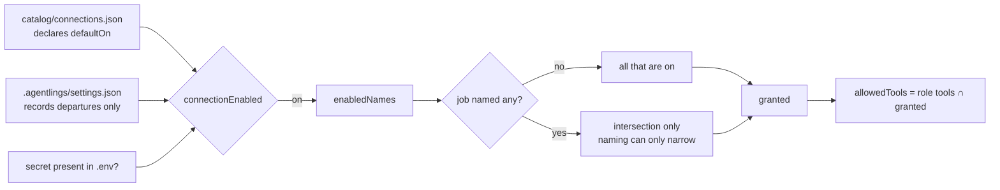
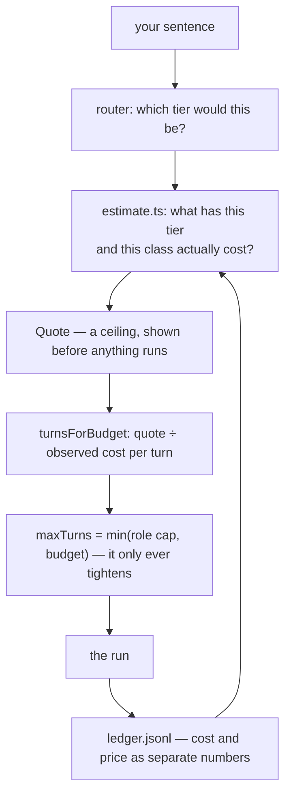
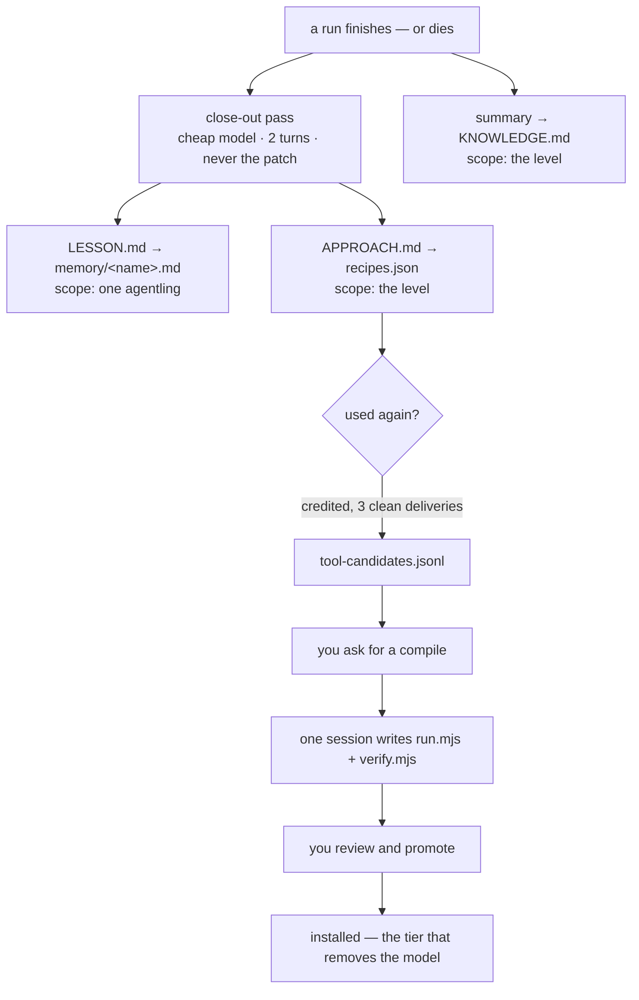
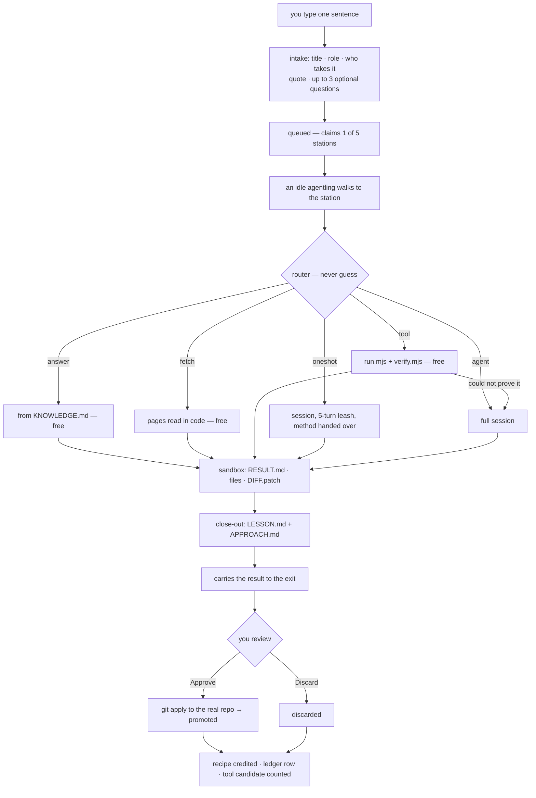
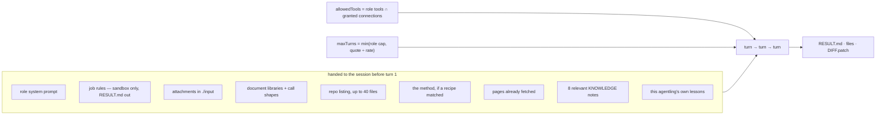

# The Agentling — a generalist CV

What one agentling is, and what it can do, *before* it is given a trade, a
skill, a level or a job. Everything here is a property of the engine rather
than of any particular crew member.

The three files are meant to be read together: `SPEC.md` says what the product
is, `DECISIONS.md` says why each choice was made and what measurement settled
it, and this one says what the thing in the middle is actually capable of.
Where a claim here was settled by evidence, the entry is cited (`D-021`).

Every capability carries a status:

| | Meaning |
|---|---|
| **Live** | Built, running, and exercised by tests or by real jobs |
| **Partial** | The mechanism exists; the thing it is for is not fully there |
| **Not built** | Designed, decided, or deliberately refused — with the reason |

Written 2026-08-01 against `e5c80c9`.

---

## 0. At a glance

|  |  |
|---|---|
| **What it is** | One Claude Agent SDK session, run in a child process, inside a per-job sandbox, wrapped in a deterministic layer that tries not to start it at all |
| **Where it works** | `.agentlings/levels/<level>/jobs/<id>/` — a directory it may never leave |
| **What it starts with** | A name, a colour, a role, an empty memory file, and whatever its level already knows |
| **What it can touch** | Files, a shell, a git clone of your repo, web pages as text, a read-only browser, document libraries |
| **What it can never touch** | Your real repository before you approve; any credential value; anything on the far end of a network it was not granted |
| **What it is asked not to touch** | Anything outside its sandbox — an instruction and a working directory, not an OS jail. See §9 |
| **What one job costs** | Free (three of five tiers), ~13c on a leash, ~50c for a full session — quoted before it runs and never billed above the quote |
| **What binds it** | Turns, not dollars — 10 by default, 40 hard ceiling, 5 on a recipe leash |
| **What it remembers** | Its own lessons, its level's knowledge, and the method for any job it has done before |
| **What it can become** | A script. Work done often enough compiles into a tool that runs with no model at all |
| **Who it answers to** | You, at review. Nothing it produces reaches the real world until you promote it |

---

## 1. Identity at birth — Live

A blank agentling is nine fields and a file.

| Field | At hire | Notes |
|---|---|---|
| `id` | generated | Stable for its life |
| `name` | assigned | Also the filename of its memory: `memory/<name>.md` |
| `color` | assigned tint | `0xRRGGBB`; the dot on the level card and the sprite in the world |
| `role` | chosen at hire | The whole of its capability — see §2 |
| `jobDescription` | your sentence | What *you* said it was for, in your words; seeded as its first memory |
| `state` | `idle` | `idle → walking → working → delivering` |
| `x`, `targetX` | spawn point | Presentation only; the world can never block or corrupt a job |
| `jobsDone` / `jobsFailed` | `0` | Persisted in the roster, not the sim — a restart no longer wipes a career |
| `memory/<name>.md` | absent | Created on its first lesson |

What is **not** blank: the level it is born into. A new agentling inherits its
level's `KNOWLEDGE.md`, its recipes and its compiled tools from the moment it
starts. Capability is a property of the level, not of the worker — a method
that works against one repository is not a method that works against another.

The roster is the record and the sim holds only who is awake (`crew.ts`). An
agentling can be **rested** (walks out the door, off the queue, nothing lost),
**woken** (drops back through the hatch with career and lessons intact), **let
go** (roster entry removed, lessons moved to `memory/archive/`, never deleted),
or **merged** into another of the same role (careers add, memories merge
oldest-first with duplicates dropped, an absorption note records who was folded
in). All four are blocked mid-job.

---

## 2. Trades — Live

A role is a Claude Code subagent file: `roles/<name>.md`, frontmatter plus a
system prompt as the body. **The role is the agentling.** It decides the system
prompt, the tool allowlist, the model, the mounted skills and the turn budget.
A scout with read-only tools genuinely cannot edit code — this is enforced at
the SDK session, not advised in a prompt.

| Role | For | Tools | Skills | Model | Turns |
|---|---|---|---|---|---|
| `worker` | Generalist — takes any job, masters none | read, write, edit, bash | concise-reports, check-your-work | default | 10 |
| `mason` | Builds — implements, refactors, fixes | read, write, edit, bash, grep | small-diffs, check-your-work | default | 15 |
| `scout` | Research — reads much, writes little | read, grep, web_fetch | concise-reports, cite-sources | Haiku 4.5 | 12 |
| `scribe` | Documentation — turns work into words | read, write, grep | concise-reports, plain-language | default | 10 |
| `analyst` | Numbers — reads records, reports what they say | read, grep, bash | concise-reports, tables-and-numbers, cite-sources | Haiku 4.5 | 6 |

Role tool names map onto SDK tools (`grep` → `Grep` + `Glob`, `web_fetch` →
`WebFetch`). A role naming no tools gets the default set: Read, Write, Edit,
Bash, Grep, Glob. A role naming `maxTurns` gets it clamped to 40.

**The catalog is global; the crews are per level.** Roles install from GitHub
URLs, SHA-pinned, preview-first: the full text plus warnings about broad tools,
outbound links and the declared licence, because installing copies the file
into your own project. Provenance is recorded, so a later sync can report
"update available" and never apply one.

---

## 3. Abilities — Live

A skill is a `SKILL.md` folder mounted into `sandbox/.claude/skills` for the
session. Six ship, hand-written against this app's contract — sandbox only,
`RESULT.md` out — which third-party skills know nothing about:

`check-your-work` · `cite-sources` · `concise-reports` · `plain-language` ·
`small-diffs` · `tables-and-numbers`

Skills install from the same library as roles, whole-folder: up to 200
companion files and 2 MB, with every remote path refused rather than sanitised
if it could climb out of its folder. The preview says how many extra files a
skill brings and that they are scripts it can run, which is the question the
preview exists to ask.

---

## 4. What an agentling can actually do

### Inside its sandbox — Live

| Activity | How |
|---|---|
| Read, write and edit files | SDK `Read` / `Write` / `Edit`, gated by role |
| Run commands | `Bash`, gated by role. No shell is available to a role without it |
| Search | `Grep` / `Glob` |
| Work on your code | `git clone --local --no-hardlinks` into `sandbox/repo`; every change captured as `DIFF.patch` after the session |
| Read your attachments | Up to 5 files, 10 MB each, waiting in `input/` — never at the sandbox root, because everything that asks "did this run deliver?" looks at top-level files |
| Produce real documents | `.docx` (docx, mammoth), `.xlsx` (exceljs), `.pptx` (pptxgenjs), `.pdf` (pdf-lib, pdf-parse) — resolved from the project root, nothing installed per job |
| Write and run scripts | Plain Node, no shell, no dependencies — this is also how a tool gets compiled (§8) |
| Report | `RESULT.md`: outcome first, evidence second |

The document libraries are named in the system prompt with their exact call
shapes, because a library nobody is told about is not a capability: watched
live, an agentling asked for a PDF hand-assembled the bytes over several turns
because it had no idea `pdf-lib` was there (D-031).

The repository listing — up to 40 files — is handed over before the first turn,
because every repo run used to open with `ls` before it could do anything, and
on a five-turn leash that orientation turn was the difference between landing
the edit and running out.

### Reaching a page — Live

Web reading is **on by default**. This is an outreach platform, so reaching a
page is what the crew is *for* rather than a permission to be granted job by
job (D-032). It is the app's own fetch, not a browser and not a raw dump: a
page comes back as readable text trimmed to 12,000 characters. A Wikipedia
article measured 573 KB raw (~143k tokens) against ~3k tokens delivered.

Two paths, one implementation:

- URLs **you** typed are fetched by plain code *before* the session starts, at
  no token cost, and land as files the agent reads.
- An in-session `fetch_page` tool calls back into the server, so extraction,
  trimming and the allowlist have one implementation.

Non-HTTP is refused. 15-second timeout, 5 MB cap.

### Driving a browser — Partial (reads, cannot act)

Playwright MCP, headless and isolated, fetched by `npx` so no code lands in the
repo. **Eight** of its twenty-four tools are granted, and all eight read:

`browser_navigate` · `browser_navigate_back` · `browser_snapshot` ·
`browser_find` · `browser_wait_for` · `browser_take_screenshot` ·
`browser_console_messages` · `browser_network_requests`

Twelve that act are deliberately absent — `click`, `type`, `fill_form`,
`press_key`, `select_option`, `drag`, `drop`, `file_upload`, `handle_dialog`,
`evaluate`, `run_code_unsafe`, `network_request`. `catalog.test.ts` asserts
those names against the shipped catalog, so the boundary is a test rather than
a description of one. Why, in full, is §10.

It ships **off**. Signing in, when you want it, works by re-using a session you
made yourself: log in once in a real browser, save the storage state, point
`AGENTLINGS_BROWSER_STATE` at the file. The app never sees a password, and with
the variable unset the argument is dropped and browsing works signed out.

### Answering a run — Live

A job can carry `continues: <jobId>`. The earlier run's sandbox is carried
forward — `RESULT.md`, `DIFF.patch`, `LESSON.md`, `APPROACH.md` — so a reply
picks up where that run stopped instead of paying to redo it (D-033).

---

## 5. Reach outside the sandbox

### The rule

Nothing is ambient. A job gets what the platform has switched on, narrowed to
what it named, and nothing else. This is both the security boundary and the
cost one: every visible tool is definition overhead in every request of the
session.



Four properties worth stating plainly:

1. **Settings is authoritative.** A job cannot name its way past a switch you
   turned off. Never switched on is not the same as not switched off.
2. **Naming a connection can only narrow.** Per-job opt-in is about not
   carrying tool definitions you do not need, not about a job granting itself
   something.
3. **A connection that cannot work is not a preference.** Missing secret means
   never live, whatever its default says.
4. **One resolver, three readers** — the quote, the router and the executor all
   ask the same function. Measured on the same sentence: web on quotes `routed`
   / "Free — we already know this"; web off quotes `session` / "Up to $1.58".
   Two answers here would be dollars apart (D-032).

The SDK's own `WebFetch` and `WebSearch` are gated by the same door. They were
not, once: a role naming `web_fetch` got them whatever the user had switched
off, so the app's fetch was gated and this second door was not.

### What ships

| Connection | Transport | Default | Status |
|---|---|---|---|
| `web` — read web pages | builtin | **on** | Live |
| `browser` — read pages in a real browser | stdio (Playwright MCP) | off | Partial, read-only |

### Connecting to other apps — Partial

The socket is built; nothing credentialed is plugged into it. An external MCP
server is declared with `name`, `label`, `transport: "stdio"`, `command`,
`args`, `tools` and optional `secrets: {ENV_NAME: "why it is needed"}`.

- **The tool list is the grant.** A server offering both reading and acting can
  be adopted for reading alone by naming only its reading tools; anything not
  named is refused by the allowlist. It also makes the catalog say what a
  connection can do without anyone having to run it.
- **Secrets are referenced by environment variable name.** Values never appear
  in the registry, never cross the API, and reach only the connection they were
  declared for.
- **`${VAR}` in an argument** is filled from the environment, and the whole
  argument is *dropped* when the variable is unset — which is what makes an
  optional sign-in optional.
- **They all ship off.** Credentialed connections carry credentials and act on
  the user's behalf, which is a different decision from reading a page (D-005).

**Not built:** any credentialed connection at all. Not Gmail, not a calendar,
not a ticket tracker, not a database. The registry would take one today; none
has been added, because adding one is a decision about §10 rather than a line
in a list.

**Never:** borrowing claude.ai or Claude Code connector auth. The app owns its
own external credentials or has none — a stated non-goal.

---

## 6. What a turn costs, and who pays

### Quote → turns → ledger



**The quote is a lookup, not a model.** It asks the router what it would do,
then asks the ledger what that tier and class have actually cost. It tightens
as history accumulates — which is only possible because the router sorts work
into tiers with genuinely different cost behaviour.

**Turns are the only enforcement that exists before the money is spent.** The
session stream carries no running cost: measured, the only `total_cost_usd` in
a 35-message session arrives on the final message, and per-message usage is
partial (52 output tokens reported against a true 568). A mid-flight dollar
check cannot stop an overspend, only notice one after the money is gone. So the
ceiling is converted into turns at what a turn of this work has really cost.

**A turn is priced by the shape of the work, not just the role.** Measured
2026-07-31, a repo run burnt 7.4c/turn against 1.8c for the same role without
one, because the clone puts hundreds of thousands of cached tokens in front of
every turn. A rate pooled across both shapes predicted neither: the budget
worked out to 17 turns against a role cap of 8, so the cap always won and the
ceiling could never bind on anything (D-018).

**The rate prices a turn *granted*, never a turn the SDK reports.** A cap of 4
came back as 6 when the run was cut off, and lower when it finished early.

### Rules the user can rely on

- **Nothing is billed above its quote.** `priceFor` takes the minimum.
- **Failed work is charged nothing.** The app absorbs it.
- **Work quoted free that then cost money is absorbed too** — if a compiled
  tool claimed a job, could not prove its output, and a session had to do it
  after all, you were promised free and a promise of free that arrives as a
  bill is the one thing the quote exists to prevent.
- **A quote may never come in under the turns it has already decided to
  grant.** A tier calibrated on its own failures cannot otherwise escape them:
  the recipe tier's history was thirteen runs that died on a three-turn leash,
  so it quoted 22c, which funded three turns, which was the leash that was
  failing (D-026).
- **The quote reads every run that spent money**, not only the ones that
  landed. The runs that break a quote are exactly the ones that exhaust their
  turns and file failed — a done-only average is blind to its own worst cases
  by construction. Measured: a job quoted at 30c cost 59c, ran out of turns,
  and the quote for the identical next job did not move a cent (D-017).
- **Two ceilings, not one.** 50c is what ignorance quotes; $2 exists only so
  one freak run cannot set every later quote for its class. They were the same
  number until that caused a breach (D-016).
- **What the ledger records is what actually happened.** The job class is the
  role that *ran* the work, not the role the matcher named — a job routed to a
  role nobody holds is picked up by whoever is free and runs as their role.

**Not built:** any actual billing. There is no invoice, no payment, no user to
charge. The spine is built for pass-through because a ledger cannot be
reconstructed retroactively, and the shape has to exist from the first entry or
the history is worthless (D-012).

---

## 7. The five tiers — Live

Every request that never reaches the model costs nothing, so this is the
largest saving available and the most dangerous, because an answer given
without the agent is an answer nobody checked.

> **The rule is: never guess.** The router claims only work whose shape it
> recognises exactly. Everything else falls through to a session untouched. A
> missed saving costs money; a wrong answer costs trust.

| Tier | Fires when | Cost | What runs |
|---|---|---|---|
| `answer` | A question about what this level already knows, answered from `KNOWLEDGE.md`; or an exact repeat with a stored answer | free | Plain code |
| `fetch` | A bare "read this page" — addresses plus words that only mean *fetch* | free | Plain code |
| `tool` | A compiled tool matches the job's words **and** its shape | free | Two Node scripts |
| `oneshot` | A recipe matches strongly (≥ 0.65) — the method, on a 5-turn leash | ~13c | A short session |
| `agent` | Everything else. A weak match (≥ 0.3) still lends its method | ~50c | A full session |

Guards that keep the free tiers honest:

- A **stored answer** is replayed only on an exact prompt repeat with **no
  repository and no web access**. The same words against a different repo are a
  different question.
- A run that **made something** banks only its method, never its answer.
  Measured on job `57bbff81`: a run that had written a PDF banked its own
  summary, and the next identical request was answered for free with
  "hello-world.pdf (1,380 bytes) is a valid one-page PDF" — and no PDF.
- An **attachment** makes an answer unrepeatable even when the run produced
  nothing, because the recipe key is the prompt: "summarise the attached
  contract" would replay contract A's summary for contract B.
- **"Do it properly"** re-queues with `noRouter` when you disagree with a
  routed answer.

---

## 8. How an agentling learns

Four things accumulate, at three different scopes.



### The close-out pass — Live

**The write-up is not the session's job.** A separate pass runs afterwards on a
cheap model with two turns, handed the run's own `RESULT.md` and the *names* of
the files it changed — never the patch, because a patch is what makes a turn
expensive.

It runs after **every job that left anything behind, including the ones that
died**, which are most of them. Asking the session itself produced nothing: the
write-up competed with the work for turns, so it was cut first, and 13 of 13
recipe runs died before writing either file. Anything that learns only from
clean successes goes blind exactly where a short leash puts most of its runs
(D-020).

### Recipes — Live

A recipe stores an **approach**, not an answer: how to do this *kind* of job
without exploring. Keyed on the normalised prompt, terms stemmed and weighted
by rarity, and recomputed from the key on read rather than trusted from disk —
so changing how words are stemmed can never strand the recipes written before
it.

**Two bars, because the two mistakes cost different amounts.** A strong match
(0.65) shortens the run to five turns. A weak one (0.3) hands over the method
and leaves the leash alone: a wrong method given to a full-length session
wastes a turn it can ignore; the same method with the leash cut wastes the
whole run (D-019, D-023).

### The capability surface — Live

A method is only as good as what was available when it was found. Every recipe
records the surface it was learned under, as one sorted token list:

```
conn:web  conn:browser  tool:Read  tool:Bash  skill:small-diffs  lib:pdf-lib
```

When the surface has changed, the recipe still lends its method but no longer
shortens the leash — the crew has to be able to notice it has grown. Model and
turn cap are deliberately *absent* from the list: they change how *well* a run
does something, not what it can do, and a leashed run takes five turns
regardless of its role's cap (D-036, D-037).

### Compiled tools — Live

The fourth tier, and the only one that makes a cost per task actually fall. A
recipe makes repeat work cheaper by saving the exploring, and still pays a
model to read it. **A tool removes the model:** the agent stops being the thing
that does the job and becomes the thing that once wrote down how.
Interpretation compiled.

This also settles when to call the API at all — *pay for judgement that has not
been compiled yet, and nothing else* — and it sets the honest ceiling: "add
tests for module X" never compiles, because the assertions depend on the
module; "list the modules with no test file" does. Tools take the scaffolding,
sessions keep the judgement (D-021).

A tool is a directory holding a manifest and two plain-node ES modules,
`run.mjs` and `verify.mjs` — no shell, no dependencies, no network. Nothing
about it is trusted:

- It matches on the **strong bar only**, and on **shape** as well as words. A
  script written against a clone is simply wrong where there is no clone, and
  the two jobs can be worded identically.
- It must **prove its own output**, checked in a second process, because a run
  that crashed cannot be trusted to report that it crashed. Work it cannot
  prove is discarded — the files as well as the result, since the files *are*
  the work — and the sandbox is emptied before the session redoes the job.
- **Two failures in a row retire it.** One is noise; three is a habit you paid
  for twice. A hang is killed at 60 seconds.

**Promotion is a request, never automatic.** It spends money, and a promotion
nobody asked for is a charge nobody quoted. It refuses a recipe that has not
landed three times, then queues one session whose brief insists on the check
harder than on the script — without one, the tier is only a faster way to be
wrong. The scripts land in that session's sandbox and are installed only when
it is **reviewed and promoted**, exactly like a library install: a generated
tool is executable instruction. A second attempt is told how the first failed,
because a retry that is not is an identical first try at the same price.

### Level knowledge — Live

Every finished job appends to the level's `KNOWLEDGE.md`. A session is given
the **eight most relevant notes for its own job**, chosen by the same term
overlap the recall tier uses — never another level's, and never simply the most
recent. Feeding it the twelve most recent instead showed a job about billing
whatever happened to be done yesterday.

---

## 9. Boundaries

### The sandbox — Partial, and this is the one to read carefully

The sandbox is the session's working directory plus a rule in its system
prompt: *work only inside the sandbox; never read or write paths outside it.*
It is **not an OS jail**. `Bash` runs with your own permissions, and
`permissionMode: 'dontAsk'` means there is no interactive gate to catch a stray
command. A session that decided to walk up a directory could.

What actually holds, and what the app's guarantees really rest on:

- **Your repository is a clone.** Nothing a session does reaches the real tree
  until you press Approve, at which point a *reviewed* patch is replayed. That
  is enforced by the shape of the flow, not by trust.
- **The tool allowlist is enforced.** A role without `write` has no `Write`
  tool at all. A connection you switched off contributes no tools.
- **The session inherits nothing.** `settingSources: []` — your own Claude Code
  settings, project rules and skills do not leak into an agentling's session.

Treat the sandbox as a strong convention that has held in practice, and the
clone-plus-review as the actual guarantee. Do not point a level at a repository
you would not let a shell near.

### The rest — Live

| Boundary | Enforcement |
|---|---|
| Tools are the intersection of the role and what you allowed | `allowedTools` is a strict allowlist; `permissionMode: dontAsk` means there is no prompt to talk past |
| The SDK never enters the server | Sessions run in `agent-runner.mjs`, plain JS spawned with plain node — its import graph stays out, and a wedged session cannot take the server down |
| A server started inside a Claude Code terminal cannot inherit that session | The child environment is laundered of `CLAUDE*`, `ANTHROPIC_BASE_URL` and `ANTHROPIC_AUTH_TOKEN` |
| A session cannot run forever | 10-minute timeout, 40-turn hard ceiling whatever a role's frontmatter says |
| A compiled tool cannot run forever | 60-second timeout, killed |
| Remote paths cannot climb out of their folder | Refused rather than sanitised — there is no legitimate skill that needs `..` or a drive letter |
| A torn ledger line cannot lose the history | Parsed line by line; a bad line is skipped, not fatal |

The world is presentation. The server sim owns all state and the client renders
it; nothing in the world may block or corrupt a job, and no LLM call decides
movement.

---

## 10. Representation and privacy — the honest section

### Acting on your behalf — Not built, deliberately

An agentling **cannot act in the world**. It cannot click, type, submit a form,
sign in, send a message, place an order, or issue an arbitrary HTTP request. It
can read, and it can produce files you then approve.

This is structural rather than incidental. Every guarantee this app makes rests
on one shape — **work in a sandbox, review, promote** — and a diff can be
inspected before it touches anything real. `browser_click` on "Confirm order"
happens on the live internet the instant the model decides to, and there is no
promote step for a submitted form. The obvious mitigation, pausing a run to
ask, needs a `waiting` job status and a runner holding stdin, which was refused
for separate reasons (D-030, D-034).

So the first version reads and cannot act. That removes the real limitation —
a plain HTTP GET returns an empty shell on most modern sites — without adding a
new risk class, and it produces the cost data needed to price an acting version
honestly. **Adding an acting tool is a decision about the safety model, not a
line in a list.**

### Personal data — Partial, and the gap is worth naming

What is true today:

- **Localhost only.** No multi-user, no auth, no hosting, no telemetry. The
  server binds a local port and the browser talks to it.
- **`.agentlings/` is gitignored.** The app's memory is not the repository's:
  the ledger, the sandboxes, the rosters, the lessons and everything fetched
  stay out of version control.
- **Secret values never move.** The registry holds environment variable *names*
  and a reason each is needed. Values never appear in the registry, never cross
  the API, never reach the UI, and are passed only to the connection that
  declared them.
- **Sign-in without a password.** The browser's storage-state file is one you
  make yourself; the app passes a path and never reads a credential. The file
  is a bearer token for every site in it, so it is gitignored.
- **Attachments are confined.** They land in `input/` inside the sandbox and
  the prompt tells the session not to go looking elsewhere.
- **The catalog token is scoped.** `GITHUB_TOKEN`, when set, is sent to the API
  host only and never to raw file hosts.

What is **not built**, and should not be assumed:

- **No classification, redaction or masking.** An attached document, a repo
  file or a fetched page goes into a Claude API session whole. If it contains
  personal data, the model sees it.
- **No retention policy.** Sandboxes, fetched pages, attachments, lessons and
  ledger rows persist under `.agentlings/` until you delete them. Nothing
  expires.
- **No audit of what left the machine.** The ledger records what a job cost,
  not what it sent.
- **No per-level or per-job data boundary beyond the sandbox directory.**
  Levels do not share sandboxes, but nothing stops you pointing two levels at
  the same repository.
- **No filesystem isolation.** The sandbox is a working directory and an
  instruction, not a jail — see §9. A session with `Bash` runs as you do.

The honest one-line summary: **privacy here is the sandbox, the localhost
boundary and the absence of any credential the app holds itself — not a data
control plane.**

---

## 11. The loop

### One job, end to end



Failure does not leave the loop: on failure the agentling walks home, the job
is marked `failed`, the close-out still runs, and the recipe is still credited
if it was used. A run that delivered something and then ran out of turns is
`partial` — its own outcome, not a failure, because calling it one hides work
that is ready to promote.

### Inside one session



Nothing in that list asks for `LESSON.md` or `APPROACH.md`. They used to
compete with the work for turns, so they were cut first and the crew learned
nothing.

### Researching, specifically

`scout` on Haiku, twelve turns, read + grep + web_fetch and no write. URLs you
named are already on disk. `fetch_page` trims each page to 12,000 characters of
readable text. With the browser switched on it can also open a JavaScript site
and read what renders — and cannot touch it. `cite-sources` and
`concise-reports` are mounted, so the report names where every claim came from.

### Editing code, specifically

`mason`, fifteen turns, read + write + edit + bash + grep. The repository is a
local clone at `./repo` with its listing already provided. Everything it does
lands in `DIFF.patch`, summarised into files/added/removed for the review card.
`small-diffs` and `check-your-work` are mounted. Your real repository is
untouched until you press Approve.

---

## 12. Reference — every number that binds

### Turns

| Constant | Value | Where | What it does |
|---|---|---|---|
| `DEFAULT_MAX_TURNS` | 10 | `executors/claude.ts` | A role that names no budget |
| `TURN_CEILING` | 40 | `executors/claude.ts` | Hard clamp; a typo cannot uncap the loop |
| `RECIPE_TURNS` | 5 | `executors/claude.ts` | The leash on a strong recipe match |
| `COMPILE_TURNS` | 10 | `executors/claude.ts` | A compile gets its own cap, not the role's |
| `CLOSEOUT_TURNS` | 2 | `executors/claude.ts` | The write-up pass |
| `SESSION_TIMEOUT_MS` | 10 min | `executors/claude.ts` | Wall clock on one session |

### Money

| Constant | Value | Where | What it does |
|---|---|---|---|
| `DEFAULT_CEILING_USD` | $0.50 | `estimate.ts` | What ignorance quotes |
| `ONESHOT_CEILING_USD` | $0.10 | `estimate.ts` | One call cannot run away like a loop |
| `MAX_CEILING_USD` | $2.00 | `estimate.ts` | Runaway clamp; `AGENTLINGS_MAX_COST_USD` overrides |
| ceiling formula | `max(mean × 2, max × 1.2)` | `estimate.ts` | Room to exceed the average without breaking the quote |
| `certainty` | ≥ 3 samples → `high` | `estimate.ts` | Below that, `estimated` |

### Learning

| Constant | Value | Where | What it does |
|---|---|---|---|
| `SIMILAR_ENOUGH` | 0.65 | `recipes.ts` | Strong match — shortens the leash |
| `WORTH_A_HINT` | 0.3 | `recipes.ts` | Weak match — lends the method only |
| `RARITY_NEEDS` | 5 | `recipes.ts` | Corpus size before rarity weighting is trusted |
| `TOOL_CANDIDATE_RUNS` | 3 | `recipes.ts` | Deliveries before a recipe is compilable |
| `STRIKES_ALLOWED` | 2 | `tools.ts` | Consecutive failures that retire a tool |
| `TOOL_TIMEOUT_MS` | 60 s | `tools.ts` | A compiled tool that hangs is not cheaper |
| KNOWLEDGE notes per session | 8 | `executors/claude.ts` | Chosen by term overlap, not recency |
| KNOWLEDGE notes per recall | 6 | `router.ts` | The `answer` tier |

### Reaching out

| Constant | Value | Where | What it does |
|---|---|---|---|
| `DEFAULT_MAX_CHARS` | 12,000 | `web.ts` | Trimmed page text |
| `FETCH_TIMEOUT_MS` | 15 s | `web.ts` | One page |
| `MAX_BYTES` | 5 MB | `web.ts` | Refuses to download a page it will trim anyway |
| pre-fetched URLs | 5 | `router.ts` | URLs pulled out of your sentence |
| browser tools granted | 8 of 24 | `catalog/connections.json` | All eight read |

### Intake and files

| Constant | Value | Where | What it does |
|---|---|---|---|
| `MIN_CONFIDENCE` | 0.35 | `match.ts` | Below it the app says so instead of guessing |
| `INTENT_WEIGHT` / `DOMAIN_WEIGHT` | 1.5 / 0.55 | `match.ts` | The verb decides the role, not the noun |
| `MAX_QUESTIONS` | 3 | `clarify.ts` | Above this the box has become a form |
| `MAX_ATTACHMENTS` | 5 | `shared` | Per job |
| `MAX_ATTACHMENT_BYTES` | 10 MB | `shared` | Per file |
| `SNIFF_BYTES` | 8,000 | `outputs.ts` | How much to read before calling a file binary |
| `MAX_COMPANIONS` | 200 | `library.ts` | Files a skill folder may bring |
| `MAX_COMPANION_BYTES` | 2 MB | `library.ts` | Per companion file |
| `MAX_PER_SOURCE` | 250 | `library.ts` | Catalog entries per source repo |
| `STALE_MS` | 7 days | `library.ts` | Catalog TTL, refreshed in the background |

### The world

| Constant | Value | What it does |
|---|---|---|
| `MAX_STATIONS` | 5 | Jobs visibly in progress; extras wait |
| `TICK_MS` | 100 | Sim tick — 10 Hz on the wire |
| `SERVER_PORT` | 4600 | API and WebSocket; the runner calls back here for fetches |
| `WORLD_WIDTH` | 1000 | Logical units the client scales |

### Authentication

Any one of three, auto-detected at startup and reported once rather than one
failed agentling at a time: `ANTHROPIC_API_KEY` in `.env`, a
`CLAUDE_CODE_OAUTH_TOKEN` from `claude setup-token`, or a fresh Claude Code
login. `AGENTLINGS_EXECUTOR` overrides. With none of them the
`SimulatedExecutor` stands in for the whole tail, so the loop runs end to end
without an API key.

---

## 13. What an agentling is not

- **Not autonomous.** It takes one job, does it, and stops. There is no
  standing instruction, no schedule, no self-started work.
- **Not a pipeline.** Jobs are independent. Decomposition and pipelines are
  parked in M6.
- **Not a chat.** A reply is a new job that carries the previous sandbox
  forward; there is no live conversation with a running session.
- **Not shared.** No multi-user, no auth, no hosting — localhost only.
- **Not an actor.** It reads and it produces. Everything that reaches the real
  world goes through you.
