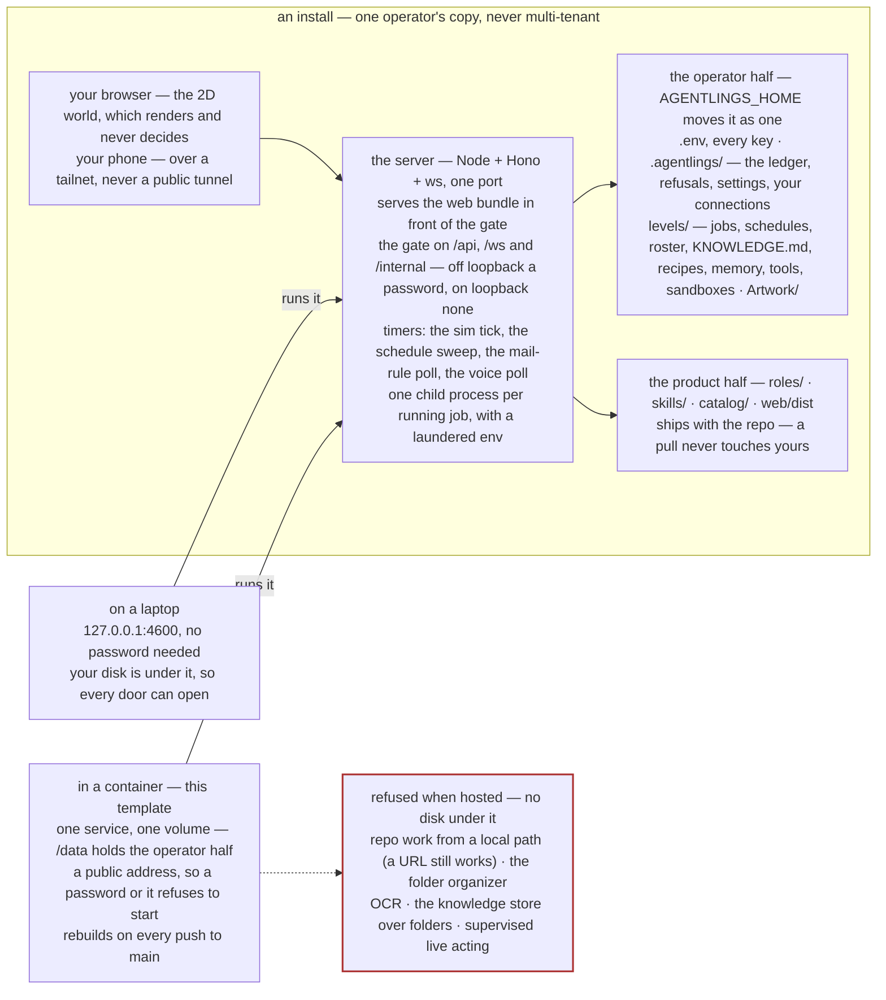
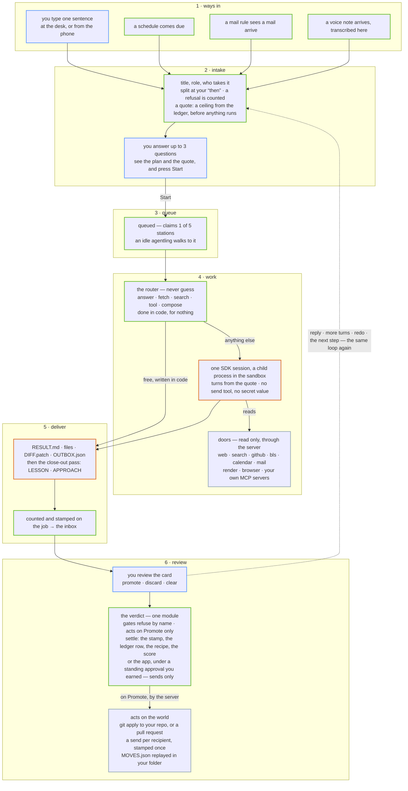

# Agentlings

A horde of small agentlings marches through a side-view 2D world, picks up real
coding and desk jobs, works them in per-job sandboxes, and delivers results for
you to review. Nothing it produces reaches the real world until you promote it.

This repository is the whole thing. Deploy it and you get an **install** of your
own; nobody runs anything for you.

## Deploy your own install

[](https://railway.com/deploy/agentlings)

An **install** is one operator's copy of Agentlings: one secrets file, one data
directory, one ledger, jobs running as that operator. There is no multi-tenancy
and there never will be — a laptop and a container you own are the same thing,
and what differs between them is only whether your own disk is under it, which
decides which doors the install can open.

The template is one service and one volume. Everything the install owns — your
secrets file at `/data/.env`, your data directory at `/data/.agentlings` — lives
on that volume, which is what makes a key you paste on Monday still work after a
rebuild on Tuesday. Lose the volume and you lose the keys, the ledger and the
schedules with it.

The shape of one install, and the two places it can stand:



### Updates arrive on their own

Your install builds from this repository and follows its `main` branch, so when
this repository is pushed, Railway rebuilds yours. That is how a fix reaches you
without your doing anything, and it is also the honest catch: a change lands on
your install without asking you first. There is no telemetry here and no way to
reach you, so an install that did not follow `main` would keep whatever fault it
deployed with, silently and forever — which is the worse of the two.

A rebuild does not touch your volume. The secrets file and the data directory
survive it, which is the whole reason they live there.

### The one variable the template asks for

`AGENTLINGS_PASSWORD`. Anyone with this and your URL is you, so make it long.

It is the only one the template requires to *start*. To have your install do
real work you will set a second — the model credential below — because there is
nowhere in the app to paste that one. Two variables, then, and everything else
goes in Settings.

Without it the server **refuses to start** rather than put an ungated horde on a
public address, and says so in one line. That is the whole rule: no password, no
public interface. On loopback — the way it runs on a laptop — no password means
no gate, exactly as before.

The template sets the other two itself: `AGENTLINGS_HOME=/data`, so the operator
half lands on the volume, and `AGENTLINGS_BIND=0.0.0.0`, because a public address
is what you deployed this to get.

### The model credential

An install needs one of two things to run real sessions, and on a host there are
only two:

1. **An API key** — `ANTHROPIC_API_KEY`, from the Anthropic Console.
2. **A long-lived Claude Code token** — run `claude setup-token` in any terminal
   on your own machine and use the result as `CLAUDE_CODE_OAUTH_TOKEN`.

The third route a laptop has — a fresh `claude` login that the app auto-detects —
**does not exist in a container**. There is no interactive login to do and no
stored session to find.

**The API key goes in Settings**, on the engine's own row, like every other key:
paste it and it is checked against Anthropic before anything is stored. The
check is `GET /v1/models`, which costs nothing and spends no tokens — it proves
the key is valid, though not that the account has credit, which no check short
of spending money can. The next job runs for real; there is no restart.

You can also pick **which model** the crew runs on there. The list is whatever
your own key can reach, asked of Anthropic rather than written down here, and
leaving it on *the engine's default* is a real choice. A role that names its own
model still uses that one.

The long-lived token route is different: set `CLAUDE_CODE_OAUTH_TOKEN` as a
**variable on the service**, since it is not something the drawer can check
against Anthropic. Setting a variable redeploys, which is fine — but note that a
variable set on the host **beats the secrets file for good** under that name, so
if you set the API key as a service variable you will not be able to change it
from Settings afterwards.

### Where every other key goes

Inside the app: **Settings → the connection → paste the key**. Telegram, GitHub,
Brave search, Google, Buk, any MCP server you add — each is checked with one real
call before it is saved, so a key that does not work never gets stored, and the
value never appears on screen again. They land in your secrets file on the
volume, which is why they survive a redeploy.

Only the password and the model credential are service variables. Everything else
belongs where it explains itself.

### The precedence rule, and the one way it will bite you

**A name set in the environment beats the same name in the secrets file.** Node's
`process.loadEnvFile` does not overwrite a name already present in `process.env`
— measured on node v24.14.0, not assumed.

The consequence is worth knowing before it happens to you: pasting a key in
Settings writes the secrets file **and** patches the live process in one call, so
it works immediately. But if a service variable of that same name also exists,
the paste loses at the next restart and the drawer looks as though it forgot.
Pick one place for a given key and stay there.

## What an install cannot do hosted

Everything that needs *your own disk or your own desktop* is refused at its
probe, exactly as it is refused today on a machine that is not Windows. These
five carry the tag **Not available hosted** in [AGENTLING.md](AGENTLING.md), each
citing the probe that produces it:

- **repo work from a local path** — a level points at a folder on the operator's
  machine and the server checks it exists. In a container it does not. Point the
  level at a GitHub URL instead and repo work runs on any install: the clone is
  over https, and Approve pushes a branch and opens a pull request rather than
  applying a patch to a working tree that isn't there.
- **the folder organizer** — a run proposes moves and *you* approve them, over a
  folder picked in a native dialog. There is no typed-path fallback by design, so
  with no desktop to open a dialog on this is a refusal and not a detour.
- **OCR** — reading a scan or a photograph off pixels uses the Windows OCR
  engine, and the probe is a real run against it rather than a platform check.
- **the knowledge store over folders** — a level indexes folders of your own
  material. The folders are on your machine.
- **supervised live acting** — the door where an agentling clicks and types in a
  browser *you are watching*. It is headed by construction: you sign in yourself
  and closing the window ends the run. A container has no screen to open one on.

They appear in the work bar as **refused**, with the reason, rather than being
absent — so you learn what the local version would have done and why yours does
not, before a turn is spent rather than halfway through work you paid for.

Everything else is the desk, and it works: fetching and searching the web, every
document format, PDF and backdrop rendering, the read-only browser door, every
send channel, the calendar, schedules and mail triggers, recipes, compiled
tools, the ladder and the ledger, and any remote MCP server you add.

Voice notes work too, but not out of the box: the transcriber is not baked into
the image. Run `npm run voice:install` once and it fetches the model (241 MB)
onto your volume. Until you do, a note that arrives says the transcriber is not
installed rather than failing quietly.

## Run it on your own machine instead

Node 20.19 or newer.

```
npm install
                          # copy .env.example → .env, set one auth option
npm run serve             # web on :5173, API and WS on :4600
```

Nothing binds beyond loopback and no password is needed. `npm run build` then the
server alone serves both halves from one port, which is what the container does.

## How a sentence becomes work

One job, end to end. The colour of a box says who acts: blue is you, green is
plain code on the server with no model in it, orange is a session, grey is the
world outside. The model appears in one place, and nothing it produces reaches
the outside until you promote it — or until a standing approval you earned
promotes a pure send for you.



Every way in lands on the same intake, and every job leaves through the same
verdict. The dashed return is every way the loop runs again: a reply, more
turns, a redo, the next step of a “then” chain. The 2D world only mirrors a
job's status and can never block one.

## Reading the code

It runs shell commands with your credentials, so read it before you trust it.

| | |
|---|---|
| [SPEC.md](SPEC.md) | What the product is, milestone by milestone |
| [AGENTLING.md](AGENTLING.md) | What one agentling can do — every capability tagged Live / Partial / Not built / Not available hosted |
| [CONTEXT.md](CONTEXT.md) | The glossary. *Install*, *hosted*, *door*, *channel*, *act* |
| [DECISIONS.md](DECISIONS.md) | Why each choice was made, and what measurement settled it |
| [LICENSE](LICENSE) | Apache-2.0 |

The boundaries are worth reading before the features: **§10 of `AGENTLING.md`**
is honest that the sandbox is an instruction and a working directory, not an OS
jail, and **§11** says exactly what can act on your behalf and when.
